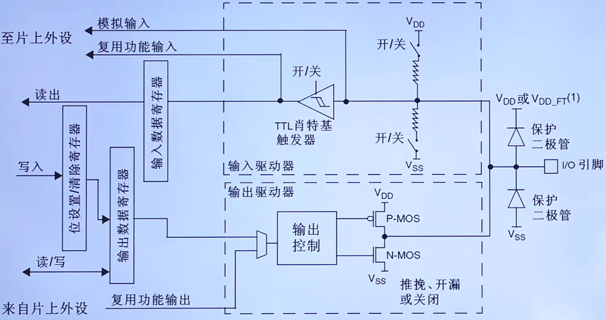
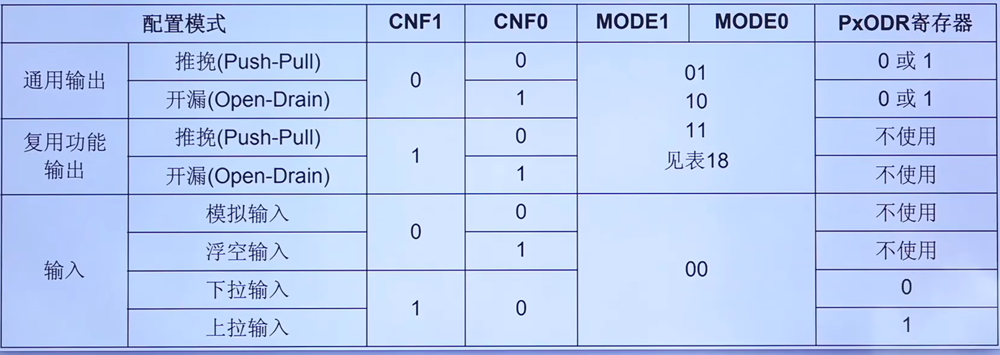
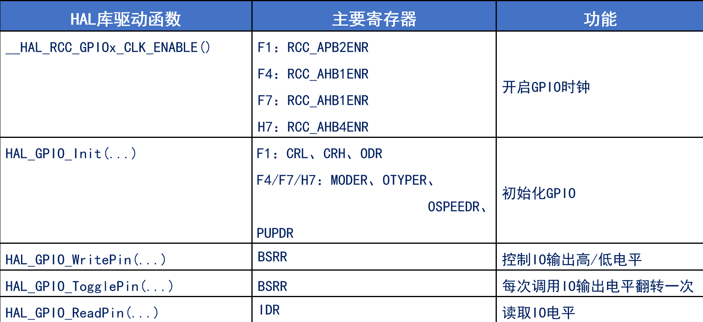
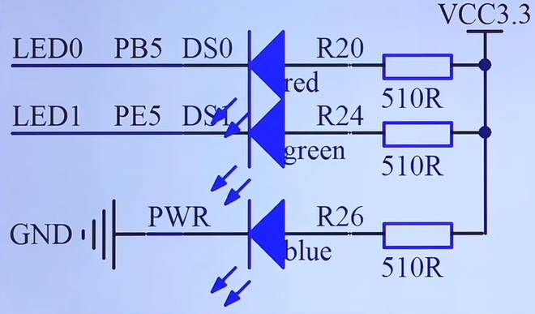
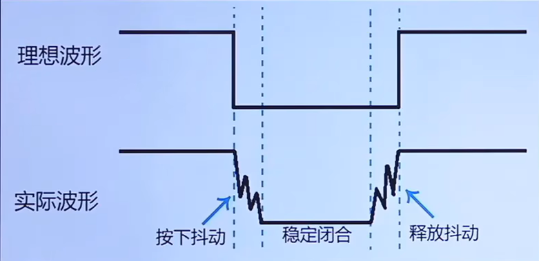
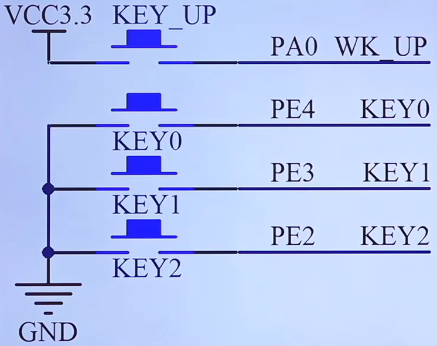

<!--
 * @Date: 2024-06-06
 * @LastEditors: GoKo-Son626
 * @LastEditTime: 2024-06-26
 * @FilePath: \STM32_Study\入门篇\1.GPIO\GPIO.md
 * @Description: 
-->

# GPIO

> 内容目录：
> 
>        1. 什么是GPIO?
>        2. STME32 GPIO简介
>        3. IO端口基本结构介绍
>        4. GPIO的八种模式分析
>        5. GPIO寄存器介绍
>        6. 通用外设驱动模型（四步法）
>        7. GPIO配置步骤
>        8. 编程实战：点亮一个LED灯
>        9. 编程实战：通过一个按键控制一个LED灯

#### 1. 什么是GPIO?

> General Purposelnput Output，即通用输入输出端口，简称GPIO
> 作用:负责采集外部器件的信息或者控制外部器件工作，即输入输出

#### 2. STME32 GPIO简介

###### 1. GPIO特点 

- 不同类型IO口数量可能不一样
- 快速翻转（翻转高电平到低或低到高）
  
        若芯片的时钟频率为72Mhz，且每次翻转最少需要两个时钟周期，那么IO口最大翻转频率：

        一个周期为1/72Mhz
        单次翻转时间：2 * 1/72Mhz
        翻转频率 = 1s/翻转时间 = 36Mhz
- 每个IO口都可做中断
- 支持8种工作模式

###### 2. GPIO电气特性

- STM32工作电压范围：2V <= VDD <= 3.6V
- GPIO识别电压范围：
  
        COMS端口（IO电平未标记为FT的）：
                
                0：-0.3V ≤ V.IL ≤ 1.164V
                1：1.866V ≤ V.IH ≤ 3.6V
        TTL端口（IO电平标记为FT的）：
- GPIO输出电流：单个IO，最大25mA

更多参考数据手册：5.1.2小节和5.3.13小节

###### 3.GPIO引脚分布

- 64个引脚，51个IO口
- 引脚类型（六大类）：
  
        电源引脚：V字母开头的
        晶振引脚：
                PC 14-0 SC 32_IN
                PC 15-0 SC 32_OUT
                P DO-OS C_IN
                P D 1-OS C_OUT
        复位引：脚位为7的NRST引脚
        下载引脚：串口，SWF，JTAG
        BOOT引脚：BOOT0和PB2上的BOOT1
        GPIO引脚：剩下的P开头的
- 特点：按组存在，组数视芯片而定，每组最多16个IO口
- 
#### 3. IO端口基本结构介绍

###### 1. F1系列IO端口基本结构


- 保护二极管（弱保护）：
  
        上：V.DD或V.DD_FF^(1)有0.3V的压降
        下：V.ss为0V，到上位正好位-0.3V，起到保护作用
- （弱的）内部上下拉电阻：
- 施密特触发器：施密特触发器就是一种整形电路，可以将非标准方波，整形成方波

        特点:
                当输入电压高于正向阈值电压，输出为高;
                当输入电压低于负向阈值电压，输出为低;
                当输入在正负向阈值电压之间，输出不改变。
        作用：
                整型！如正弦波转方波
- P-MOS & N-MOS管简介

        MOS管是压控型元件，通过控制栅源电压(Vgs）来实现导通或关闭。

#### 4. GPIO的八种模式分析

###### 1. GPIO的八种模式分析

| GPIO八种模式   | 特点及应用                              |
| -------------- | --------------------------------------- |
| 输入浮空       | 输入用，完全浮空，状态不定              |
| 输入上拉       | 输入用，用内部上拉，默认是高电平        |
| 输入下拉       | 输入用，用内部下拉，默认是低电平        |
| 模拟功能       | ADC，DAC                                |
| 开漏输出       | 软件IIC的SDA、SCL等                     |
| 推挽输出       | 驱动能力强，25mA(max)，通用输出         |
| 开漏式复用功能 | 片上外设功能(硬件IIC的SDL、SCL引脚等)   |
| 推挽式复用功能 | 片上外设功能(SPI的SCK、MISO、MOS引脚等) |

1. 输入浮空

        上拉电阻关闭
        下拉电阻关闭
        施密特触发器打开
        双MOS管不导通
        特点：空闲时（高阻态（外部引脚不接任何东西时）），IO状态不确定，由外部环境确定
2. 输入上拉

        较1.变化：上拉电阻打开
        特点：空闲时，IO呈高电平，弱上拉

3. 输入下拉

        较2.变化：下拉电阻打开
        特点：空闲时，IO呈低电平

4. 模拟功能

        较1.变化：施密特触发器关闭
        特点：专门用于模拟信号输入或输出，如：ADC和DAC

5. 开漏输出（输出模式可以读取到引脚电平）

        较1.变化：P-MOS始终不导通，往ODR对应位写0，N-MOS管导通，写1则N-MOS不导通
        特点:不能输出高电平必须有外部(或内部，对于F4-H7)上拉才能输出高电平

6. 推挽输出

        较1.变化：往ODR对应位写0，N-MOS管导通，写1则P-MOS不导通
        特点:可以输出高低电平，驱动能力强

7. 开漏式复用功能

        同5.：
        特点:
           1. 不能输出高电平必须有外部(或内部，对于F4-H7)上拉才能输出高电平
           2. 由其它外设控制输出

8. 推挽式复用功能

        上拉电阻关闭
        下拉电阻关闭
        施密特触发器打开
        特点:
                1、可输出高低电平，驱动能力强
                2、由其他外设控制输出
> STM32能输出5V的电平吗？
>       开漏式外接外部上拉才可以

#### 5. GPIO寄存器介绍

**(F1系列)GPIO通用寄存器GPIOX_yyy**

| CRL                    | CRH   | IDR      | ODR      | BSRR              | BRR                                              | LCKR              |
| ---------------------- | ----- | -------- | -------- | ----------------- | ------------------------------------------------ | ----------------- |
| 配置工作模式，输出速度 | 同CRL | 输入数据 | 输出数据 | 设置ODR寄存器的值 | F4之后没有这个寄存器考虑代码兼容性的话不建议使用 | 配置锁定,使用不多 |

1. CRL和CRH：CRL控制PA0-PA7,CRH控制PA8-PA15(共64个位，控制16个IO引脚)。对于每个IO引脚，CNF以MODE为前提。
        **F1工作模式配置补充：端口位配置表**
        
        - 输入上拉下拉电阻通过**3：ODR**寄存器来设置
  
2. IDR：用于判断IO引脚的电平
        （16个位，位31：16保留，始终只读为0）全只读，只能以字（16位）的形式读出。读出的值为IO的状态

3. ODR：用于设置IO引脚输出的电平
        （16个位，位31：16保留，始终只读为0）这些可读可写只能以字（16位）的形式操作

4. BSRR：用于控制ODR寄存器(只读)
        BRy：（31：16）
                0：无影响
                1：清除对应的ODRy位为0
        BSy：（15：1）
                0：无影响
                1：清除对应的ODRy位为1
        **注**：同时设置）BRy和BSy的对应位时，BSy位起作用
> ODR和BSRR寄存器控制输出有什么区别?
        ODR修改：读->改->写（写之前有中断时会被覆盖）
        BSRR修改：写

        ST官方给的答案:使用ODR，在读和修改访问之间产生中断时，可能会发生风险;BSRR则无风险

#### 6. 通用外设驱动模型（四步法）

1. 初始化：时钟设置，参数设置，（可选：IO设置，中断设置（开中断，设NVIC））
2. 读函数（可选）：从外设读取数据
3. 写函数（可选）：往外设写入数据
4. 中断服务函数（可选）：根据中断标志，处理外设各种中断事务

#### 7. GPIO配置步骤

相关HAL库函数介绍：


1. 使能时钟 __HAL_RCC_GPIOx_CLK_ENABLE()
        ```
        SET BIT(RCC-APB2ENR ,1 << 2)
        ```
2. 设置工作模式 HAL_GPIO_Init()
        参数：
                GPIO TypeDef(GPIO的基地址)
                GPIO_InitTypeDef（内容是可选选择来的）
3. 设置输出状态（可选）：
        HAL_GPIO_WritePin()
        HAL_GPIO_TogglePin()
4. 读取输入状态(可选)：HAL_GPIO_ReadPin()

#### 8. 编程实战：点亮一个LED灯

**战舰LED连接原理图**

(3.3V GCC - 1.83V 压降) / 510R = 2.88mA
> 0805贴片发光二极管：绿侧为负极
> IO模式：输入为采集，输出为控制
> 输出模式时禁止使用上下拉
> 高阻态可以为1，但是当另一端接地时相当于电路断开了，所以不能用
> 

1. 点亮一个灯
     - 因为新建一个LED的驱动，所以先建立一个板级工程文件（Drivers->BSP）
     - 放入led.c和led.h文件

**led.c代码**
```c
void led_init(void)
{
    GPIO_InitTypeDef gpio_init_struct;
    
    __HAL_RCC_GPIOB_CLK_ENABLE();
    
    gpio_init_struct.Pin = GPIO_PIN_5;
    gpio_init_struct.Mode = GPIO_MODE_OUTPUT_PP;
    gpio_init_struct.Speed = GPIO_SPEED_FREQ_LOW;
    
    HAL_GPIO_Init(GPIOB, &gpio_init_struct);
    
    HAL_GPIO_WritePin(GPIOB, GPIO_PIN_5, GPIO_PIN_SET);
}
```

#### 编程实战：通过一个按键控制一个LED灯

**独立按键抖动波形图**

> 软件消抖:通过延时跳过抖动的时间段，再判断I0输入电平。

**KEY连接原理图**

> PA0:输入下拉
> PE4/3/2:输入上拉

**key.c代码**
```c
void key_init(void)
{
    GPIO_InitTypeDef gpio_init_struct;
    
    __HAL_RCC_GPIOE_CLK_ENABLE();
    
    gpio_init_struct.Pin = GPIO_PIN_2;
    gpio_init_struct.Mode = GPIO_MODE_INPUT;
    gpio_init_struct.Pull = GPIO_PULLUP;
    
    HAL_GPIO_Init(GPIOE, &gpio_init_struct);
    
    HAL_GPIO_WritePin(GPIOE, GPIO_PIN_2, GPIO_PIN_SET);
}

uint8_t key_scan(void)
{
    if(HAL_GPIO_ReadPin(GPIOE, GPIO_PIN_2) == 0)
    {
        delay_ms(10);
        while(1)
        {
            while(HAL_GPIO_ReadPin(GPIOE, GPIO_PIN_2) == 0);
            return 1;
        }
    }
    return 0;
}
```
