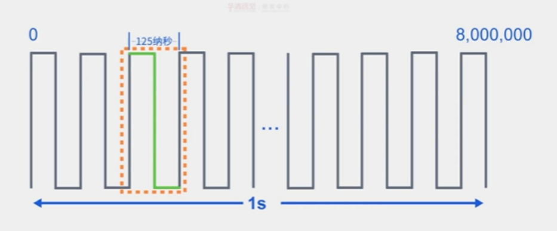

<!--
 * @Date: 2024-06-06
 * @LastEditors: GoKo-Son626
 * @LastEditTime: 2024-07-29
 * @FilePath: \STM32_Study\入门篇\1.GPIO\GPIO.md
 * @Description: 
-->

# GPIO

> 内容目录：
> 
>        1. 什么是GPIO?
>        2. STME32 GPIO简介
>        3. IO端口基本结构介绍
>        4. GPIO的八种模式分析
>        5. GPIO寄存器介绍
>        6. 通用外设驱动模型（四步法）
>        7. GPIO配置步骤
>        8. 编程实战：点亮一个LED灯
>        9. 编程实战：通过一个按键控制一个LED灯

#### 1. 什么是GPIO?

> General Purposelnput Output，即通用输入输出端口，简称GPIO
> 作用:负责采集外部器件的信息或者控制外部器件工作，即输入输出

#### 2. STME32 GPIO简介

> 时钟频率是按照一定规律不断变化的高低电平，**将一秒里总的变化次数称为时钟频率**，变化n次就为nHz
> Hz -> KHz -> MHz -> GHz (1000进制)

> 一个周期：每次变换电平所需要的时间 8MHz一个周期的时间就为1/800 0000s

###### 1. GPIO特点 

- STM32F103ZET6 芯片是 144 脚的芯片，具有 GPIOA、GPIOB、GPIOC、GPIOD、GPIOE、GPIOF 和 GPIOG 七组 GPIO 口，共有 112 个 IO 口可供我们编程使用
- 不同类型IO口数量可能不一样
- 快速翻转（翻转高电平到低或低到高）
  
        若芯片的时钟频率为72Mhz，且每次翻转最少需要两个时钟周期，那么IO口最大翻转频率：
        
        答: 一个周期为1/72Mhz
        单次翻转时间：2 * 1/72Mhz
        翻转频率 = 1s/翻转时间 = 36Mhz

- **每个IO口都可做中断**
- **支持8种工作模式**

###### 2. GPIO电气特性

- STM32工作电压范围：2V <= VDD <= 3.6V
- GPIO识别电压范围：
  
        COMS端口（IO电平未标记为FT的）：
                
                0：-0.3V ≤ V.IL ≤ 1.164V
                1：1.866V ≤ V.IH ≤ 3.6V
        TTL端口（IO电平标记为FT的）：
        
                兼容 5V 电平的 IO 口，可以直接接 5V 的外设
                （注意：如果引脚设置的是模拟输入模式，则不能接5V!)
- GPIO输出电流：单个IO，最大25mA

更多参考数据手册：5.1.2小节和5.3.13小节

###### 3.GPIO引脚分布

- 64个引脚，51个IO口
- 引脚类型（六大类）：
  
        电源引脚：V字母开头的
        晶振引脚：
                PC 14-0 SC 32_IN
                PC 15-0 SC 32_OUT
                P DO-OS C_IN
                P D 1-OS C_OUT
        复位引脚：脚位为7的NRST引脚
        下载引脚：串口，SWF，JTAG
        BOOT引脚：BOOT0和PB2上的BOOT1
        GPIO引脚：剩下的P开头的
- 特点：按组存在，组数视芯片而定，每组最多16个IO口

#### 3. IO端口基本结构介绍

###### 1. F1系列IO端口基本结构


- 保护二极管（弱保护）：
  
        上：V.DD或V.DD_FF^(1)有0.3V的压降
        下：V.ss为0V，到上位正好位-0.3V，起到保护作用
- （弱的）内部上下拉电阻：
> 在使用微控制器的GPIO（通用输入输出）引脚时，可以通过配置引脚上下拉电阻来控制其在没有外部信号连接时的电平状态。这种电阻通常称为上拉电阻和下拉电阻。
> 它们阻值大概在 30~50K 欧之间，可以通过上、下两个对应的关控制,这两个开关由寄存器控制。
> 若无设置则位高阻态
> **高阻态**（High-Z State）指的是一个电路元件（如传输线、输入端口或输出端口）处于非常高的阻抗状态，通常用于描述输入或输出电路未连接到有效信号源时的状态。在这种状态下，**电路元件对电路的影响极小**，不会主动地提供或消耗电流，也不会输出明确定义的电平信号。
- 施密特触发器：施密特触发器就是一种整形电路，可以将非标准方波，整形成方波

        特点:
                当输入电压高于正向阈值电压，输出为高;
                当输入电压低于负向阈值电压，输出为低;
                当输入在正负向阈值电压之间，输出不改变。
        作用：
                整型！如正弦波转方波
- P-MOS & N-MOS管简介
**P-MOS和N-MOS元件图**


> 这个结构控制 GPIO 的开漏输出和推挽输出两种模式。
> MOS管是压控型元件，通过控制栅源电压(Vgs）来实现导通或关闭。

#### 4. GPIO的八种模式分析

###### 1. GPIO的八种模式分析

| GPIO八种模式   | 特点及应用                              |
| -------------- | --------------------------------------- |
| 输入浮空       | 输入用，完全浮空，状态不定              |
| 输入上拉       | 输入用，用内部上拉，**默认是高电平**        |
| 输入下拉       | 输入用，用内部下拉，**默认是低电平**        |
| 模拟功能       | ADC，DAC                                |
| 开漏输出       | 软件IIC的SDA、SCL等                     |
| 推挽输出       | 驱动能力强，25mA(max)，通用输出         |
| 开漏式复用功能 | 片上外设功能(硬件IIC的SDL、SCL引脚等)   |
| 推挽式复用功能 | 片上外设功能(SPI的SCK、MISO、MOS引脚等) |

1. **输入浮空**

        上拉电阻关闭
        下拉电阻关闭
        施密特触发器打开
        双MOS管不导通
        特点：空闲时（高阻态（外部引脚不接任何东西时）），IO状态不确定，由外部环境确定

**浮空输入的引脚在以下几种状态中表现为高阻态：**
- 未连接（悬空）：如果引脚没有连接到任何信号源，输入引脚的电平会不确定，容易受到环境噪声的影响，从而产生不稳定的电平。
- 连接到高阻抗信号源：如果引脚连接到一个高阻抗的信号源，输入引脚不会拉低或拉高电压，保持高阻态。

2. **输入上拉**

        较1.变化：上拉电阻打开
        特点：空闲时，IO呈高电平，弱上拉

3. **输入下拉**

        较1.变化：下拉电阻打开
        特点：空闲时，IO呈低电平

4. **模拟功能**

        较1.变化：施密特触发器关闭,
        其他外设可以通过模拟通道输入输出。
        该模式下需要用到芯片内部的模拟电路单元单元，
        用于 ADC、DAC、MCO这类操作模拟信号的外设。
        特点：专门用于模拟信号输入或输出，
        如：ADC和DAC

5. **开漏输出（输出模式可以读取到引脚电平）**

- 开漏输出模式下 P-MOS 一直在截止状态，即不导通，所以 P-MOS 管的栅极相当于一直接 VDD。如果输出数据寄存器①的值为 0，那么 IO 引脚的输出状态②为低电平，这是我们需要的控制逻辑，怎么做到的呢？是这样的，输出数据寄存器的**逻辑 0** 经过“输出控制”的取反操作后，输出逻辑 1 到 N-MOS 管的栅极，这时 N-MOS 管就会导通，使得 IO 引脚连接到 VSS，即**输出低电平**。**如果输出数据寄存器的值为 1，经过“输出控制”的取反操作后，输出逻辑 0 到 N-MOS 管的栅极，这时 N-MOS 管就会截止。又因为 P-MOS管是一直截止的，使得 IO 引脚呈现高阻态，即不输出低电平，也不输出高电平。** 
- **因此要 IO 引脚输出高电平就必须接上拉电阻。又由于 F1 系列的开漏输出模式下，内部的上下拉电阻不可用，所以只能通过接芯片外部上拉电阻的方式，实现开漏输出模式下输出高电平。如果芯片外部不接上拉电阻，那么开漏输出模式下，IO 无法输出高电平。**
- 在开漏输出模式下，施密特触发器是工作的，所以 IO 口引脚的电平状态会被采集到输入数据寄存器中，如果对输入数据寄存器进行读访问可以得到 IO 口的状态。也就是说开漏输出模式下，我们可以读取 IO 引脚状态。
        
        较1.变化：

                P-MOS始终不导通，往ODR对应位写0，N-MOS管导通，写1则N-MOS不导通
        特点:不能输出高电平必须有外部(或内部，对于F4-H7)上拉才能输出高电平

6. 推挽输出

**由上述可知，推挽输出模式下，P-MOS 管和 N-MOS 管同一时间只能有一个管是导通的。当 IO 引脚在做高低电平切换时，两个管子轮流导通，一个负责灌电流，一个负责拉电流，使其负载能力和开关速度都有较大的提高。另外在推挽输出模式下，施密特触发器也是打开的，我们可以读取 IO 口的电平状态。**

        较1.变化：

                往ODR对应位写0，N-MOS管导通，使得 IO 引脚接到 VSS，即输出低电平
                往ODR对应位写1，P-MOS管导通，使得 IO 引脚接到 VDD，即输出低电平
        特点:可以输出高低电平，驱动能力强

7. 开漏式复用功能

        同5.：
        特点:
           1. 不能输出高电平必须有外部(或内部，对于F4-H7)上拉才能输出高电平
           2. 由其它外设控制输出

8. 推挽式复用功能

        上拉电阻关闭
        下拉电阻关闭
        施密特触发器打开
        特点:
                1、可输出高低电平，驱动能力强
                2、由其他外设控制输出
> STM32能输出5V的电平吗？
> 
>       开漏式外接外部上拉才可以
> 常见复用功能：
>
>       GPIO（通用输入输出）
>       USART（通用同步异步收发器）
>       SPI（串行外设接口）
>       I2C（集成电路接口）
>       TIM（定时器）
#### 5. GPIO寄存器介绍

**(F1系列)GPIO通用寄存器GPIOX_yyy**

| CRL                    | CRH   | IDR      | ODR      | BSRR              | BRR                                              | LCKR              |
| ---------------------- | ----- | -------- | -------- | ----------------- | ------------------------------------------------ | ----------------- |
| 配置工作模式，输出速度 | 同CRL | 输入数据 | 输出数据 | 设置ODR寄存器的值 | F4之后没有这个寄存器考虑代码兼容性的话不建议使用 | 配置锁定,使用不多 |

1. CRL和CRH：CRL控制PA0-PA7,CRH控制PA8-PA15(共64个位，控制16个IO引脚)。对于每个IO引脚，CNF以MODE为前提。
        **F1工作模式配置补充：端口位配置表**
        
        - 输入上拉下拉电阻通过**3：ODR**寄存器来设置
  
2. IDR：用于判断IO引脚的电平
        （16个位，位31：16保留，始终只读为0）全只读，只能以字（16位）的形式读出。读出的值为IO的状态

3. ODR：用于设置IO引脚输出的电平
        （16个位，位31：16保留，始终只读为0）这些可读可写只能以字（16位）的形式操作

4. BSRR：用于控制ODR寄存器(只读)
        BRy：（31：16）
                0：无影响
                1：清除对应的ODRy位为0
        BSy：（15：1）
                0：无影响
                1：清除对应的ODRy位为1
        **注**：同时设置BRy和BSy的对应位时，BSy位起作用
> ODR和BSRR寄存器控制输出有什么区别?
        ODR修改：读->改->写（写之前有中断时会被覆盖）
        BSRR修改：写

        ST官方给的答案:使用ODR，在读和修改访问之间产生中断时，可能会发生风险;BSRR则无风险

> 为什么有了 ODR 寄存器，还要这个 BSRR 寄存器呢？我们先看看 BSRR 的寄存器描述，首先 BSRR 是只写权限，而 ODR 是可读可写权限。BSRR 寄存器 32 位有效，对于低 16 位（0-15），我们往相应的位写 1(BSy=1)，那么对应的 IO 口会输出高电平，往相应的位写 0(BSy=0)，对 IO 口没有任何影响，高 16 位（16-31）作用刚好相反，对相应的位写 1(BRy=1)会输出低电平，写 0(BRy=0)没有任何影响，y=0~15。也就是说，对于 BSRR 寄存器，你写 0 的话，对 IO 口电平是没有任何影响的。我们要设置某个 IO 口电平，只需要相关位设置为 1 即可。而 ODR 寄存器，我们要设置某个 IO 口电平，我们首先需要读出来 ODR 寄存器的值，然后对整个 ODR 寄存器重新赋值来达到设置某个或者某些 IO 口的目的，而 BSRR 寄存器直接设置即可，这在多任务实时操作系统中作用很大。BSRR寄存器还有一个好处，就是 BSRR 寄存器改变引脚状态的时候，不会被中断打断，而 ODR 寄存器有被中断打断的风险

#### 6. 通用外设驱动模型（四步法）

1. 初始化：时钟设置，参数设置，（可选：IO设置，中断设置（开中断，设NVIC））
2. 读函数（可选）：从外设读取数据
3. 写函数（可选）：往外设写入数据
4. 中断服务函数（可选）：根据中断标志，处理外设各种中断事务

#### 7. GPIO配置步骤

相关HAL库函数介绍：


1. 使能时钟 __HAL_RCC_GPIOx_CLK_ENABLE()
        ```
        SET BIT(RCC-APB2ENR ,1 << 2)
        ```
2. 设置工作模式 HAL_GPIO_Init()
        参数：
                GPIO TypeDef(GPIO的基地址)
                GPIO_InitTypeDef（内容是可选选择来的）
3. 设置输出状态（可选）：
        HAL_GPIO_WritePin()
        HAL_GPIO_TogglePin()
4. 读取输入状态(可选)：HAL_GPIO_ReadPin()

#### 8. 编程实战：点亮一个LED灯

**战舰LED连接原理图**

(3.3V GCC - 1.83V 压降) / 510R = 2.88mA
> 0805贴片发光二极管：绿侧为负极
> IO模式：输入为采集，输出为控制
> 输出模式时禁止使用上下拉
> 高阻态可以为1，但是当另一端接地时相当于电路断开了，所以不能用
> 

1. 点亮一个灯
     - 因为新建一个LED的驱动，所以先建立一个板级工程文件（Drivers->BSP）
     - 放入led.c和led.h文件

**led.c代码**
```c
void led_init(void)
{
    GPIO_InitTypeDef gpio_init_struct;
    //初始化GPIO时钟
    __HAL_RCC_GPIOB_CLK_ENABLE();
    
    gpio_init_struct.Pin = GPIO_PIN_5;
    gpio_init_struct.Mode = GPIO_MODE_OUTPUT_PP;
    gpio_init_struct.Speed = GPIO_SPEED_FREQ_LOW;
    
    HAL_GPIO_Init(GPIOB, &gpio_init_struct);
    
    HAL_GPIO_WritePin(GPIOB, GPIO_PIN_5, GPIO_PIN_SET);
}
```

#### 编程实战：通过一个按键控制一个LED灯

**独立按键抖动波形图**

> 软件消抖:通过延时跳过抖动的时间段，再判断I0输入电平。

**KEY连接原理图**

> PA0:输入下拉
> PE4/3/2:输入上拉

**key.c代码**
```c
void key_init(void)
{
    GPIO_InitTypeDef gpio_init_struct;
    
    __HAL_RCC_GPIOE_CLK_ENABLE();
    
    gpio_init_struct.Pin = GPIO_PIN_2;
    gpio_init_struct.Mode = GPIO_MODE_INPUT;
    gpio_init_struct.Pull = GPIO_PULLUP;
    
    HAL_GPIO_Init(GPIOE, &gpio_init_struct);
    
    HAL_GPIO_WritePin(GPIOE, GPIO_PIN_2, GPIO_PIN_SET);
}

uint8_t key_scan(void)
{
    if(HAL_GPIO_ReadPin(GPIOE, GPIO_PIN_2) == 0)
    {
        delay_ms(10);
        while(1)
        {
            while(HAL_GPIO_ReadPin(GPIOE, GPIO_PIN_2) == 0);
            return 1;
        }
    }
    return 0;
}
```
