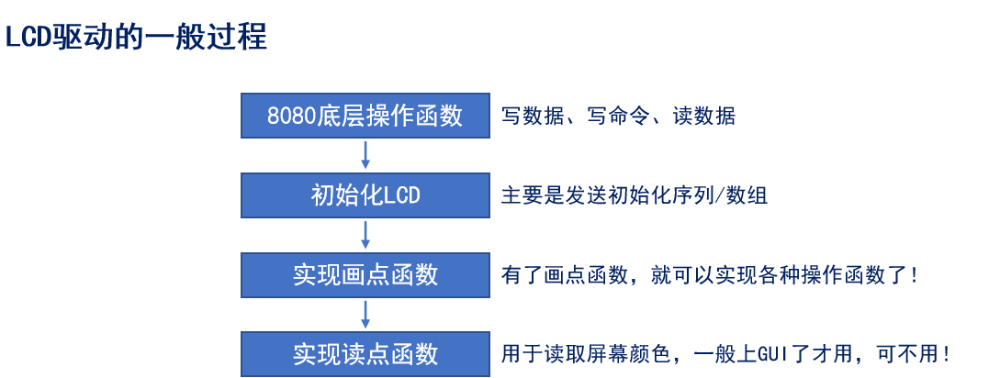
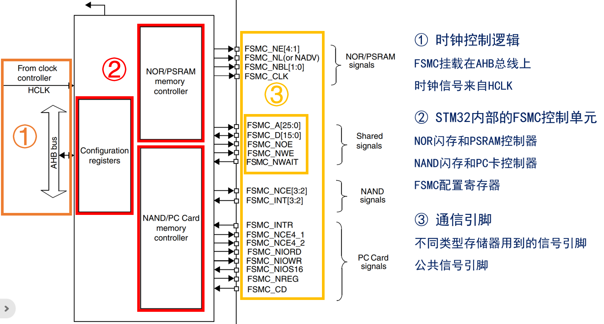
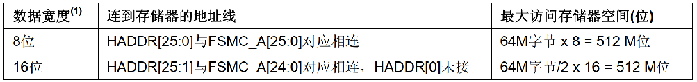
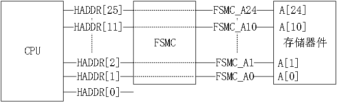

<!--
 * @Date: 2024-06-06
 * @LastEditors: GoKo-Son626
 * @LastEditTime: 2024-07-16
 * @FilePath: \STM32_Study\入门篇\10.FMC\FMC-LCD.md
 * @Description: 该模板为所有笔记模板
-->

# FMC-LCD

> 内容目录：
> 
>       1. 
>       2. 
>       3. 

> 在STM32微控制器中，以下是常见的存储器类型及其简要说明：
> 
> 1. **SRAM (静态随机访问存储器)**
>    - **特点**：速度快，易于使用，不需要周期性刷新。
>    - **用途**：用于临时数据存储，如变量和堆栈。
> 
> 2. **PSRAM (伪静态随机访问存储器)**
>    - **特点**：结合了DRAM的高密度和SRAM的易用性，速度比DRAM快，但比传统SRAM慢。
>    - **用途**：提供较大容量的临时存储。
> 
> 3. **ROM (只读存储器)**
>    - **特点**：数据在生产时被写入，不能更改（或更改困难）。
>    - **用途**：存储固件或程序代码。
> 
> 4. **NOR Flash**
>    - **特点**：可擦写的非易失性存储器，支持随机读写，速度相对较快。
>    - **用途**：存储代码、操作系统等可更新的数据。
> 
> 以下是这些存储器类型的对比表格：
> 
> | 存储器类型 | 特点                             | 速度         | 读取/写入方式   | 用途                     |
> |------------|----------------------------------|--------------|----------------|--------------------------|
> | SRAM       | 快速，不需刷新，易于使用           | 快           | 随机访问       | 临时数据存储，变量，堆栈 |
> | PSRAM      | 高容量，结合DRAM和SRAM特点         | 中等          | 随机访问       | 较大容量的临时存储       |
> | ROM        | 数据不可更改，通常在生产时写入     | 取决于实现   | 只读           | 固件，程序代码           |
> | NOR Flash  | 可擦写，支持随机读写               | 较快          | 随机访问       | 存储代码，操作系统       |
> 
> ### 联系和区别
> - **联系**：所有这些存储器类型都是计算机系统中用于存储数据或代码的基本组成部分。
> - **区别**：
>   - **SRAM**和**PSRAM**主要用于临时数据存储，SRAM更快但容量较小，PSRAM容量较大但速度较慢。
>   - **ROM**是只读的，用于存储不需要修改的数据（如固件），而**NOR Flash**是可擦写的，用于存储可更新的代码和数据，速度比ROM快。

### 1. LCD和MCU屏简介

**LCD（Liquid Crystal Display）**是一种显示技术，利用液晶材料的光电效应，通过控制电压来改变液晶的排列，从而控制光的通过。LCD屏广泛应用于各种显示设备，如手机、电视、电脑显示器、工业仪器、便携设备等。
**MCU屏**特指**由微控制器驱动**的LCD屏。这种屏幕通常用于嵌入式系统和低功耗设备中，因为微控制器的功耗低、成本相对较低且灵活性高。MCU屏幕可以是多种类型的LCD屏，比如字符型LCD、图形LCD、TFT LCD等。

### 2. LCD驱动（一般过程）



**LCD接口分类**
| 接口 | 分辨率    | 特性                                               |
| ---- | --------- | -------------------------------------------------- |
| MCU  | ≤800*480  | 带SRAM，无需频繁刷新，无需大内存，驱动简单         |
| RGB  | ≤1280*800 | 不带SRAM，需要实时刷新，需要大内存，驱动稍微复杂   |
| MIPI | 4K        | 不带SRAM，支持分辨率高，省电，大部分手机屏用此接口 |

**8080时序简介**
- 并口总线时序，常用于MCU屏驱动IC的访问，由Intel提出，也叫英特尔总线
| 信号    | 名称      | 控制状态  | 作用                                   |
| ------- | --------- | --------- | -------------------------------------- |
| CS      | 片选      | 低电平    | 选中器件，低电平有效，先选中，后操作   |
| WR      | 写        | ↑         | 写信号，上升沿有效，用于数据/命令写入  |
| RD      | 读        | ↑         | 读信号，上升沿有效，用于数据/命令读取  |
| RS      | 数据/命令 | 0=命/1=数 | 表示当前是读写数据还是命令，也叫DC信号 |
| D[15:0] | 数据线    | 无        | 双向数据线，可以写入/读取驱动IC数据    |

### 3. 编程实战1

### 4. ASCII字库制作
> - 使用PCtoLCD2002.exe软件制作
> 点帧格式：阴码
> 取模方式：逐列式
> 取模走向：顺向
> 自定义格式：C51格式


### 5. FSMC介绍

###### 1. FSMC简介

> FSMC，Flexible Static Memory Controller，灵活的静态存储控制器。
> 用途：用于驱动SRAM，NOR FLASH，NAND FLASH及PC卡类型的存储器。
> 配置好FSMC，定义一个指向这些地址的指针，通过对指针操作就可以直接修改存储单元的内容，FSMC自动完成读写命令和数据访问操作，不需要程序去实现时序。
> **F1/F4(407)系列大容量型号，且引脚数目在100脚以上的芯片都有FSMC接口**
**F4/F7/H7系列就是FMC接口**

**FSMC框图介绍**


**使用FSMC驱动LCD**


###### 2. FSMC时序介绍

> FSMC是Flexible灵活的，可以产生多种时序来控制外部存储器。
> NOR/PSRAM控制器产生的异步时序就有5种，总体分为两类：一类是模式1，其他为拓展模式。
> 拓展模式相对模式1来说读写时序时间**参数设置**可以不同，满足存储器读写时序不一样需求。

| 访问模式  | 对应的外部存储器     | 时序特性                                                        |
| --------- | -------------------- | --------------------------------------------------------------- |
| 模式1     | SRAM/CRAM            | OE在读时序片选过程不翻转，有NBL信号，无NADV信号                 |
| **模式A** | **SRAM/PSRAM(CRAM)** | **OE在读时序片选过程翻转，有NBL信号，无NADV信号**               |
| 模式B/2   | NOR FLASH            | OE在读时序片选过程不翻转，无NBL信号，有NADV信号                 |
| 模式C     | NOR FLASH            | OE在读时序片选过程翻转，无NBL信号，有NADV信号                   |
| 模式D     | 带地址扩展的异步操作 | OE在读时序片选过程翻转，无NBL信号，有NADV信号，存在地址保存时间 |

- 注意：FSMC时序中ADDSET和DATAST不需要严格要求，可以使用实践值

###### 3. HADDR与FSMC_A关系

> - HADDR总线是转换到外部存储器的内部AHB地址线。
> - 简单来说，从CPU通过AHB总线到外部信号线之间的关系。
> - HADDR是字节地址，而存储器访问不都是按字节访问，接到存储器的地址线与其数据宽度相关。

**HADDR连接线数据宽度**

- **LCD使用16位数据线**

**HADDR连接图**


**LCD的RS信号线与地址线关系**
> 8080接口中RS(数据/命令选择线)，用FSMC的某根A地址线进行替换。
> - 当FSMC_A10为高电平时（即RS为高电平），FSMC_D[15:0]被理解为数据。
> - 当FSMC_A10为低电平时（即RS为低电平），FSMC_D[15:0]被理解为命令。
> - **FSMC_A10接到RS线上**

###### 4. FSMC寄存器
| 寄存器     | 名称           | 作用                                        |
| ---------- | -------------- | ------------------------------------------- |
| FSMC_BCR4  | 片选控制寄存器 | 包含存储器块的信息（存储器类型/数据宽度等） |
| FSMC_BTR4  | 片选时序寄存器 | 设置读操作时序参数（ADDSET/DATAST）         |
| FSMC_BWTR4 | 写时序寄存器   | 设置写操作时序参数（ADDSET/DATAST）         |

- 对于NOR_FLASH/PSRAM控制器(存储块1)配置工作，通过FSMC_BCRx、FSMC_BTRx和FSMC_BWTRx寄存器设置（其中x=1~4，对应4个区）。

######  5. SRAM和FSMC初始化结构体

**SRAM**
```c
typedef struct 
{ 
	FSMC_NORSRAM_TypeDef *Instance;		        /* 寄存器基地址 */ 1
        FSMC_NORSRAM_EXTENDED_TypeDef *Extended; 	/* 扩展模式寄存器基地址 */ 2
	FSMC_NORSRAM_InitTypeDef Init;			/* SRAM初始化结构体*/ 3
	HAL_LockTypeDef Lock; 				/* SRAM锁对象结构体 */ 
	__IO HAL_SRAM_StateTypeDef State; 		/* SRAM设备访问状态 */ 
	DMA_HandleTypeDef *hdma; 			/* DMA结构体 */ 
} SRAM_HandleTypeDef;
```
**FSMC**
```c
typedef struct 
{ 
	uint32_t NSBank; 		        /* 存储区块号 */ 1
	uint32_t DataAddressMux; 		/* 地址/数据复用使能 */ 2	
	uint32_t MemoryType; 			/* 存储器类型 */3 	
	uint32_t MemoryDataWidth; 		/* 存储器数据宽度 */4
	uint32_t BurstAccessMode;		/*设置是否支持突发访问模式，只支持同步类型的存储器*/
	uint32_t WaitSignalPolarity;		/* 设置等待信号的极性 */
	uint32_t WrapMode; 			/* 突发模式下存储器传输使能 */
	uint32_t WaitSignalActive; 		/* 等待信号在等待状态之前或等待状态期间有效 */ 
	uint32_t WriteOperation; 		/* 存储器写使能 */5 
	uint32_t WaitSignal; 			/* 是否使能等待状态插入 */ 
	uint32_t ExtendedMode; 		/* 使能或者禁止使能扩展模式 */6 
	uint32_t AsynchronousWait; 		/* 用于异步传输期间，使能或者禁止等待信号 */ 
	uint32_t WriteBurst; 			/* 用于使能或者禁止异步的写突发操作 */ 
	uint32_t PageSize; 			/* 设置页大小 */ 
} FSMC_NORSRAM_InitTypeDef;
```

### 6. LCD初始化步骤（FSMC）

1. **lcd_init()**
> 1.    使能LCD相关GPIO引脚时钟并初始化
> 2.    配置SRAM句柄的相关参数
> 3.    分别配置读写时序句柄
> 4.    使用步骤**2.3**初始化FSMC（后延时50ms）
> 5.    读取并读回特定寄存器的值以识别LCD控制器的ID
> 6.    根据控制器ID执行相关初始化