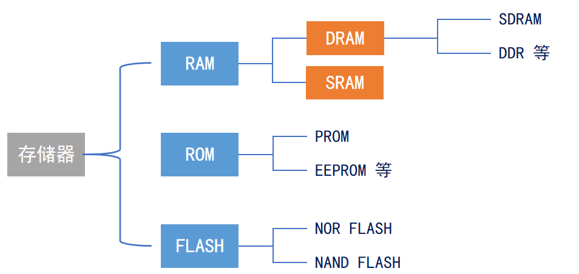

<!--
 * @Date: 2024-06-06
 * @LastEditors: GoKo-Son626
 * @LastEditTime: 2024-07-16
 * @FilePath: \STM32_Study\入门篇\10.FMC\FSMC-SDRAM.md
 * @Description: FSMC-SDRAM
-->

# FSMC-SDRAM

> 内容目录：
> 
>       1. SDRAM介绍
>       2. FMC介绍
>       3. SDRAM模块驱动步骤
>       4. 编程实战

### 1. SDRAM介绍

**存储器类型**
> 

**SDRAM**
- **同步：**内存工作需要同步时钟，内部的命令的发送与数据的传输都以它为基准
- **动态：**存储阵列 需要不断的刷新来保证数据不丢失
- **随机：**数据不是线性依次存储，而是自由指定地址进行数据读写 
- **优点：**容量大、读写速度快、价格相对便宜
- **缺点：**控制逻辑复杂

### 2. FMC介绍

> **数据掩码信号**
> 在 FSMC（Flexible Static Memory Controller）中，数据掩码信号（Data Mask Signal）用于控制哪些数据线在写操作期间是有效的，哪些数据线是被屏蔽的。
> 数据掩码信号通常用于以下几种情况：
> - 部分字节写入：当你不需要更新整个数据总线上的所有数据时，可以使用数据掩码信号只更新其中的某些字节。
> - 错误校正：在某些纠错编码或数据校正应用中，数据掩码信号可以用于屏蔽掉错误的数据位。

### 3. SDRAM模块驱动步骤

### 4. 编程实战