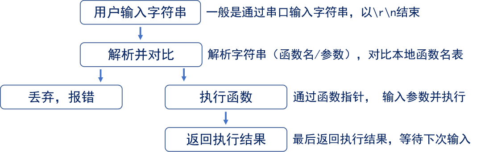
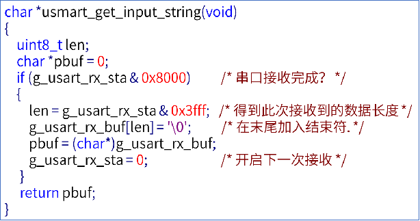
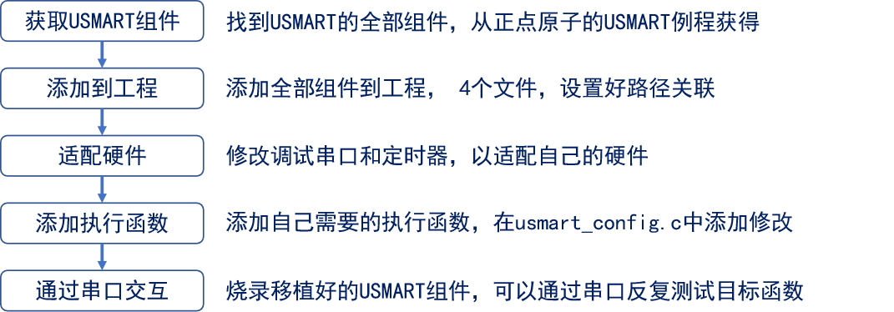

<!--
 * @Date: 2024-06-06
 * @LastEditors: GoKo-Son626
 * @LastEditTime: 2024-07-17
 * @FilePath: \STM32_Study\入门篇\11.USMART\USART.md
 * @Description: 该模板为所有笔记模板
-->

# USMART

> 内容目录：
> 
>       1. USMART简介
>       2. USMART原理
>       3. USMART移植
>       4. USMART使用

### 1. USMART简介

> - USMART是一个串口调试组件，可以大大提高代码调试效率！
> - USMART可以直接通过串口调用用户编写的函数，随意修改函数参数！

###### 1. USMART主要特点
1. 可以调用绝大部分用户直接编写的函数
2. 占用资源少（最小：4KB FLASH, 72B SRAM）
3. 支持参数类型多（整数(10/16)、字符串、函数指针等）
4. 支持函数返回值显示且可对格式进行设置
5. 支持函数执行时间计算
**注意：不支持浮点数参数！**

### 2. USMART原理

- **通过对比用户输入字符串和本地函数名，用函数指针实现调用不同的函数**

**USMART原理图**

###### 1. USMART组成：
| 文件            | 功能描述                                       |
| --------------- | ---------------------------------------------- |
| usmart .c/h     | 核心文件，用于处理命令以及对外部交互           |
| usmart_config.c | 函数管理文件，用于添加用户需要USMART管理的函数 |
| usmart_port.c/h | 移植文件，用于USMART移植                       |
| usmart_str.c/h  | 字符串处理文件，用于字符串转换、参数获取等     |

- **修改**：usmart_port.c/.h，即可完成移植
- **修改**：usmart_config.c，即可添加自己想要调用的函数

###### 2. USMART扫描函数：void usmart_scan(void)；
- 扫描函数，解析用户输入字符串数据，进而实现函数调用和组件各个控制功能

**usmart_scan调用以下获取用户输入字符串数据函数:**

**g_usart_rx_sta：串口的接收缓冲**
| g_usart_rx_sta | g_usart_rx_sta       |
| -------------- | -------------------- |
| bit15          | 接收完成标志         |
| bit14          | 接收到 0X0D 标志     |
| bit13~0        | 接收到的有效字节个数 |
### 3. USMART移植

**USART移植（配置流程）**

### 4. USMART使用

**USMART有7个系统命令：**
| ？      | 获取帮助信息                                |
| ------- | ------------------------------------------- |
| help    | 获取帮助信息                                |
| list    | 可用的函数列表                              |
| id      | 可用函数的ID列表                            |
| hex     | 参数16进制显示，后跟空格+数字即执行进制转换 |
| dec     | 参数10进制显示，后跟空格+数字即执行进制转换 |
| runtime | 1，开启函数运行计时；0，关闭函数运行计时；  |

- 注意：请按照程序编写格式输入函数名及参数并以回车键结束

