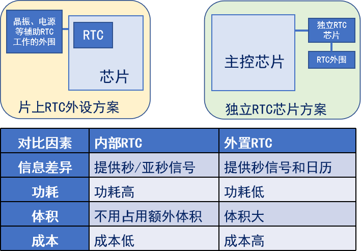
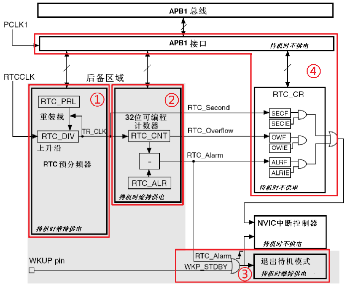
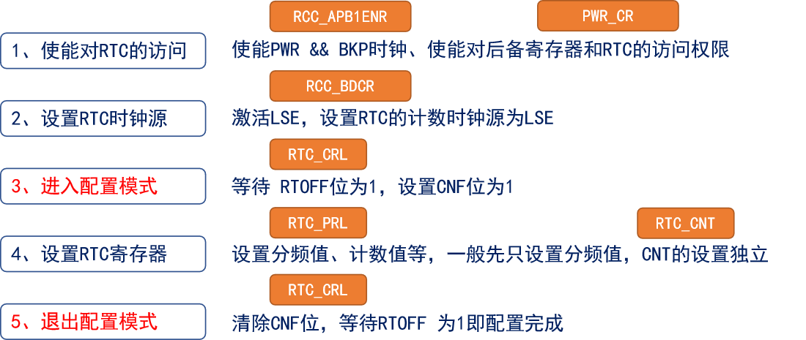
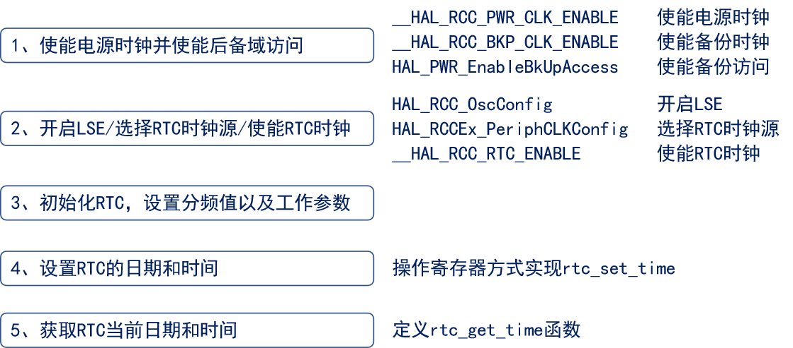
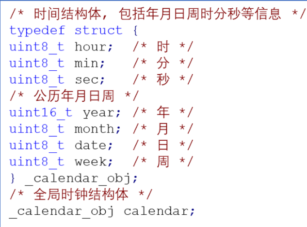

<!--
 * @Date: 2024-06-06
 * @LastEditors: GoKo-Son626
 * @LastEditTime: 2024-08-03
 * @FilePath: \STM32_Study\入门篇\12.RTC\RTC.md
 * @Description: 该模板为所有笔记模板
-->

# RTC

> 内容目录：
> 
>       1. RTC简介（了解）
>       2. STM32 RTC框图介绍（熟悉）
>       3. RTC相关寄存器介绍（熟悉）
>       4. RTC相关HAL库驱动介绍（掌握）
>       5. RTC基本驱动步骤（掌握）
>       6. 时间设置和读取（掌握）
>       7. 编程实战（掌握）

#### 1. RTC简介（了解）

- **实时时钟(Real Time Clock，RTC)，本质是一个定时计数器，计数频率常为秒，专门用来记录时间。RTC需要一个稳定的时钟源来驱动其计时功能。常用的RTC时钟源包括LSE（低速外部振荡器）和LSI（低速内部振荡器）。**
> 特性：
> 1. 能提供时间（秒钟数）
> 2. 能在MCU掉电后运行
> 3. 低功耗

- **普通定时器无法拿来作时钟，因为无法掉电运行！**

**RTC方案**

1. 一般都需要设计RTC外围电路；
2. 一般都可以给RTC设置独立的电源；
3. 多数RTC的寄存器采用[**BCD码**](https://baike.baidu.com/item/BCD%E7%A0%81/826461?fr=aladdin)存储时间信息；

#### 2. STM32 RTC框图介绍

**RTC框图**

s
> 1. RTC预分频系数
> 2. 32位可编程计数器
> 3. 待机唤醒
> 4. RTC控制器与APB1接口

#### 3. RTC相关寄存器介绍

**RTC基本配置步骤与寄存器关系**

#### 4. RTC相关HAL库驱动介绍

| 驱动函数                       | 关联寄存器        | 功能描述              |
| ------------------------------ | ----------------- | --------------------- |
| HAL_RTC_Init(...)              | CRL/CRH/PRLH/PRLL | 初始化RTC             |
| HAL_RTC_MspInit(…)             | 初始化回调        | 使能RTC时钟           |
| HAL_RCC_OscConfig(…)           | RCC_CR/PWR_CR     | 开启LSE时钟源         |
| HAL_RCCEx_PeriphCLKConfig(...) | RCC_BDCR          | 设置RTC时钟源为LSE    |
| HAL_PWR_EnableBkUpAccess(...)  | PWR_CR            | 使能备份域的访问权限  |
| HAL_RTCEx_BKUPWrite/Read()     | BKP_DRx           | 读/写备份域数据寄存器 |

**需要开启的时钟源：**
1. __HAL_RCC_RTC_ENABLE()
2. __HAL_RCC_PWR_CLK_ENABLE()
3. __HAL_RCC_BKP_CLK_ENABLE()

#### 5. RTC基本驱动步骤

**RTC基本驱动步骤**

#### 6. 时间设置和读取

> 由于F1的RTC没有日历寄存器，使用时只存储总秒数，不利于直接设置和显示，所以我们还需要编写函数把时间变成我们日常的日历时间

**全局的结构体变量calendar存储时间信息**

| 驱动函数                    | 功能描述                 |
| --------------------------- | ------------------------ |
| rtc_get_time(…)             | 总秒数转成日历时间       |
| rtc_is_leap_year(…)         | 判断是否闰年             |
| uint8_t rtc_get_week(…)     | 计算公历日历对应的星期几 |
| static long rtc_date2sec(…) | 日历时间转成对应总秒数   |

#### 7. 编程实战

