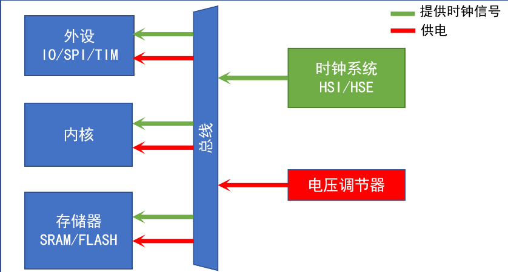

<!--
 * @Date: 2024-06-06
 * @LastEditors: GoKo-Son626
 * @LastEditTime: 2024-08-03
 * @FilePath: \STM32_Study\入门篇\13.LOW POWER\LOW POWER.md
 * @Description: 该模板为所有笔记模板
-->

# LOW POWER

> 内容目录：
> 
>       1. STM32 电源系统结结构介绍
>       2. 低功耗模式介绍
>       3. 低功耗相关寄存器介绍
>       4. 低功耗相关HAL库驱动介绍
>       5. 低功耗模式的使用步骤
>       6. 编程实战

### 1. STM32 电源系统结构介绍（了解）

STM32 电源系统结构介绍

### 2. 低功耗模式介绍（熟悉）

- **低功耗是指降低集成电路的能量消耗**

- STM32具有运行、睡眠、停止和待机四种工作模式。
- 上电后默认是在运行模式，当内核不需要继续运行时，可以选择后面三种低功耗模式。

| 低功耗模式 | 操作                                             |
| ---------- | ------------------------------------------------ |
| 睡眠模式   | 内核时钟关闭                                     |
| 停止模式   | 睡眠 + 关闭内核逻辑电路的所有时钟 + 关闭时钟系统 |
| 待机模式   | 停止 + 关闭电压调节器                            |

**低功耗模式表**
| 模式                       | 进入                              | 唤醒                                                                            | 对内核电路时钟影响                      | 对VDD区域时钟的影响  | 电压调节器                                             |
| -------------------------- | --------------------------------- | ------------------------------------------------------------------------------- | --------------------------------------- | -------------------- | ------------------------------------------------------ |
| 睡眠(立即休眠或退出时休眠) | WFI/WFE                           | 任意中断/唤醒事件                                                               | CPU时钟关，对其他时钟或模拟时钟源无影响 | 无                   | 开                                                     |
| 停止                       | PDDS和LPDS位+SLEEPDEEP位+WFI或WFE | 任意外部中断（在外部中断寄存器中设置）                                          | 关闭所有内核电路时钟                    | HSI和HSE的振荡器关闭 | 开启或处于低功耗模式（依据电源控制寄存器PWR_CR的设定） |
| 待机                       | PDDS位+SLEEPDEEP位+WFI或WFE       | WKUP引脚的上升沿、RTC闹钟(唤醒/入侵/时间戳)事件、NRST引脚上的外部复位、IWDG复位 | 关闭所有内核电路时钟                    | HSI和HSE的振荡器关闭 | 关                                                     |

三种模式的功耗（F1）
- 同等条件下（T = 25°C，VDD = 3.3V，系统时钟72MHz）

| 模式     | 主要影响                           | 唤醒时间 | 供应电流(典型值) |
| -------- | ---------------------------------- | -------- | ---------------- |
| 正常模式 | 所有外设正常工作                   | 0        | 51mA             |
| 睡眠模式 | CPU时钟关闭                        | 1.8us    | 29.5mA           |
| 停止模式 | 1.8V区域时钟关闭, 电压调节器低功耗 | 5.4us    | 35uA             |
| 待机模式 | 1.8V区域时钟关闭, 电压调节器关闭   | 50us     | 3.8uA            |

### 3. 低功耗相关寄存器介绍（熟悉）

| 寄存器  | 名称                | 作用                                               |
| ------- | ------------------- | -------------------------------------------------- |
| SCB_SCR | 系统控制寄存器      | 选择休眠和深度休眠模式，用于其他低功耗特性的控制   |
| PWR_CR  | 电源控制寄存器      | 可以设置低功耗相关（清除标记位、模式）             |
| PWR_CSR | 电源控制/状态寄存器 | 用于查看系统当前状态（待机/唤醒标志 使能唤醒引脚） |

**WFI命令和WFE命令**

| 特性             | WFI                  | WFE                          |
| ---------------- | -------------------- | ---------------------------- |
| 唤醒源           | 中断                 | 中断或事件                   |
| 睡眠条件         | 等待中断             | 等待事件（事件信号或中断）   |
| 事件挂起时的行为 | 无                   | 事件挂起时立即返回           |
| 用途             | 简单的低功耗等待中断 | 更复杂的低功耗等待事件或中断 |
### 4. 低功耗相关HAL库驱动介绍（掌握）

| 驱动函数                    | 关联寄存器           | 功能描述             |
| --------------------------- | -------------------- | -------------------- |
| HAL_PWR_EnterSLEEPMode(...) | SCB_SCR	进入睡眠模式 |
| HAL_PWR_EnterSTOPMode(…)    | PWR_CR/SCB_SCR       | 进入停止模式         |
| HAL_PWR_EnterSTANDBYMode(…) | PWR_CR/SCB_SCR       | 进入待机模式         |
| HAL_PWR_EnableWakeUpPin(…)  | PWR_CSR              | 使能WKUP管脚唤醒功能 |
| __HAL_PWR_CLEAR_FLAG(…)     | PWR_CR               | 清除PWR的相关标记    |
| __HAL_RCC_PWR_CLK_ENABLE(…) | RCC_APB1ENR          | 使能电源时钟         |

### 5. 低功耗模式的使用步骤（掌握）

### 6. 编程实战（掌握）
