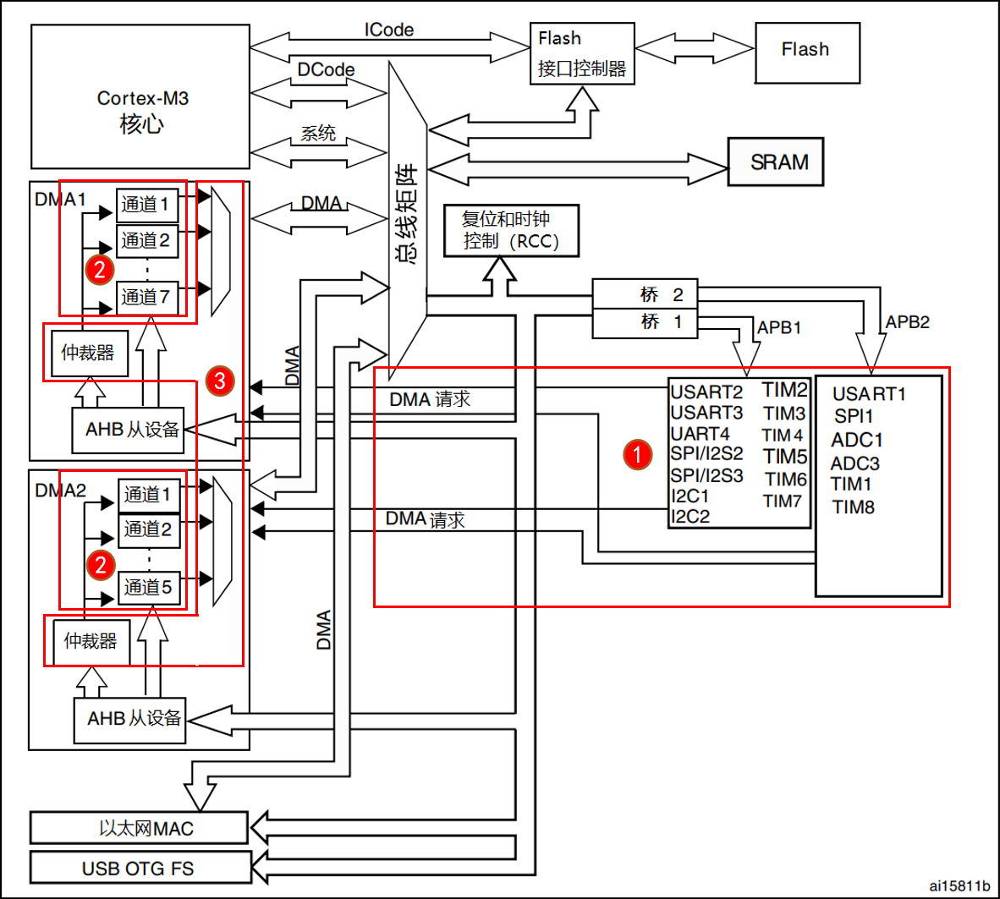

<!--
 * @Date: 2024-06-06
 * @LastEditors: GoKo-Son626
 * @LastEditTime: 2024-08-03
 * @FilePath: \STM32_Study\入门篇\14.DMA\DMA.md
 * @Description: 该模板为所有笔记模板
-->

# 文件内容标题

> 内容目录：
> 
>       1. DMA介绍（了解）
>       2. DMA结构框图介绍（熟悉）
>       3. DMA相关寄存器介绍（熟悉）
>       4. DMA相关HAL库驱动介绍（掌握）
>       5. DMA配置步骤（掌握）
>       6. 编程实战（掌握）


### 1. DMA介绍（了解）

> DMA，全称Direct Memory Access，即直接存储器访问。
> DMA传输 将数据从一个地址空间复制到另一个地址空间。
> **数据搬运工|为CPU减负**
> DMA传输无需CPU直接控制传输，也没有中断处理方式那样保留现场和恢复现场过程，通过硬件为RAM和IO设备开辟一条直接传输数据的通道，使得CPU的效率大大提高

### 2. DMA结构框图介绍（熟悉）


| 区域       | 作用                                                                                                        |
| ---------- | ----------------------------------------------------------------------------------------------------------- |
| ①DMA请求   | DMA传输数据，先向DMA控制器发送请求                                                                          |
| ②DMA通道   | 不同外设向DMA的不同通道发送请求，DMA1有7个通道，DMA2有5个通道                                               |
| ③DMA优先级 | 多个DMA通道同时发来请求时，就有先后响应处理的顺序问题，这个由仲裁器管理（优先级管理也分软件阶段和硬件阶段） |


### 3. DMA相关寄存器介绍（熟悉）

寄存器	名称	作用
DMA_CCRx	DMA通道x配置寄存器	用于配置DMA（核心控制寄存器）
DMA_ISR	DMA中断状态寄存器	用于查询当前DMA传输状态
DMA_IFCR	DMA中断标志清除寄存器	用来清除DMA_ISR对应位
DMA_CNDTRx	DMA通道x传输数量寄存器	用于控制DMA通道x每次传输的数据量
DMA_CPARx	DMA通道x外设地址寄存器	用于存储STM32外设地址
DMA_CMARx	DMA通道x存储器地址寄存器	用于存放存储器的地址
USART_CR3	USART控制寄存器3	用于使能串口DMA发送


### 4. DMA相关HAL库驱动介绍（掌握）

驱动函数	关联寄存器	功能描述
__HAL_RCC_DMAx_CLK_ENABLE(…)	RCC_AHBENR	使能DMAx时钟
HAL_DMA_Init(…)	DMA_CCR	初始化DMA
HAL_DMA_Start_IT(…)	DMA_CCR/CPAR/CMAR/CNDTR	开始DMA传输
__HAL_LINKDMA(…)		用来连接DMA和外设句柄
HAL_UART_Transmit_DMA(…)	CCR/CPAR/CMAR/CNDTR/USART_CR3	使能DMA发送，启动传输
__HAL_DMA_GET_FLAG(…)	DMA_ISR	查询DMA传输通道的状态
__HAL_DMA_ENABLE(…)	DMA_CCR(EN)	使能DMA外设
__HAL_DMA_DISABLE(…)	DMA_CCR(EN)	失能DMA外设

- DMA外设相关结构体：**`DMA_HandleTypeDef`** 和 **`DMA_InitTypeDef`**

| DMA_HandleTypeDef             | DMA_InitTypeDef                                 |
| ----------------------------- | ----------------------------------------------- |
| DMA_Channel_TypeDef	*Instance | uint32_t Direction			/* DMA传输方向 */          |
| DMA_InitTypeDef 		Init        | uint32_t PeriphInc			/* 外设地址(非)增量 */     |
| /                             | uint32_t MemInc			/* 存储器地址(非)增量*/       |
| /                             | uint32_t PeriphDataAlignment	/* 外设数据宽度 */ |
| /                             | uint32_t MemDataAlignment	/* 存储器数据宽度 */  |
| /                             | uint32_t Mode				/* 操作模式 */                 |
| /                             | uint32_t Priority				/* DMA通道优先级 */        |

### 5. DMA配置步骤（掌握）

| 步骤                           | 函数                                                                            |
| ------------------------------ | ------------------------------------------------------------------------------- |
| 1、使能DMA时钟                 | __HAL_RCC_DMA1_CLK_ENABLE                                                       |
| 2、初始化DMA                   | HAL_DMA_Init函数初始化DMA相关参数 __HAL_LINKDMA函数连接DMA和外设                |
| 3、使能串口的DMA发送，启动传输 | HAL_UART_Transmit_DMA                                                           |
| ---                            | ---                                                                             |
| 查询DMA传输状态                | __HAL_DMA_GET_FLAG 查询通道传输状态__HAL_DMA_GET_COUNTER 获取当前传输剩余数据量 |
| DMA中断使用                    | HAL_NVIC_EnableIRQ                                                              |
| HAL_NVIC_SetPriority           | 编写中断服务函数 xxx_IRQHandler                                                 |
### 6. 编程实战（掌握）

**DMA初始化**
```c
/**
 * @brief       串口TX DMA初始化函数
 *   @note      这里的传输形式是固定的, 这点要根据不同的情况来修改
 *              从存储器 -> 外设模式/8位数据宽度/存储器增量模式
 *
 * @param       dmax_chy    : DMA的通道, DMA1_Channel1 ~ DMA1_Channel7, DMA2_Channel1 ~ DMA2_Channel5
 *                            某个外设对应哪个DMA, 哪个通道, 请参考<<STM32中文参考手册 V10>> 10.3.7节
 *                            必须设置正确的DMA及通道, 才能正常使用! 
 * @retval      无
 */
void dma_init(DMA_Channel_TypeDef* DMAx_CHx)
{
    if ((uint32_t)DMAx_CHx > (uint32_t)DMA1_Channel7)     /* 大于DMA1_Channel7, 则为DMA2的通道了 */
    {
        __HAL_RCC_DMA2_CLK_ENABLE();                      /* DMA2时钟使能 */
    }
    else 
    {
        __HAL_RCC_DMA1_CLK_ENABLE();                      /* DMA1时钟使能 */
    }
    
    __HAL_LINKDMA(&g_uart1_handle, hdmatx, g_dma_handle);           /* 将DMA与USART1联系起来(发送DMA) */
    
    /* Tx DMA配置 */
    g_dma_handle.Instance = DMAx_CHx;                               /* USART1_TX使用的DMA通道为: DMA1_Channel4 */
    g_dma_handle.Init.Direction = DMA_MEMORY_TO_PERIPH;             /* DIR = 1 , 存储器到外设模式 */
    g_dma_handle.Init.PeriphInc = DMA_PINC_DISABLE;                 /* 外设非增量模式 */
    g_dma_handle.Init.MemInc = DMA_MINC_ENABLE;                     /* 存储器增量模式 */
    g_dma_handle.Init.PeriphDataAlignment = DMA_PDATAALIGN_BYTE;    /* 外设数据长度:8位 */
    g_dma_handle.Init.MemDataAlignment = DMA_MDATAALIGN_BYTE;       /* 存储器数据长度:8位 */
    g_dma_handle.Init.Mode = DMA_NORMAL;                            /* DMA模式:正常模式 */
    g_dma_handle.Init.Priority = DMA_PRIORITY_MEDIUM;               /* 中等优先级 */

    HAL_DMA_Init(&g_dma_handle);
}
```