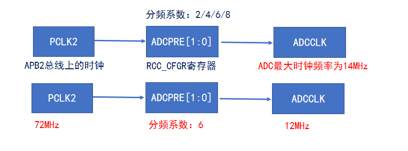

<!--
 * @Date: 2024-06-06
 * @LastEditors: GoKo-Son626
 * @LastEditTime: 2024-08-04
 * @FilePath: \STM32_Study\入门篇\15.ADC\ADC.md
 * @Description: 该模板为所有笔记模板
-->

# ADC

> 内容目录：
> 
>       1. ADC简介（了解）
>       2. ADC工作原理（掌握）
>       3. 单通道ADC采集实验（熟悉）
>       4. 单通道ADC采集（DMA读取）实验（熟悉）
>       5. 多通道ADC采集（DMA读取）实验（熟悉）
>       6. 单通道ADC过采样实验（熟悉）
>       7. 内部温度传感器实验（熟悉）
>       8. 光敏传感器实验（熟悉）

### 1. ADC简介（了解）

- **ADC，全称：Analog-to-Digital Converter，指模拟/数字转换器**
  
**常见的ADC类型**

| ADC电路类型 | 优点             | 缺点                     |
| ----------- | ---------------- | ------------------------ |
| 并联比较型  | 转换速度最快     | 成本高、功耗高，分辨率低 |
| 逐次逼近型  | 结构简单，功耗低 | 转换速度较慢             |

**ADC的特性参数**
- 分辨率（刻度划分）：表示ADC能辨别的最小模拟量，用二进制位数表示，比如：8、10、12、16位等
- 转换时间：表示完成一次A/D转换所需要的时间，转换时间越短，采样率就可以越高
- 精度（物理量的精准程度）：最小刻度基础上叠加各种误差的参数，精度受ADC性能、温度和气压等影响
- 量化误差：用数字量近似表示模拟量，采用四舍五入原则，此过程产生的误差为量化误差

### 2. ADC工作原理（掌握）

**ADC框图简介**

①参考电压/模拟部分电压
②输入通道
③转换序列
④触发源
⑤转换时间
⑥数据寄存器
⑦中断

- A/D转换被组织为两组：规则组（常规转换组）和注入组（注入转换组）
规则组最多可以有16个转换，注入组最多有4个转换

**ADC触发源**

**转换时间**

**转换时间设置：**
### ADC转换时间： TCONV = 采样时间 + 12.5个周期

- 采样时间可通过SMPx[2:0]位设置，x=0~17
  
| SMP       | 周期数             |
| --------- | ------------------ |
| SMP = 000 | 1.5个ADC时钟周期   |
| SMP = 001 | 7.5个ADC时钟周期   |
| SMP = 010 | 13.5个ADC时钟周期  |
| SMP = 011 | 28.5个ADC时钟周期  |
| SMP = 100 | 41.5个ADC时钟周期  |
| SMP = 101 | 55.5个ADC时钟周期  |
| SMP = 110 | 71.5个ADC时钟周期  |
| SMP = 111 | 239.5个ADC时钟周期 |

**举个例子：** ADC时钟频率为12MHz时，ADC最短的转换时间是多少？

        TCONV = 采样时间 + 12.5个周期 = 1.5个周期 + 12.5个周期 = 14个周期 = (1/12000000)∗14 s = 1.17us

### 3. 单通道ADC采集实验（熟悉）

### 4. 单通道ADC采集（DMA读取）实验（熟悉）

### 5. 多通道ADC采集（DMA读取）实验（熟悉）

### 6. 单通道ADC过采样实验（熟悉）

### 7. 内部温度传感器实验（熟悉）

### 8. 光敏传感器实验（熟悉）
