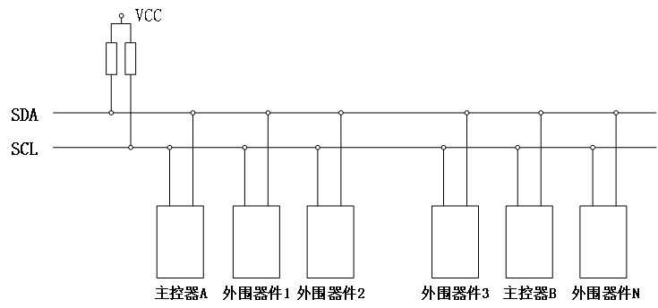
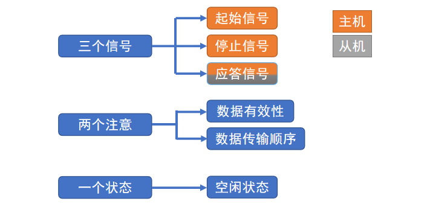
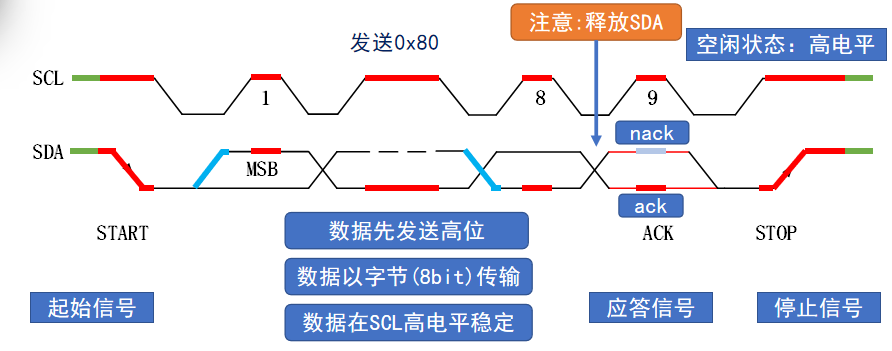
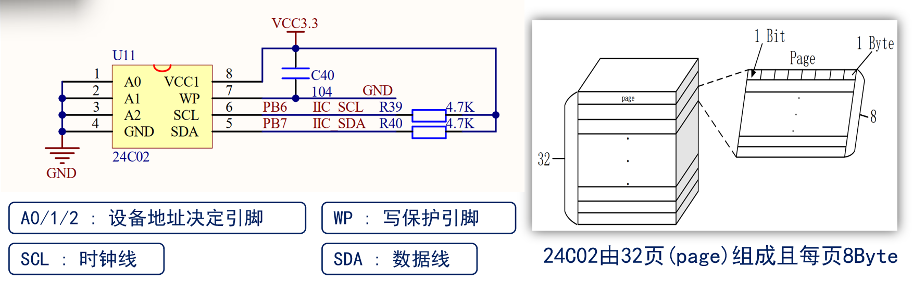
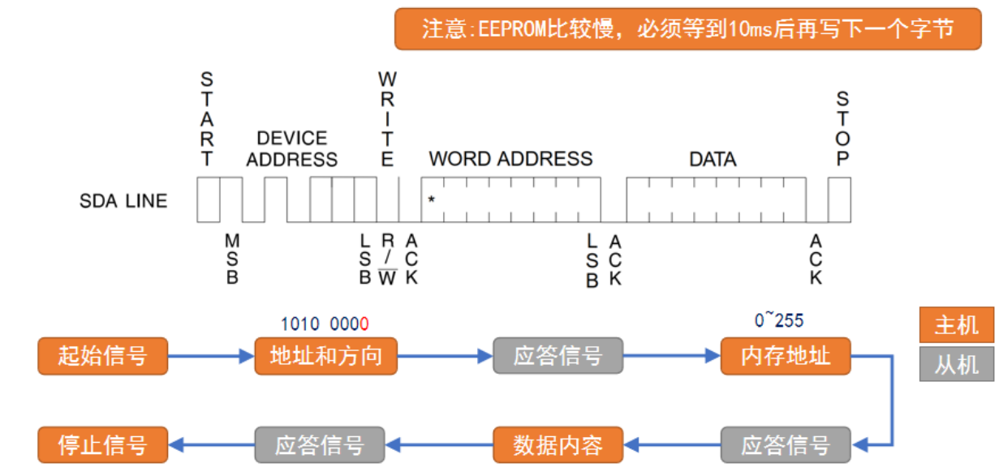
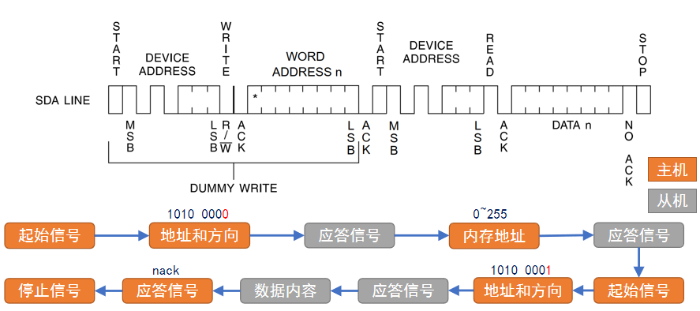
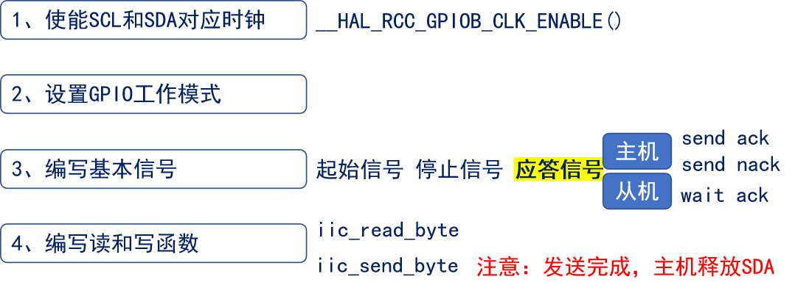

<!--
 * @Date: 2024-06-06
 * @LastEditors: GoKo-Son626
 * @LastEditTime: 2024-08-04
 * @FilePath: \STM32_Study\入门篇\17.IIC\IIC.md
 * @Description: 该模板为所有笔记模板
-->

# IIC

> 内容目录：
> 
>       1. IIC总线协议介绍（掌握）
>       2. AT24C02介绍（了解）
>       3. AT24C02读写时序（掌握）
>       4. AT24C02驱动步骤（掌握）
>       5. 编程实战（掌握）


### 1. IIC总线协议介绍（掌握）

- **IIC：Inter Integrated Circuit，集成电路总线，是一种同步 串行 半双工通信总线.**
- **总线/协议:总线就是传输数据通道, 协议就是传输数据的规则**

**IIC总线结构图**


① 由时钟线SCL和数据线SDA组成，并且都接上拉电阻，确保总线空闲状态为高电平
② 总线支持多设备连接，允许多主机存在，每个设备都有一个唯一的地址
③ 连接到总线上的数目受总线的最大电容400pf限制
④ 数据传输速率：标准模式100k bit/s  快速模式400k bit/s 高速模式3.4Mbit/s

**IIC协议**


**IIC协议时序**

- 起始信号(S)：当SCL为高电平时，SDA从高电平变为低电平
- 停止信号(P)：当SCL为高电平时，SDA从低电平变为高电平
- 应答信号：上拉电阻影响下SDA默认为高，而从机拉低SDA就是确认收到数据即ACK，否则NACK

### 2. AT24C02介绍（了解）

- **EEPROM是一种掉电后数据不丢失的储存器，常用来存储一些配置信息，在系统重新上电时就可以加载。**
- AT24C02是一个2K bit的EEPROM存储器，使用IIC通信方式。


- 24C02由32页(page)组成且每页8Byte

**AT24C02xx**
| AT24Cxx	容量（bit） | 页数               | 页内字节数 | 数据地址(占用bit数) |
| ------------------- | ------------------ | ---------- | ------------------- |
| AT24C01             | 1K bit (128 B)     | 16         | 8 Byte              | 7bit  |
| AT24C02             | 2K bit (256 B)     | 32         | 8 Byte              | 8bit  |
| AT24C04             | 4K bit (512 B)     | 32         | 16 Byte             | 9bit  |
| AT24C08             | 8K bit (1024 B)    | 64         | 16 Byte             | 10bit |
| AT24C16             | 16K bit (2048 B)   | 128        | 16 Byte             | 11bit |
| AT24C32             | 32K bit (4096 B)   | 128        | 32 Byte             | 12bit |
| AT24C64             | 64K bit (8192 B)   | 256        | 32 Byte             | 13bit |
| AT24C128            | 128K bit (16384 B) | 256        | 64 Byte             | 14bit |
| AT24C256            | 256K bit (32768 B) | 512        | 64 Byte             | 15bit |
| AT24C512            | 512K bit (65535 B) | 512        | 128 Byte            | 16bit |

### 3. AT24C02读写时序（掌握）

**写操作**
1. AT24C02支持字节写模式和页写模式。
2. 字节写模式就是一个地址一个数据进行写入。
3. 页写模式就是连续写入数据。只需要写一个地址，连续写入数据时地址会自增，但存在页的限制，超出一页时，超出数据覆盖原先写入的数据。但读会自动翻页。

**读操作**
1. AT24C02支持当前地址读模式，随机地址读模式和顺序读模式。
2. 当前读模式是基于上一次读/写操作的最后位置继续读出数据。
3. 随机地址读模式是指定地址读出数据。
4. 顺序读模式是连续读出数据。

AT24C02写时序

AT24C02读时序



### 4. AT24C02驱动步骤（掌握）

**硬件和软件IIC对比**
| IIC     | 用法             | 速度 | 稳定性 | 管脚               |
| ------- | ---------------- | ---- | ------ | ------------------ |
| 硬件IIC | 比较复杂         | 快   | 较稳定 | 需使用特定管脚     |
| 软件IIC | 操作过程比较清晰 | 较慢 | 稳定   | 任意管脚，比较灵活 |

**IIC配置步骤**

**AT24C02驱动步骤**
1. 初始化IIC接口
2. 编写写入/读取一个字节数据函数： 遵循时序流程编写
3. 编写连续读和连续写函数： 在2的基础上进行实现

### 5. 编程实战（掌握）

```c
/**
 * @brief       初始化IIC接口
 * @param       无
 * @retval      无
 */
void at24cxx_init(void)
{
    iic_init();
}
/**
 * @brief       在AT24CXX指定地址读出一个数据
 * @param       readaddr: 开始读数的地址
 * @retval      读到的数据
 */
uint8_t at24cxx_read_one_byte(uint16_t addr)
{
    uint8_t temp = 0;
    iic_start();                /* 发送起始信号 */

    /* 根据不同的24CXX型号, 发送高位地址
     * 1, 24C16以上的型号, 分2个字节发送地址
     * 2, 24C16及以下的型号, 分1个低字节地址 + 占用器件地址的bit1~bit3位 用于表示高位地址, 最多11位地址
     *    对于24C01/02, 其器件地址格式(8bit)为: 1  0  1  0  A2  A1  A0  R/W
     *    对于24C04,    其器件地址格式(8bit)为: 1  0  1  0  A2  A1  a8  R/W
     *    对于24C08,    其器件地址格式(8bit)为: 1  0  1  0  A2  a9  a8  R/W
     *    对于24C16,    其器件地址格式(8bit)为: 1  0  1  0  a10 a9  a8  R/W
     *    R/W      : 读/写控制位 0,表示写; 1,表示读;
     *    A0/A1/A2 : 对应器件的1,2,3引脚(只有24C01/02/04/8有这些脚)
     *    a8/a9/a10: 对应存储整列的高位地址, 11bit地址最多可以表示2048个位置,可以寻址24C16及以内的型号
     */    
    if (EE_TYPE > AT24C16)      /* 24C16以上的型号, 分2个字节发送地址 */
    {
        iic_send_byte(0XA0);    /* 发送写命令, IIC规定最低位是0, 表示写入 */
        iic_wait_ack();         /* 每次发送完一个字节,都要等待ACK */
        iic_send_byte(addr >> 8);/* 发送高字节地址 */
    }
    else 
    {
        iic_send_byte(0XA0 + ((addr >> 8) << 1));   /* 发送器件 0XA0 + 高位a8/a9/a10地址,写数据 */
    }
    
    iic_wait_ack();             /* 每次发送完一个字节,都要等待ACK */
    iic_send_byte(addr % 256);  /* 发送低位地址 */
    iic_wait_ack();             /* 等待ACK, 此时地址发送完成了 */
    
    iic_start();                /* 重新发送起始信号 */ 
    iic_send_byte(0XA1);        /* 进入接收模式, IIC规定最低位是0, 表示读取 */
    iic_wait_ack();             /* 每次发送完一个字节,都要等待ACK */
    temp = iic_read_byte(0);    /* 接收一个字节数据 */
    iic_stop();                 /* 产生一个停止条件 */
    return temp;
}

/**
 * @brief       在AT24CXX指定地址写入一个数据
 * @param       addr: 写入数据的目的地址
 * @param       data: 要写入的数据
 * @retval      无
 */
void at24cxx_write_one_byte(uint16_t addr, uint8_t data)
{
    /* 原理说明见:at24cxx_read_one_byte函数, 本函数完全类似 */
    iic_start();                /* 发送起始信号 */

    if (EE_TYPE > AT24C16)      /* 24C16以上的型号, 分2个字节发送地址 */
    {
        iic_send_byte(0XA0);    /* 发送写命令, IIC规定最低位是0, 表示写入 */
        iic_wait_ack();         /* 每次发送完一个字节,都要等待ACK */
        iic_send_byte(addr >> 8);/* 发送高字节地址 */
    }
    else 
    {
        iic_send_byte(0XA0 + ((addr >> 8) << 1));   /* 发送器件 0XA0 + 高位a8/a9/a10地址,写数据 */
    }
    
    iic_wait_ack();             /* 每次发送完一个字节,都要等待ACK */
    iic_send_byte(addr % 256);  /* 发送低位地址 */
    iic_wait_ack();             /* 等待ACK, 此时地址发送完成了 */
    
    /* 因为写数据的时候,不需要进入接收模式了,所以这里不用重新发送起始信号了 */
    iic_send_byte(data);        /* 发送1字节 */
    iic_wait_ack();             /* 等待ACK */
    iic_stop();                 /* 产生一个停止条件 */
    delay_ms(10);               /* 注意: EEPROM 写入比较慢,必须等到10ms后再写下一个字节 */
}
```
