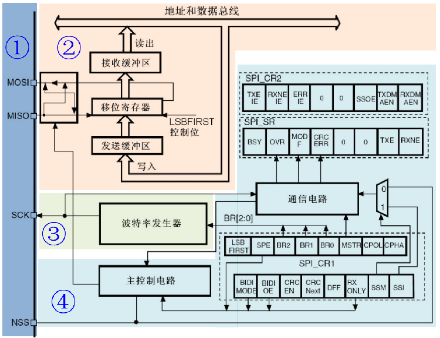
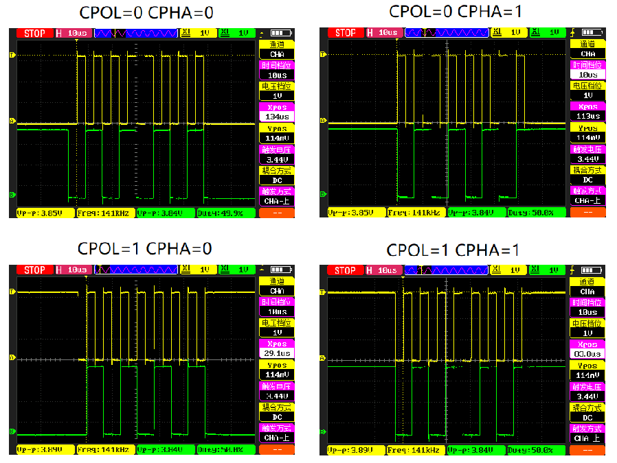
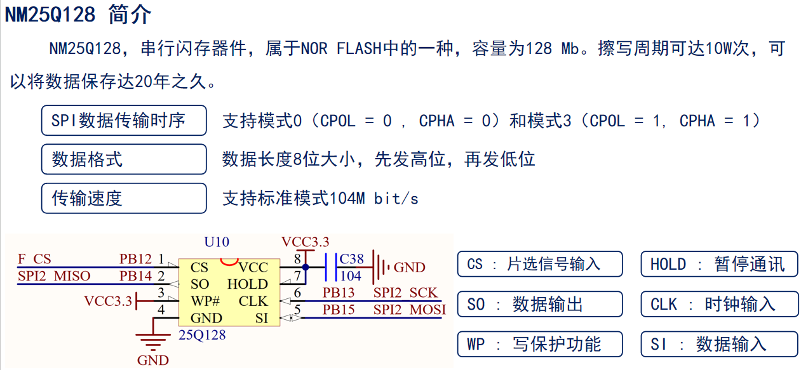
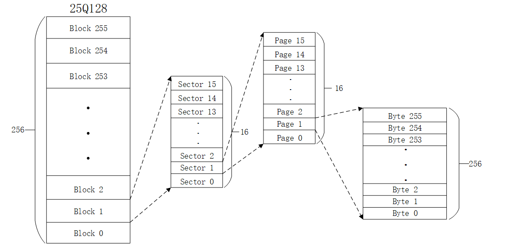
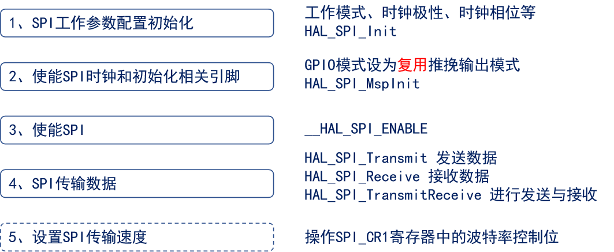
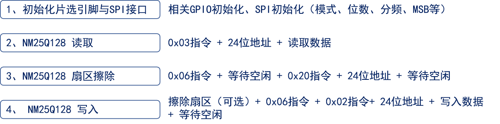

<!--
 * @Date: 2024-06-06
 * @LastEditors: GoKo-Son626
 * @LastEditTime: 2024-08-05
 * @FilePath: \STM32_Study\入门篇\18.SPI\SPI.md
 * @Description: 该模板为所有笔记模板
-->

# SPI

> 内容目录：
> 
>       1. 1，SPI介绍（了解）
>       2. SPI结构框图介绍（熟悉）
>       3. SPI工作模式介绍（熟悉）
>       4. SPI相关寄存器介绍（熟悉）
>       5. SPI相关HAL库驱动介绍（掌握）
>       6. NOR FLASH介绍（掌握）
>       7. NOR FLASH基本驱动步骤（掌握）
>       8. 编程实战（掌握）

### 1. SPI介绍（了解）

- **SPI：串行外设设备接口（Serial Peripheral Interface），是一种高速的，全双工，同步的通信总线。**
| 功能说明 | SPI总线             | IIC总线                |
| -------- | ------------------- | ---------------------- |
| 通信方式 | 同步 串行 全双工    | 同步 串行 半双工       |
| 总线接口 | MOSI、MISO、SCL、CS | SDA、SCL               |
| 拓扑结构 | 一主多从/一主一从   | 多主从                 |
| 从机选择 | 片选引脚选择        | SDA上设备地址片选      |
| 通信速率 | 一般50MHz以下       | 100kHz、400kHz、3.4MHz |
| 数据格式 | 8位/16位            | 8位                    |
| 传输顺序 | MSB/LSB             | MSB                    |

- SPI接口主要应用在存储芯片、AD转换器以及LCD中。

### 2. SPI结构框图介绍（熟悉）

**SPI结构框图**

**①SPI相关引脚**:MOSI（输出数据线）MISO（输入数据线）SCK（时钟）NSS（片选）
**②数据发送和接收**:与缓冲区、移位寄存器以及引脚相关
**③时钟信号**:SPI时钟信号是通过SPI_CR1寄存器配置
**④主控制逻辑**:涉及两个控制寄存器SPI_CR1/2用于配置SPI工作，SPI_SR用于查看工作状态

**外设对应引脚：**
- STM32F1有三个SPI。

| F1  | 引脚 | SPI1 | SPI2 | SPI3 |
| --- | ---- | ---- | ---- | ---- |
| -   | NSS  | PA4  | PB12 | PA15 |
| -   | CLK  | PA5  | PB13 | PB3  |
| -   | MISO | PA6  | PB14 | PB4  |
| -   | MOSI | PA7  | PB15 | PB5  |

> F4 / F7 / H7 系列芯片SPI外设都有6个，分别为SPI1、SPI2、SPI3、SPI4、SPI5和SPI6.不同系列的SPI外设用到的引脚是不一样的.

### 3. SPI工作模式介绍（熟悉）

- **决定数据的有效性**
时钟极性(CPOL)

        没有数据传输时时钟线的空闲状态电平
        0：SCK在空闲状态保持低电平
        1：SCK在空闲状态保持高电平
时钟相位(CPHA)

        时钟线在第几个时钟边沿采样数据
        0：SCK的第一(奇数)边沿进行数据位采样，数据在第一个时钟边沿被锁存
        1：SCK的第二(偶数)边沿进行数据位采样，数据在第二个时钟边沿被锁存

| SPI工作模式 | CPOL | CPHA | SCL空闲状态 | 采样边沿 | 采样时刻 |
| ----------- | ---- | ---- | ----------- | -------- | -------- |
| 0           | 0    | 0    | 低电平      | 上升沿   | 奇数边沿 |
| 1           | 0    | 1    | 低电平      | 下降沿   | 偶数边沿 |
| 2           | 1    | 0    | 高电平      | 下降沿   | 奇数边沿 |
| 3           | 1    | 1    | 高电平      | 上升沿   | 偶数边沿 |

- 棕黄色：SCL 深绿色：MOSI
- 传输顺序：MSB
- 传输帧格式：8bit

### 4. SPI相关寄存器介绍（熟悉）

| 寄存器  | 名称           | 作用                                                |
| ------- | -------------- | --------------------------------------------------- |
| SPI_CR1 | SPI控制寄存器1 | 用于配置SPI工作参数                                 |
| SPI_SR  | SPI状态寄存器  | 用于查询当前SPI传输状态（TXE、RXNE）                |
| SPI_DR  | SPI数据寄存器  | 用于存放待发送数据或接收数据，有两个缓冲区（TX/RX） |

### 5. SPI相关HAL库驱动介绍（掌握）

| 驱动函数                     | 关联寄存器    | 功能描述          |
| ---------------------------- | ------------- | ----------------- |
| __HAL_RCC_SPIx_CLK_ENABLE(…) | RCC_APB2ENR   | 使能SPIx时钟      |
| HAL_SPI_Init(…)              | SPI_CR1       | 初始化SPI         |
| HAL_SPI_MspInit(…)           | 初始化回调    | 初始化SPI相关引脚 |
| HAL_SPI_Transmit(…)          | SPI_DR/SPI_SR | SPI发送           |
| HAL_SPI_Receive(…)           | SPI_DR/SPI_SR | SPI接收           |
| HAL_SPI_TransmitReceive(…)   | SPI_DR/SPI_SR | SPI接收发送       |
| __HAL_SPI_ENABLE(…)          | SPI_CR1(SPE)  | 使能SPI外设       |
| __HAL_SPI_DISABLE(…)         | SPI_CR1(SPE)  | 失能SPI外设       |

**结构体：`SPI_HandleTypeDef`**

        SPI_TypeDef		*Instance
        SPI_InitTypeDef 		Init
**结构体：`SPI_InitTypeDef`**

        uint32_t Mode				/* SPI模式（主机）  */
        uint32_t Direction			/* 工作方式（全双工） */
        uint32_t DataSize			/* 帧格式（8位） */
        uint32_t CLKPolarity			/* 时钟极性（CPOL = 0） */
        uint32_t CLKPhase			/* 时钟相位 （CPHA = 0）*/
        uint32_t NSS				/* SS控制方式（软件） */
        uint32_t BaudRatePrescaler		/* SPI波特率预分频值 */
        uint32_t FirstBit				/* 数据传输顺序（MSB）*/
        uint32_t TIMode				/* 帧格式：Motorola / TI  */
        uint32_t CRCCalculation		/* 设置硬件CRC校验 */
        uint32_t CRCPolynomial		/*  设置CRC校验多项式 */
        …
        (对于F7/H7来说，还有一些附加功能相关成员(NSS/CRC/IOSwap))

### 6. NOR FLASH介绍（掌握）

> 1. FLASH是常用的用于储存数据的半导体器件，它具有容量大，可重复擦写、按“扇区/块”擦除、掉电后数据可继续保存的特性。
> 2. FLASH是有一个物理特性：只能写0，不能写1，写1靠擦除。
> 3. FLASH主要有NOR Flash和NAND Flash两种类型，NOR和NAND是两种数字门电路。
> 
> | 类型 | 特点  | 应用举例                                                                     |
> | ---- | ----- | ---------------------------------------------------------------------------- |
> | NOR  | FLASH | 基于字节读写，读取速度快，独立地址/数据线，无坏块，支持XIP	25Qxx、程序ROM    |
> | NAND | FLASH | 基于块读写，读取速度稍慢，地址数据线共用，有坏块，不支持XIP	EMMC、SSD、U盘等 |

**NM25Q128简介**

**NM25Q128存储结构:地址范围（0x0 ~ 0xFFFFFF）**
- 25Q128存储容量为128M bit，即16M Byte

**NM25Q128常用指令**
| 指令(HEX) | 名称     | 作用                                   |
| --------- | -------- | -------------------------------------- |
| 0X06      | 写使能   | 写入数据/擦除之前，必须先发送该指令    |
| 0X05      | 读SR1    | 判定FLASH是否处于空闲状态，擦除用      |
| 0X03      | 读数据   | 用于读取NOR FLASH数据                  |
| 0X02      | 页写     | 用于写入NOR FLASH数据，最多写256字节   |
| 0X20      | 扇区擦除 | 扇区擦除指令，最小擦除单位（4096字节） |

**NM25Q128基本操作时序**

### 7. NOR FLASH基本驱动步骤（掌握）

**SPI配置步骤**

**NM25Q128驱动步骤**

NOR FLASH驱动核心在写数据，写数据需要注意：
1. 是否需要擦除？
2. 写入数据（是否需要换页？是否需要换扇区？）
3. 遵循：读、改、写 的原则

### 8. 编程实战（掌握）

