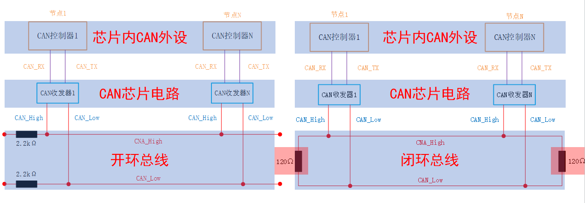
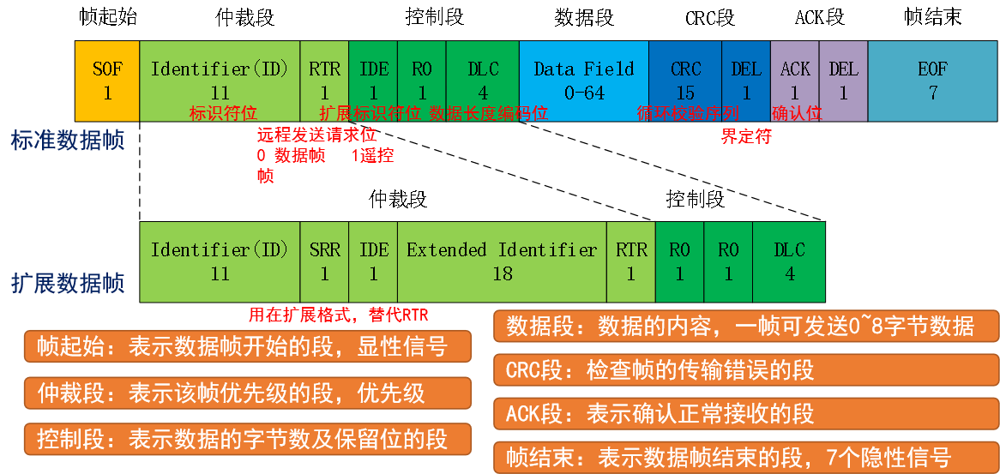

<!--
 * @Date: 2024-06-06
 * @LastEditors: GoKo-Son626
 * @LastEditTime: 2024-08-05
 * @FilePath: \STM32_Study\入门篇\20,CAN\CAN.md
 * @Description: 该模板为所有笔记模板
-->

# CAN

> 内容目录：
> 
>       1. CAN基础知识介绍（熟悉）
>       2. STM32 CAN控制器介绍（熟悉）
>       3. CAN相关寄存器介绍（熟悉）
>       4. CAN相关HAL库驱动介绍（掌握）
>       5. CAN基本驱动步骤（掌握）
>       6. 编程实战（掌握）

### 1. CAN基础知识介绍（熟悉）

- **CAN（Controller Area Network），是ISO国际标准化的串行通信协议。为了满足汽车产业的“减少线束的数量”、“通过多个LAN，进行大量数据的高速通信”的需求。**
- 低速CAN(ISO11519)通信速率10~125Kbps，总线长度可达1000米
- 高速CAN(ISO11898)通信速率125Kbps~1Mbps，总线长度≤40米
- CAN FD 通信速率可达5Mbps，并且兼容经典CAN，遵循ISO 11898-1 做数据收发

**CAN总线拓扑图-左低速右高速**

- 终端电阻，用于阻抗匹配，以减少回波反射
- CAN总线由两根线（ CANL 和 CANH ）组成，允许挂载多个设备节点（低速CAN:20 高速CAN:30）。

#### **1. CAN总线**

- **多主控制			      :**  每个设备都可以主动发送数据
- **系统的柔软性		              :**  没有类似地址的信息，添加设备不改变原来总线的状态
- **通信速度			      :**  速度快，距离远
- **错误检测&错误通知&错误恢复功能:**
- **故障封闭                           :**  判断故障类型，并且进行隔离
- **连接节点多			      :**  速度与数量找个平衡

**CAN应用场景**
- CAN总线协议已广泛应用在汽车电子、工业自动化、船舶、医疗设备、工业设备等方面。

#### **2. CAN物理层**

- CAN使用差分信号进行数据传输，根据CAN_H和CAN_L上的电位差来判断总线电平。
- 总线电平分为显性电平(逻辑0)和隐性电平(逻辑1)，二者必居其一。
- 显性电平具有优先权。发送方通过使总线电平发生变化，将消息发送给接收方。

| 电平          | 高速CAN              | 低速CAN                  |
| ------------- | -------------------- | ------------------------ |
| 显性电平（0） | UCAN_H – UCAN_L=  2V | UCAN_H – UCAN_L = 3V     |
| 隐性电平（1） | UCAN_H – UCAN_L = 0V | UCAN_H – UCAN_L = - 1.5V |

- AN收发器芯片
	TJA1050、TJA1042、SIT1050T
- SIT1050T 支持高速CAN，传输速率可达1Mbps

#### **3. CAN协议层**

- CAN总线以“帧”形式进行通信。CAN协议定义了5种类型的帧：数据帧、遥控帧、错误帧、过载帧、间隔帧，其中数据帧最为常用。

| 帧类型                      | 帧作用                                         |
| --------------------------- | ---------------------------------------------- |
| **数据帧（Data Frame）**        | **用于发送单元向接收单元传输数据的帧**             |
| **遥控帧（Remote Frame）**      | **用于接收单元向具有相同ID的发送单元请求数据的帧** |
| 错误帧（Error Frame）       | 用于当检测出错误时向其他单元通知错误的帧       |
| 过载帧（Overload Frame）    | 用于接收单元通知其尚未做好接收准备的帧         |
| 间隔帧（Inter Frame Space） | 用于将数据帧 及遥控帧与前面的帧分离开来的帧    |

**数据帧介绍**
- 数据帧由7段组成。数据帧又分为标准帧(CAN2.0A)和扩展帧(CAN2.0B)，主要体现在仲裁段和控制段。

..................................................................

### 2. STM32 CAN控制器介绍（熟悉）

### 3. CAN相关寄存器介绍（熟悉）

### 4. CAN相关HAL库驱动介绍（掌握）

### 5. CAN基本驱动步骤（掌握）

### 6. 编程实战（掌握）
