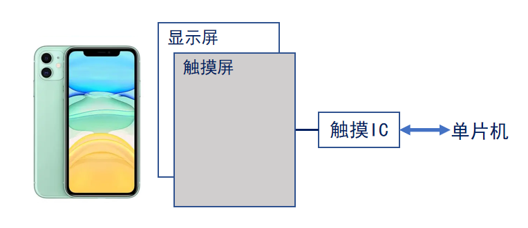
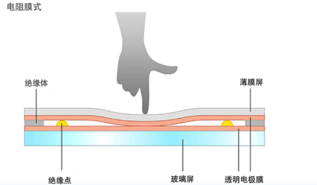
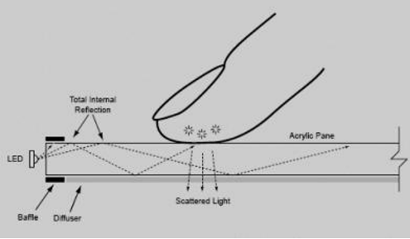
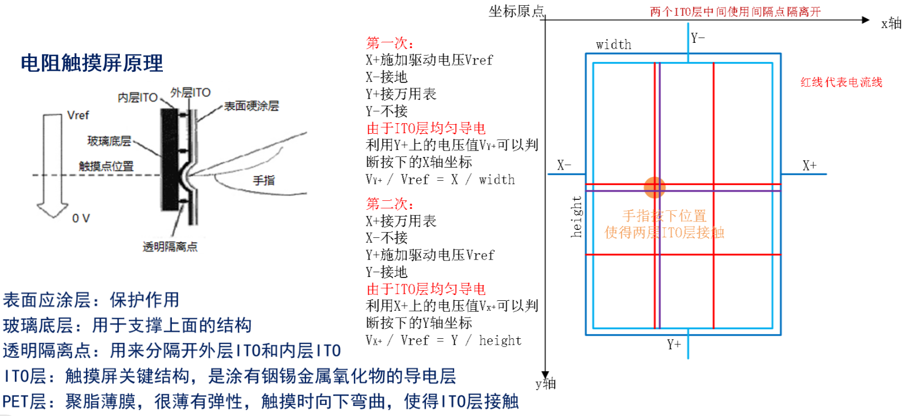
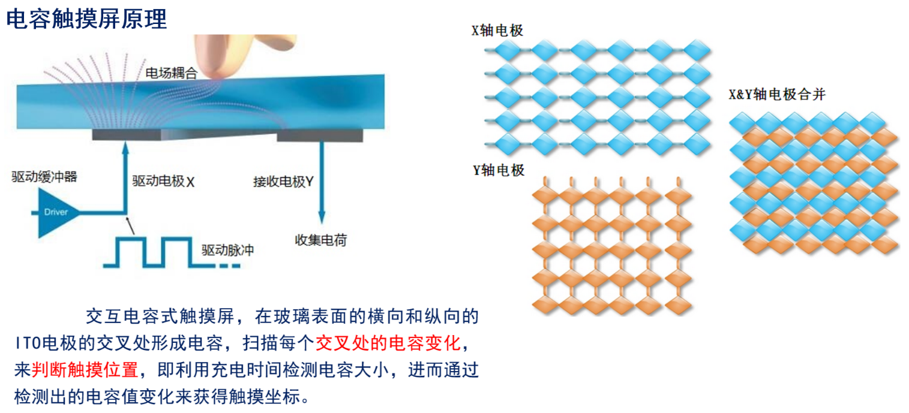

<!--
 * @Date: 2024-06-06
 * @LastEditors: GoKo-Son626
 * @LastEditTime: 2024-08-05
 * @FilePath: \STM32_Study\入门篇\21.TOUCH\TOUCH.md
 * @Description: 该模板为所有笔记模板
-->

# TOUCH

> 内容目录：
> 
>       1.触摸屏介绍（了解）
>       2. 触摸屏原理介绍（熟悉）
>       3. 触摸IC介绍（熟悉）
>       4. 触摸屏驱动步骤（掌握）
>       5. 编程实战（掌握）

### 1. 触摸屏介绍（了解）

- 触摸屏（Touch Panel），又称为“触控面板”。简单来讲，就是一种可以把触摸位置转化为坐标数据的输入设备。
- 触摸屏本质上与液晶屏是分离开来的。触摸屏负责检测触摸点，而液晶屏负责显示。
- 触摸屏按工作原理和传输介质可分为：红外线式、表面声波式、电阻式和电容式

**触摸屏分类**
1. 电阻式触摸屏

        分类：四线，五线，七线和八线
2. 电容式触摸屏
 
        分类：  ① 表面电容式（利用电场感应感测屏幕触摸，只能识别一次触摸）
                ② 投射式（利用触摸屏电极发射出静电场线）
                        自我电容（扫描电极与地构成的电容）
                        交互电容（玻璃表面的横向和纵向的ITO电极的交叉处形成的电容）

| 电阻触摸屏                                           | 电容触摸屏                                                                   |
| ---------------------------------------------------- | ---------------------------------------------------------------------------- |
|                         |                                                 |
| 触摸点(X,Y)转换代表X坐标和Y坐标的电压                | 利用人体感应进行触点检测控制，只需要轻微接触，通过检测感应电流定位触摸坐标。 |
| 优点：精度高，价格便宜，抗干扰能力强，稳定性好       | 优点：手感好、无需校准、支持多点触摸、透光性好                               |
| 缺点：需校准，容易被划伤，透光性较差，不支持多点触摸 | 缺点：成本高、精度不高、抗干扰能力差                                         |
| 应用场景：广泛用于工业领域                           | 应用场景：广泛用于智能手机，平板电脑                                         |

### 2. 触摸屏原理介绍（熟悉）

**电阻触摸屏原理**

**电容触摸屏原理**

### 3. 触摸IC介绍（熟悉）

**分类**
1. 电阻式触摸屏驱动IC

	XPT2046、TSC2046、HR2046
2. 电容式触摸屏驱动IC

	GT9147、GT917S、GT911、GT1151、FT5426

### 4. 触摸屏驱动步骤（掌握）

### 5. 编程实战（掌握）

