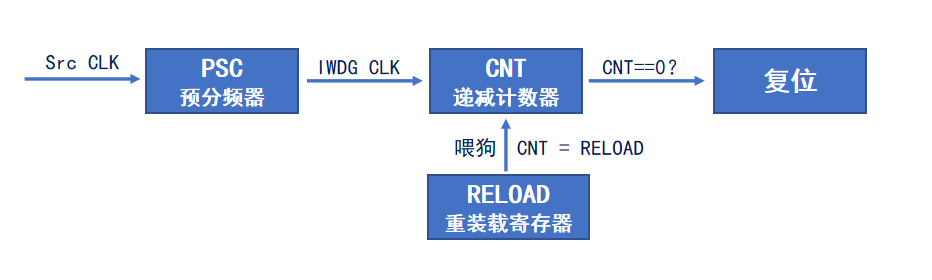
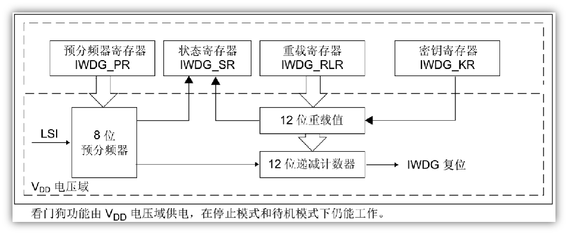

<!--
 * @Date: 2024-06-06
 * @LastEditors: GoKo-Son626
 * @LastEditTime: 2024-06-17
 * @FilePath: \STM32_Study\入门篇\4.IWDG\IWDG.md
 * @Description: IWDG的学习记录和编程实战
-->

# IWDG

> 内容目录：
> 
>       1. IWDG简介（了解）
>       2. IWDG工作原理（熟悉）
>       3. IWDG框图（熟悉）
>       4. IWDG寄存器（熟悉）
>       5. IWDG溢出时间计算（掌握）
>       6. IWDG配置步骤（掌握）
>       7. 编程实战：验证不及时喂狗，系统将复位重启（掌握）
>       8. 课堂总结（掌握）

#### 1. IWDG简介（了解）

> Independent watchdog，即独立看门狗
> - 能产生系统复位信号的计数器
> - 递减的计数器
时钟由独立的RC振荡器提供（可在待机和停止模式下运行）
看门狗被激活后，当递减计数器计数到0x000时产生复位
> - 在计数器计数到0之前，重装载计数器的值，防止复位

**作用**:主要用于检测外界电磁干扰，或硬件异常导致的程序跑飞问题
**异常**:外界电磁干扰或者自身系统（硬件或软件）异常，
造成程序跑飞，如：陷入某个不正常的死循环，打断正常的程序运行
**应用**:在一些需要高稳定性的产品中，并且对时间精度要求较低的场合
- 独立看门狗是异常处理的最后手段，不可依赖，应在设计时尽量避免异常的发生！

#### 2. IWDG工作原理（熟悉）

**IWDG工作原理**

> CPU必须及时喂狗，否则系统复位重启！

#### 3. IWDG框图（熟悉）

**IWDG框图**

> - 启用IWDG后，LSI时钟会自动开启
> - LSI时钟频率并不精确，F1用40kHz，F4/F7/H7用32kHz进行计算即可

#### 4. IWDG寄存器（熟悉）

1. IWDG_KR
2. IWDG_PR
3. 

#### 5. IWDG溢出时间计算（掌握）

#### 6. IWDG配置步骤（掌握）

#### 7. 编程实战：验证不及时喂狗，系统将复位重启（掌握）