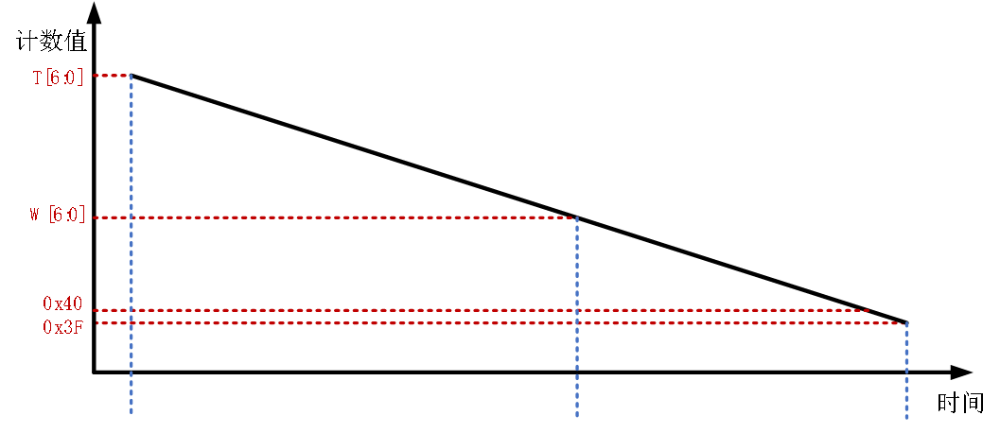
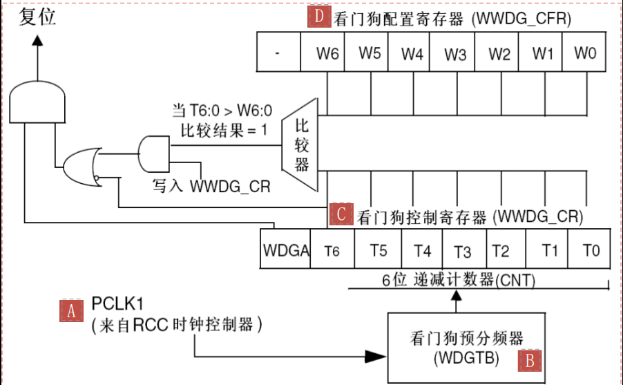

<!--
 * @Date: 2024-06-06
 * @LastEditors: GoKo-Son626
 * @LastEditTime: 2024-07-30
 * @FilePath: \STM32_Study\入门篇\5.WWDG\WWDG.md
 * @Description: WWDG的学习记录和编程实战
-->

# WWDG

> 内容目录：
> 
>       1. WWDG简介（了解）
>       2. WWDG工作原理（熟悉）
>       3. WWDG框图（熟悉）
>       4. WWDG寄存器（熟悉）
>       5. WWDG超时时间计算（掌握）
>       6. WWDG配置步骤（掌握）
>       7. 编程实战：验证窗口看门狗功能（掌握）
>       8. IWDG和WWDG的主要区别（熟悉）
>       9. 课堂总结（掌握）
 
#### 1. WWDG简介（了解）

**WWDG**:Window watchdog，即窗口看门狗
- 能产生系统复位信号和提前唤醒中断的计数器
- 递减的计数器

        1. 当递减计数器值从0x40减到0x3F时复位（即T6位跳变到0）
        2. 计数器的值大于W[6:0]值时喂狗会复位
        3. 提前唤醒中断 (EWI)：当递减计数器等于0x40时可产生
- 在窗口期内重装载计数器的值，防止复位
**作用**：窗口看门狗（WWDG）通常被用来监测由外部干扰或不可预见的逻辑条件造成的应用程序背离正常的运行序列而产生的软件故障。用于监测单片机程序运行时效是否精准，主要检测软件异常
**应用**：需要精准检测程序运行时间的场合（因为时钟源来自系统总线的时钟）

#### 2. WWDG工作原理（熟悉）

**WWDG工作原理**



#### 3. WWDG框图（熟悉）

**WWDG逻辑框图**

> - 递减计数器的值递减过程中，当T[6:0] > W[6:0]是不允许刷新T[6:0]的值，即不允许喂狗，否则会产生复位。只有T[6:0]在W[6:0] 和0x3F这个时间内可以喂狗，这就是喂狗的窗口时间。当T[6:0] = 0x3F，即T6位为0这一刻，也会产生复位。
> - 上限值W[6:0]是由用户自己设置，但是一定要确保大于0x40，否则就不存在上图的窗口了，下限值0x40是固定的，不可修改。

#### 4. WWDG寄存器（熟悉)

###### 1. 控制寄存器（WWDG_CR）

> - 该寄存器只有低八位有效，其中T[6：0]用来存储看门狗的计数器的值，随时更新的，每隔（4096×2^WDGTB[2:0]）PCLK个周期减1。当该计数器的值从0x40变为0x3F的时候，将产生看门狗复位。
> - WDGA位(位7)则是看门狗的激活位，该位由软件置1，启动看门狗，并且一定要注意的是该位一旦设置，就只能在硬件复位后才能清零了。

###### 2. 配置寄存器（WWDG_CFR）

> - 该寄存器中的EWI位是提前唤醒中断，如果该位置1，当递减计数器等于0x40时产生提前唤醒中断，我们就可以及时喂狗以避免WWDG复位。因此，我们一般都会用该位来设置中断，当窗口看门狗的计数器值减到0X40的时候，如果该位设置，并开启了中断，则会产生中断，我们可以在中断里面向WWDG_CR重新写入计数器的值，来达到喂狗的目的。注意这里在进入中断后，必须在不大于1个窗口看门狗计数周期的时间（在pclk1频率为36M且WDGTB 为0的条件下，该时间为113us）内重新写WWDG_CR，否则，看门狗将产生复位！

###### 3. 状态寄存器（WWDG_SR）

> - 该寄存器用来记录当前是否有提前唤醒的标志。该寄存器仅有位0有效，其他都是保留位。当计数器值达到0x40时，此位由硬件置1。它必须通过软件写0来清除。对此位写1无效。即使中断未被使能，在计数器的值达到0x40的时候，此位也会被置1。

#### 5. WWDG超时时间计算（掌握）

**如何计算窗口看门狗的超时公式**：

- ### **TWWDG=(4096×2^WDGTB×(T[5:0] + 1))/ FPCLK1**

> TWWDG：WWDG超时时间(单位为ms）
FPCLK1：APB1的时钟频率（单位为Khz）
2^WDGTB：是WWDG_CFR寄存器设置的预分频系数值
T[5:0]：窗口看门狗的计数器低6位的值

根据以上公式，假设FPCLK1=36Mhz
**最小-最大超时时间表**如下表所示：
| WDGTB | 最小超时值 | 最大超时值 |
| ----- | ---------- | ---------- |
| 0     | 113us      | 7.28ms     |
| 1     | 227us      | 14.56ms    |
| 2     | 445us      | 29.12ms    |
| 3     | 910us      | 58.25ms    |

#### 6. WWDG配置步骤（掌握）

1. 初始化窗口看门狗: void wwdg_init(uint8_t tr, uint8_t wr, uint32_t fprer)
2. WWDG MSP回调: void HAL_WWDG_MspInit(WWDG_HandleTypeDef *hwwdg)
3. 窗口看门狗中断服务程序: void WWDG_IRQHandler(void)
4. 窗口看门狗喂狗提醒中断服务回调函数:void HAL_WWDG_EarlyWakeupCallback(WWDG_HandleTypeDef *hwwdg)

#### 7. 编程实战：验证窗口看门狗功能（掌握）

###### 1. 独立看门狗
**初始化独立看门狗**
```c
void iwdg_init(uint8_t prer, uint16_t rlr)
{
    g_iwdg_handle.Instance = IWDG;
    g_iwdg_handle.Init.Prescaler = prer; /* 设置IWDG分频系数 */
    g_iwdg_handle.Init.Reload = rlr;     /* 重装载值 */
    HAL_IWDG_Init(&g_iwdg_handle);       /* 初始化IWDG并启动 */
}
```
**独立看门狗喂狗**
```c
void iwdg_feed(void)
{
    HAL_IWDG_Refresh(&g_iwdg_handle); /* 重装载计数器 */
}
```

###### 2. 窗口看门狗

**初始化窗口看门狗**
```c
void wwdg_init(uint8_t tr, uint8_t wr, uint32_t fprer)
{
    g_wwdg_handle.Instance = WWDG;
    g_wwdg_handle.Init.Prescaler = fprer;         /* 设置分频系数 */
    g_wwdg_handle.Init.Window = wr;               /* 设置窗口值 */
    g_wwdg_handle.Init.Counter = tr;              /* 设置计数器值 */
    g_wwdg_handle.Init.EWIMode = WWDG_EWI_ENABLE; /* 使能窗口看门狗提前唤醒中断 */
    HAL_WWDG_Init(&g_wwdg_handle);                /* 初始化WWDG */
}
```
**WWDG MSP回调**(用于配置与 WWDG 相关的硬件资源)
```c
void HAL_WWDG_MspInit(WWDG_HandleTypeDef *hwwdg)
{
    __HAL_RCC_WWDG_CLK_ENABLE();            /* 使能窗口看门狗时钟 */

    HAL_NVIC_SetPriority(WWDG_IRQn, 2, 3);  /* 抢占优先级2，子优先级为3 */
    HAL_NVIC_EnableIRQ(WWDG_IRQn);          /* 使能窗口看门狗中断 */
}
```
**窗口看门狗中断服务程序**
```c
void WWDG_IRQHandler(void)
{
    HAL_WWDG_IRQHandler(&g_wwdg_handle);  /* 调用WWDG共用中断处理函数 */
}
```
**窗口看门狗喂狗提醒中断服务回调函数**
```c
void HAL_WWDG_EarlyWakeupCallback(WWDG_HandleTypeDef *hwwdg)
{
    HAL_WWDG_Refresh(&g_wwdg_handle); /* 更新窗口看门狗值 */
    LED1_TOGGLE();                    /* LED1闪烁 */
}
```

#### 8. IWDG和WWDG的主要区别（熟悉）

| **IWDG：**                           | **WWDG：**                 |
| ------------------------------------ | -------------------------- |
| 独立于主系统时钟和电源。             | 依赖于主系统时钟。         |
| 使用LSI作为时钟源。                  | 使用PCLK作为时钟源。       |
| 配置后不可修改。                     | 配置后可修改。             |
| 适用于高可靠性和安全性要求高的系统。 | 适用于定期检查的应用场景。 |
| -                                    | 具有窗口功能。             |
