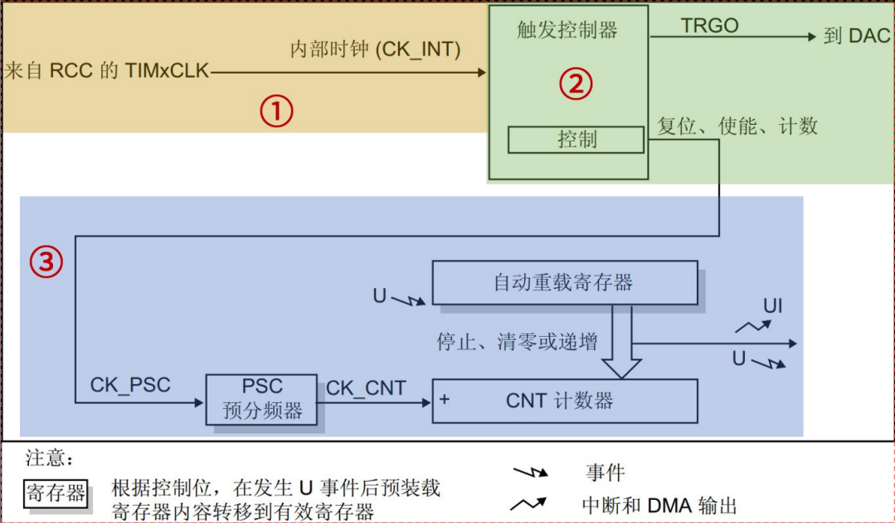
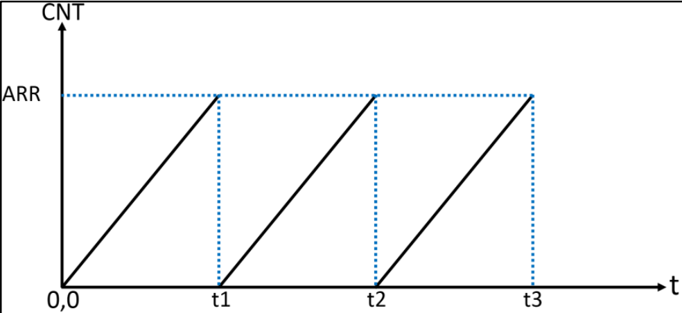

<!--
 * @Date: 2024-06-06
 * @LastEditors: GoKo-Son626
 * @LastEditTime: 2024-07-12
 * @FilePath: \STM32_Study\入门篇\6.Timer\Basic_timer.md
 * @Description: 定时器学习的笔记和代码实践
-->

# 定时器

> 内容目录：
> 
>       1. 基本定时器 


> **STM32F103 有众多的定时器，其中包括 2 个基本定时器（TIM6 和 TIM7）、4 个通用定时器（TIM2~TIM5）、2 个高级控制定时器（TIM1 和 TIM8），这些定时器彼此完全独立，不共享任何资源。**

### 1. 基本定时器

> STM32F103 有两个基本定时器 TIM6 和 TIM7，它们的功能完全相同，资源是完全独立的，可以同时使用。其主要特性如下：16 位自动重载递增计数器，16 位可编程预分频器，预分频系数 1~65536，用于对计数器时钟频率进行分频，还可以触发 DAC 的同步电路，以及生成中断/DMA 请求。

###### **1. 基本定时器框图**


**①时钟源**
定时器的核心就是计算器，要实现计数功能，首先要给它一个时钟源。基本定时器时钟挂载在APB1总线，所以它的时钟来自于APB1总线，但是基本定时器时钟不是直接由APB1总线直接提供，而是先经过一个倍频器。当APB1的预分频器系数为1时，这个倍频器系数为1，即定时器的时钟频率等于APB1总线时钟频率；当APB1的预分频器系数≥2分频时，这个倍频器系数就为2，即定时器的时钟频率等于APB1总线时钟频率的两倍。我们在sys_stm32_clock_init时钟设置函数已经设置APB1总线时钟频率为36M，APB1总线的预分频器分频系数是2，所以挂载在APB1总线的定时器时钟频率为72Mhz。
**②控制器**
控制器除了控制定时器复位、使能、计数等功能之外，还可以用于触发DAC转换。
**③时基单元**
时基单元包括：计数器寄存器(TIMx_CNT)、预分频器寄存器(TIMx_PSC)、自动重载寄存器(TIMx_ARR) 。基本定时器的这三个寄存器都是16位有效数字，即可设置值范围是0~65535。
时基单元中的预分频器PSC，它有一个输入和一个输出。输入CK_PSC来源于控制器部分，实际上就是来自于内部时钟（CK_INT），即2倍的APB1总线时钟频率（72MHz）。输出CK_CNT 是分频后的时钟，它是计数器实际的计数时钟，通过设置预分频器寄存器(TIMx_PSC)的值可以得到不同频率CK_CNT
**计算公式如下：**
### **计数器计数频率：fCK_CNT= fCK_PSC / (PSC[15:0]+1)**
**其倒数为数一个数的时间，数（ARR+1）个数**
**所以溢出时间Tout就为：其倒数乘以（ARR+1）**
PSC[15:0]是写入预分频器寄存器(TIMx_PSC)的值。
另外：预分频器寄存器(TIMx_PSC)可以在运行过程中修改它的数值，新的预分频数值将在下一个更新事件时起作用。因为更新事件发生时，会把TIMx_PSC寄存器值更新到其影子寄存器中，这才会起作用。

**什么是影子寄存器？**
从框图上看，预分频器PSC后面有一个影子，自动重载寄存器也有个影子，这就表示这些寄存器有影子寄存器。影子寄存器是一个实际起作用的寄存器，不可直接访问。举个例子：我们可以把预分频系数写入预分频器寄存器(TIMx_PSC)，但是预分频器寄存器只是起到缓存数据的作用，只有等到更新事件发生时，预分频器寄存器的值才会被自动写入其影子，这时寄存器才真正起作用。

###### **2. TIM6/TIM7寄存器**
- 控制寄存器1（TIMx_CR1）
> 位0（CEN）用于使能或者禁止计数器，该位置1计数器开始工作，置0则停止。还有位7（APRE）用于控制自动重载寄存器ARR是否具有缓冲作用，如果ARPE位置1，ARR起缓冲作用，即只有在更新事件发生时才会把ARR的值写入其影子寄存器里；如果ARPE位置0，那么修改自动重载寄存器的值时，该值会马上被写入其影子寄存器中，从而立即生效。

- DMA/中断使能寄存器（TIMx_DIER）
> 该寄存器位0（UIE）用于使能或者禁止更新中断，因为本实验我们用到中断，所以该位需要置1。位8（UDE）用于使能或者禁止更新DMA请求，我们暂且用不到，置0即可。

- 状态寄存器（TIMx_SR）
> 该寄存器位0（UIF）是中断更新的标志位，当发生中断时由硬件置1，然后就会执行中断服务函数，需要软件去清零，所以我们必须在中断服务函数里把该位清零。如果中断到来后，不把该位清零，那么系统就会一直进入中断服务函数，这显然不是我们想要的。

- 计数器寄存器（TIMx_CNT）
> 该寄存器位[15:0]就是计数器的实时的计数值。

- 预分频寄存器（TIMx_PSC）
> 该寄存器是TIM6/TIM7的预分频寄存器，比如我们要7200分频，就往该寄存器写入7199。注意这是16位的寄存器，写入的数值范围是0到65535，分频系数范围：1到65536。

- 自动重载寄存器（TIMx_ARR）
> 该寄存器可以由APRE位设置是否进行缓冲。计数器的值会和ARR寄存器影子寄存器进行比较，当两者相等，定时器就会溢出，从而发生更新事件，如果打开更新中断，还会发生更新中断。

###### **3. 基本定时器中断示意图**


- **如图所示，CNT计数器从0开始计数，当CNT的值和ARR相等时（t1），产生一个更新中断，然后CNT复位（清零），然后继续递增计数，依次循环。图中的t1、t2、t3就是定时器更新中断产生的时刻。**
- **通过修改ARR的值，可以改变定时时间。另外，通过修改PSC的值，使用不同的计数频率（改变图中CNT的斜率），也可以改变定时时间。**

**通过软件的方式设置UG位产生软件的更新事件，从而产生更新中断:**
- 设置UG位：通过软件（通常是通过编程）将定时器的控制寄存器中的UG位置1。
- 生成更新事件：UG位被置1后，定时器会立即生成一个更新事件。
- 触发更新中断：如果更新中断已使能（通过设置相应的中断使能位），则更新事件会触发一个中断信号。
- 处理中断：CPU响应中断信号，执行相应的中断服务程序（ISR），完成预定的任务。

###### **4. 定时器的配置**

1.  初始化函数：HAL_TIM_Base_Init()
2.  Msp回调函数：HAL_TIM_Base_MspInit()（设置CLOCK，NVIC）
3.  使能更新中断并启用定时计数器：HAL_TIM_Base_Start_IT() 
4.  定时器中断公用服务函数：HAL_TIM_Base_Start_IT() 
5.  中断回调函数：HAL_TIM_PeriodElapsedCallback()

###### 5. 实验：使用定时器6，实现500ms定时器更新中断，在中断里翻转LED0

**定时器初始化**
```c
void btim_timx_int_init(uint16_t arr, uint16_t psc)
{
    g_timx_handle.Instance = BTIM_TIMX_INT;                      /* 通用定时器X */
    g_timx_handle.Init.Prescaler = psc;                          /* 设置预分频系数 */
    g_timx_handle.Init.CounterMode = TIM_COUNTERMODE_UP;         /* 递增计数模式 */
    g_timx_handle.Init.Period = arr;                             /* 自动装载值 */
    HAL_TIM_Base_Init(&g_timx_handle);

    HAL_TIM_Base_Start_IT(&g_timx_handle);    /* 使能定时器x及其更新中断 */
}
```
**Msp初始化**
```c
void HAL_TIM_Base_MspInit(TIM_HandleTypeDef *htim)
{
    if (htim->Instance == BTIM_TIMX_INT)
    {
        BTIM_TIMX_INT_CLK_ENABLE();                     /* 使能TIM时钟 */
        HAL_NVIC_SetPriority(BTIM_TIMX_INT_IRQn, 1, 3); /* 抢占1，子优先级3，组2 */
        HAL_NVIC_EnableIRQ(BTIM_TIMX_INT_IRQn);         /* 开启ITM3中断 */
    }
}
```
**重写中断服务函数和中断回调函数**
```c
void BTIM_TIMX_INT_IRQHandler(void)
{
    HAL_TIM_IRQHandler(&g_timx_handle); /* 定时器中断公共处理函数 */
}
void HAL_TIM_PeriodElapsedCallback(TIM_HandleTypeDef *htim)
{
    if (htim->Instance == BTIM_TIMX_INT)
    {
        LED1_TOGGLE(); /* LED1反转 */
    }
}
```