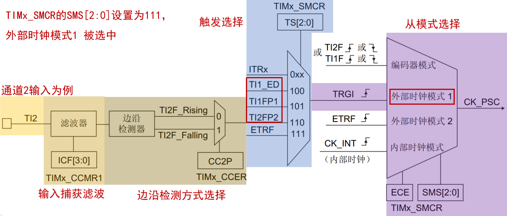
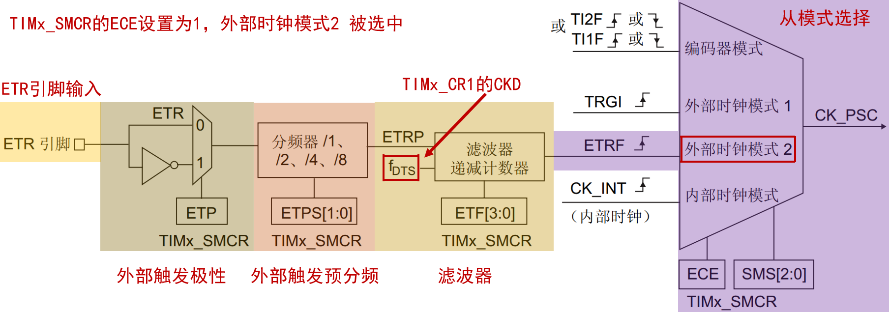
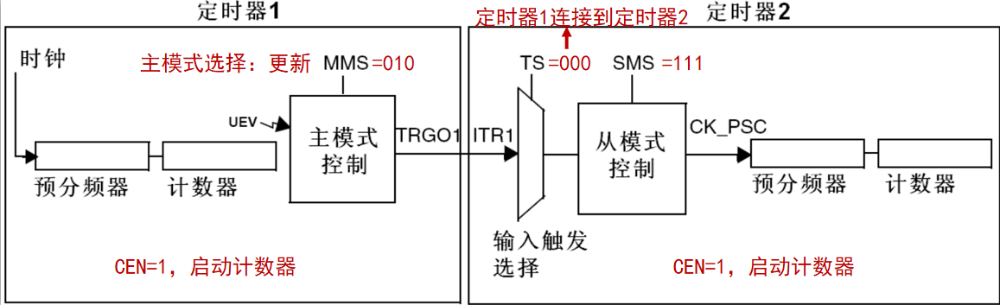
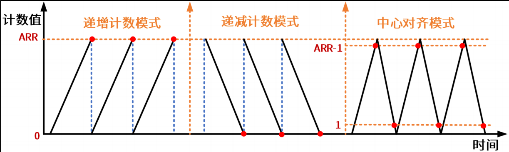
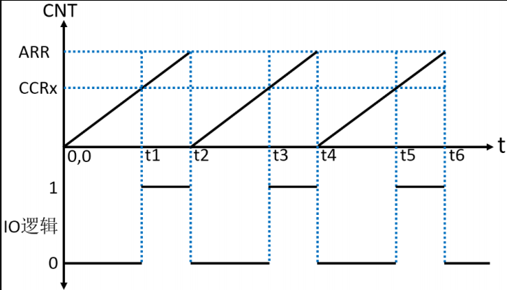
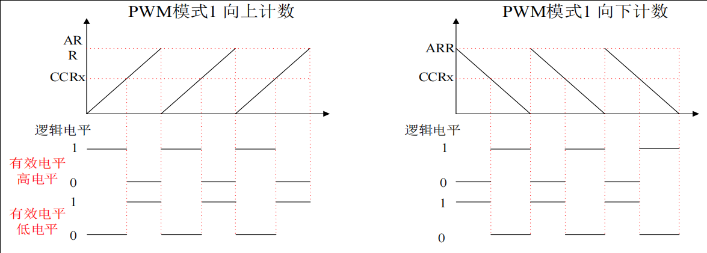
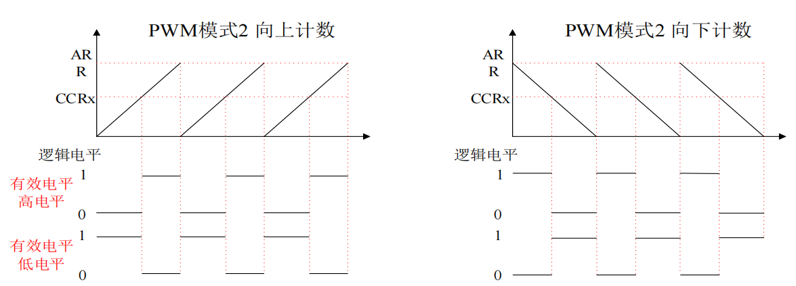

<!--
 * @Date: 2024-06-06
 * @LastEditors: GoKo-Son626
 * @LastEditTime: 2024-07-10
 * @FilePath: \STM32_Study\入门篇\6.Timer\General_timer.md
 * @Description: 通用定时器的学习和记录
-->

# 文件内容标题

> 内容目录：
> 
>       1.通用定时器

### 1. 通用定时器

> - **通用定时器：** TIM2/TIM3 /TIM4 /TIM5
> - **特性：**
>       16位**递增**、**递减**、**中心对齐计数器**（计数值：0~65535）
16位预分频器（分频系数：1~65536）
可用于触发**DAC,ADC**
在更新事件、**触发事件、输入捕获、输出比较**时，会产生中断/DMA请求
4个独立通道，可用于：**输入捕获、输出比较、输出PWM、单脉冲模式**
**使用外部信号控制定时器且可实现多个定时器互连的同步电路**
**支持编码器和霍尔传感器电路等**

###### 1. 通用定时器框图

 通用定时器框图 

> **①时钟源**

 计数器时钟源框图 

①**内部时钟**(CK_INT)，来自外设总线APB提供的时钟
> 高级定时器 TIM1 和 TIM8 是挂载在 APB2 总线上的,所以 TIM1 和 TIM8 时钟源频率为 72MHz

②**外部时钟模式1**：外部时钟源信号→IO→TIMx_CH1（或者 TIMx_CH2）,CH3 和 CH4 都是不可以的

 外部时钟模式1框图 

> TI1F_ED 表示来自于 CH1，并且没有经过边沿检测器过滤的信号，所以它是 CH1 的双边沿信号，即上升沿或者下降沿都是有效的。TI1FP1 表示来自 CH1 并经过边沿检测器后的信号，可以是上升沿或者下降沿。TI2FP2 表示来自 CH2 并经过边沿检测器后的信号，可以是上升沿或者下降沿。

③**外部时钟模式2**：外部
时钟源信号→IO→TIMx_ETR。从 IO到 TIMx_ETR，就需要我们配置 IO 的复用功能，才能使IO 和定时器相连通。

 外部时钟模式2框图 

- 反相器：
用于转换信号的有效边沿，确保系统能够统一处理上升沿触发事件。
适应不同的信号源，增加了系统的兼容性和灵活性。
- 滤波器：
在噪声环境中或信号边沿不稳定的情况下，滤波器能显著提高信号的可靠性。
对于高频信号输入，滤波器能有效去除抖动，确保定时器的准确计时。

④**内部触发输入**(ITRx)，用于与芯片内部其它通用/高级定时器级联

 内部触发输入框图 

- 详见开发手册

**通用定时器时钟源设置方法**
| 定时器时钟类型                    | 设置方法                                                        |
| --------------------------------- | --------------------------------------------------------------- |
| 内部时钟(CK_INT)                  | 设置 TIMx_SMCR 的 SMS=0000                                      |
| 外部时钟模式 1：外部输入引脚(TIx) | 设置 TIMx_SMCR的 SMS=1111                                       |
| 外部时钟模式 2：外部触发输入(ETR) | 设置 TIMx_SMCR 的 ECE=1                                         |
| 内部触发输入(ITRx)                | 设置可参考《STM32F10xxx参考手册_V10（中文版）.pdf》14.3.15 小节 |

> **②控制器**
控制器包括：从模式控制器、编码器接口和触发控制器（TRGO）。
- **从模式控制器**可以控制计数器复位、启动、递增/递减、计数。
- **编码器接口**针对编码器计数。
- **触发控制器**用来提供触发信号给别的外设，比如为其它定时器提供时钟或者为 DAC/ADC 的触发转换提供信号。

> **③时基单元**
和基本定时器**不同点**是：通用定时器的计数模式有三种：递增计数模式、递减计数模式和中心对齐模式；
TIM2 和 TIM5 的计数器是 32 位的。

   更新时间发生条件

- 中心对齐模式下：计数器先从 0 开始递增计数，直到计数器的值等于自动重载寄存器影子寄存器的值减 1 时，定时器上溢，同时生成更新事件，然后从自动重载寄存器影子寄存器的值开始递减计算，直到计数值等于 1 时，定时器下溢，同时生成更新事件，然后又从 0 开始递增计数，依此循环。每次定时器上溢或下溢都会生成更新事件。

> **④输入捕获**
> **⑤捕获/比较(公共)**
> **⑥输出比较**
> - 详见开发指南

###### 2. TIM2/TIM3/TIM4/TIM5 的几个与定时器中断相关且重要的寄存器

- 控制寄存器 1（TIMx_CR1）
- 从模式控制寄存器（TIMx_SMCR）
- DMA/中断使能寄存（TIMx_DIER）
- 状态寄存器（TIMx_SR）
- 计数寄存器（TIMx_CNT）
- 预分频寄存器（TIMx_PSC）
- 自动重载寄存器（TIMx_ARR）

###### 3. 通用定时器输出PWM

> PWM（Pulse Width Modulation，脉宽调制）是一种通过调节脉冲信号的占空比来控制电压或功率的技术。PWM广泛应用于电机控制、LED调光、音频信号生成和通信等领域。在STM32微控制器中，PWM信号可以通过定时器模块生成。
**占空比（Duty Cycle）**：PWM信号中高电平时间与周期的比值，输出决定了信号的平均电压。

**PWM生成示意图**

> 上图中，定时器工作在递增计数模式，纵轴是计数器的计数值 CNT，横轴表示时。当CNT<CCRx 时，IO 输出低电平（逻辑 0）；当 CNT>=CCRx 时，IO 输出高电平（逻辑 1）；当CNT=ARR 时，定时器溢出，CNT 的值被清零，然后继续递增，依次循环。在这个循环中，改变 CCRx 的值，就可以改变 PWM 的占空比，改变 ARR 的值，就可以改变 PWM 的频率，这就是 PWM 输出的原理。

**产生PWM模式示意图**

