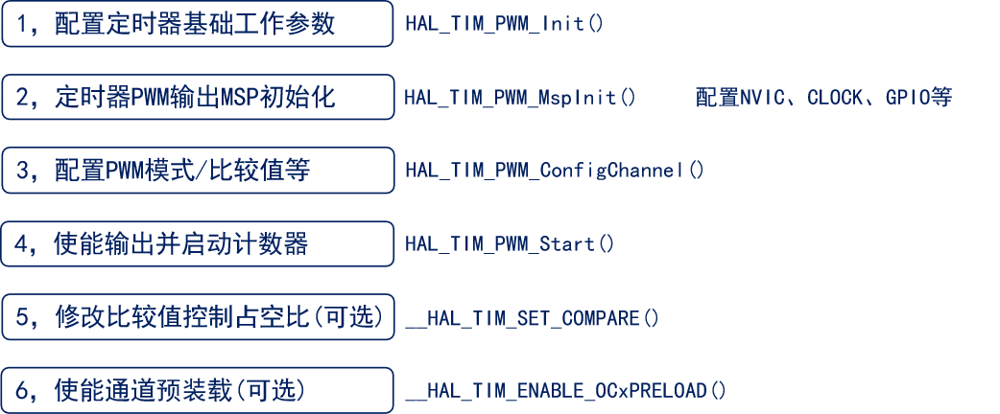
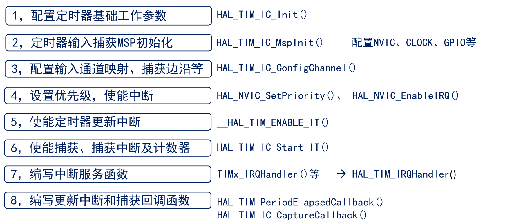

<!--
 * @Date: 2024-06-06
 * @LastEditors: GoKo-Son626
 * @LastEditTime: 2024-07-12
 * @FilePath: \STM32_Study\入门篇\6.Timer\General_timer.md
 * @Description: 通用定时器的学习和记录
-->

# 通用定时器

> 内容目录：
> 
>       1.通用定时器


### 1. 通用定时器

> - **通用定时器：** TIM2/TIM3 /TIM4 /TIM5
> - **特性：**
>       16位**递增**、**递减**、**中心对齐计数器**（计数值：0~65535）
16位预分频器（分频系数：1~65536）
可用于触发**DAC,ADC**
在更新事件、**触发事件、输入捕获、输出比较**时，会产生中断/DMA请求
4个独立通道，可用于：**输入捕获、输出比较、输出PWM、单脉冲模式**
**使用外部信号控制定时器且可实现多个定时器互连的同步电路**
**支持编码器和霍尔传感器电路等**

###### 1. 通用定时器框图

<p style = "text-align:center;font-weight: bold"> 通用定时器框图 </p>


> **①时钟源**

<p style = "text-align:center;font-weight: bold"> 计数器时钟源框图 </p>


①**内部时钟**(CK_INT)，来自外设总线APB提供的时钟
> 高级定时器 TIM1 和 TIM8 是挂载在 APB2 总线上的,所以 TIM1 和 TIM8 时钟源频率为 72MHz

②**外部时钟模式1**：外部时钟源信号→IO→TIMx_CH1（或者 TIMx_CH2）,CH3 和 CH4 都是不可以的
<p style = "text-align:center;font-weight: bold"> 外部时钟模式1框图 </p>


> TI1F_ED 表示来自于 CH1，并且没有经过边沿检测器过滤的信号，所以它是 CH1 的双边沿信号，即上升沿或者下降沿都是有效的。TI1FP1 表示来自 CH1 并经过边沿检测器后的信号，可以是上升沿或者下降沿。TI2FP2 表示来自 CH2 并经过边沿检测器后的信号，可以是上升沿或者下降沿。

③**外部时钟模式2**：外部时钟源信号→IO→TIMx_ETR。从 IO到 TIMx_ETR，就需要我们配置 IO 的复用功能，才能使IO 和定时器相连通。
<p style = "text-align:center;font-weight: bold"> 外部时钟模式2框图 </p>


- 反相器：
用于转换信号的有效边沿，确保系统能够统一处理上升沿触发事件。
适应不同的信号源，增加了系统的兼容性和灵活性。
- 滤波器：
在噪声环境中或信号边沿不稳定的情况下，滤波器能显著提高信号的可靠性。
对于高频信号输入，滤波器能有效去除抖动，确保定时器的准确计时。

④**内部触发输入**(ITRx)，用于与芯片内部其它通用/高级定时器级联

<p style = "text-align:center;font-weight: bold"> 内部触发输入框图 </p>


- 详见开发手册


**通用定时器时钟源设置方法**
| 定时器时钟类型                    | 设置方法                                                        |
| --------------------------------- | --------------------------------------------------------------- |
| 内部时钟(CK_INT)                  | 设置 TIMx_SMCR 的 SMS=0000                                      |
| 外部时钟模式 1：外部输入引脚(TIx) | 设置 TIMx_SMCR的 SMS=1111                                       |
| 外部时钟模式 2：外部触发输入(ETR) | 设置 TIMx_SMCR 的 ECE=1                                         |
| 内部触发输入(ITRx)                | 设置可参考《STM32F10xxx参考手册_V10（中文版）.pdf》14.3.15 小节 |

> **②控制器**
控制器包括：从模式控制器、编码器接口和触发控制器（TRGO）。
- **从模式控制器**可以控制计数器复位、启动、递增/递减、计数。
- **编码器接口**针对编码器计数。
- **触发控制器**用来提供触发信号给别的外设，比如为其它定时器提供时钟或者为 DAC/ADC 的触发转换提供信号。

> **③时基单元**
和基本定时器**不同点**是：通用定时器的计数模式有三种：递增计数模式、递减计数模式和中心对齐模式；
TIM2 和 TIM5 的计数器是 32 位的。

<p style="text-align: center; font-weight: bold;">
   更新时间发生条件
</p>


- 中心对齐模式下：计数器先从 0 开始递增计数，直到计数器的值等于自动重载寄存器影子寄存器的值减 1 时，定时器上溢，同时生成更新事件，然后从自动重载寄存器影子寄存器的值开始递减计算，直到计数值等于 1 时，定时器下溢，同时生成更新事件，然后又从 0 开始递增计数，依此循环。每次定时器上溢或下溢都会生成更新事件。

> **④输入捕获**
> **⑤捕获/比较(公共)**
> **⑥输出比较**
> - 详见开发指南


###### 2. TIM2/TIM3/TIM4/TIM5 的几个与定时器中断相关且重要的寄存器

- 控制寄存器 1（TIMx_CR1）
- 从模式控制寄存器（TIMx_SMCR）
- DMA/中断使能寄存（TIMx_DIER）
- 状态寄存器（TIMx_SR）
- 计数寄存器（TIMx_CNT）
- 预分频寄存器（TIMx_PSC）
- 自动重载寄存器（TIMx_ARR）

###### 3. 通用定时器输出PWM

> PWM（Pulse Width Modulation，脉宽调制）是一种通过调节脉冲信号的占空比来控制电压或功率的技术。PWM广泛应用于电机控制、LED调光、音频信号生成和通信等领域。在STM32微控制器中，PWM信号可以通过定时器模块生成。
**占空比（Duty Cycle）**：PWM信号中高电平时间与周期的比值，输出决定了信号的平均电压。


**PWM生成示意图**


> 上图中，定时器工作在递增计数模式，纵轴是计数器的计数值 CNT，横轴表示时。当CNT<CCRx 时，IO 输出低电平（逻辑 0）；当 CNT>=CCRx 时，IO 输出高电平（逻辑 1）；当CNT=ARR 时，定时器溢出，CNT 的值被清零，然后继续递增，依次循环。在这个循环中，改变 CCRx 的值，就可以改变 PWM 的占空比，改变 ARR 的值，就可以改变 PWM 的频率，这就是 PWM 输出的原理。

**产生PWM模式示意图**


**PWM输出的配置步骤**


**编程实战：PWM输出控制LED灯实现呼吸灯**

- 初始化TIM
```c
void timr_tim_init(uint16_t psc, uint16_t arr)
{
    TIM_OC_InitTypeDef tim_oc_init = {0};
    
    g_tim_handle.Instance = TIM3;
    g_tim_handle.Init.Prescaler = psc;
    g_tim_handle.Init.Period = arr;
    g_tim_handle.Init.CounterMode = TIM_COUNTERMODE_UP;
    HAL_TIM_PWM_Init(&g_tim_handle);
    
    tim_oc_init.OCMode = TIM_OCMODE_PWM1;
    tim_oc_init.Pulse = arr / 2;                    //占空比50%
    tim_oc_init.OCPolarity = TIM_OCPOLARITY_LOW;    //低电平有效
    
    
    HAL_TIM_PWM_ConfigChannel(&g_tim_handle, &tim_oc_init, TIM_CHANNEL_2);
    HAL_TIM_PWM_Start(&g_tim_handle, TIM_CHANNEL_2);
    
    // 使能通道预装载（可选）

}
```
- Msp配置
```c
void HAL_TIM_PWM_MspInit(TIM_HandleTypeDef *htim)
{
    if(htim->Instance == TIM3)
    {
        GPIO_InitTypeDef gpio_init_struct;
        __HAL_RCC_TIM3_CLK_ENABLE();

        //初始化GPIO
        __HAL_RCC_GPIOB_CLK_ENABLE();
        gpio_init_struct.Pin = GPIO_PIN_5;
        gpio_init_struct.Mode = GPIO_MODE_AF_PP;            /* 推挽式复用功能 */
        gpio_init_struct.Pull = GPIO_PULLUP;                    /* 上拉 */
        gpio_init_struct.Speed = GPIO_SPEED_FREQ_HIGH;          /* 高速 */
        HAL_GPIO_Init(GPIOB, &gpio_init_struct);
        
        //使能AFIO时钟并重映射
        __HAL_RCC_AFIO_CLK_ENABLE();
        __HAL_AFIO_REMAP_TIM3_PARTIAL();
    }
}
```
- 主函数
```c
    uint16_t ledrpwmval = 0;
    uint8_t dir = 1;

    while(1)
    {
        delay_ms(10);

        if (dir)ledrpwmval++;               /* dir==1 ledrpwmval递增 */
        else ledrpwmval--;                  /* dir==0 ledrpwmval递减 */

        if (ledrpwmval > 300)dir = 0;       /* ledrpwmval到达300后，方向为递减 */
        if (ledrpwmval == 0)dir = 1;        /* ledrpwmval递减到0后，方向改为递增 */

        /* 修改比较值控制占空比 */
        //使用 __HAL_TIM_SET_COMPARE 宏，可以快速、有效地修改定时器的比较值，适合实时控制场景。
        //使用 TIM_OC_InitTypeDef 结构体和相应的配置函数，适合初始化或需要重新配置定时器多个参数的场景。
        __HAL_TIM_SET_COMPARE(&g_tim_handle, TIM_CHANNEL_2, ledrpwmval);
        
    }
```
###### 4. 通用定时器输入捕获

> - **在 STM32 微控制器中，每个外设在使用之前都需要使能其时钟。**
> - **使能外设时钟可以节省能量、合理分配系统资源，并确保外设能够正常工作和执行其功能。**
> - **使用 HAL 库或标准外设库（Standard Peripheral Library）提供的使能函数，可以方便地实现外设时钟的使能操作。**

>**下拉电阻**
> - 确定默认电平：在没有外部信号输入时，确保引脚处于一个确定的低电平（逻辑0），防止引脚悬空（浮空）。
> - 防止噪声干扰：避免引脚悬空时受到噪声干扰，引起误触发或不稳定的电平状态。
> - 输入引脚：当I/O引脚配置为输入模式时，如果不接任何信号，悬空的引脚可能会拾取噪声，导致不稳定的输入状态。下拉电阻可以确保引脚在没有输入信号时保持在低电平。
> - 按键电路：在按键电路中，通常会将按键一端连接到电源（Vcc），另一端连接到I/O引脚，同时在I/O引脚和地之间接一个下拉电阻。这样，当按键未按下时，I/O引脚通过下拉电阻接地，电平为低；当按键按下时，I/O引脚通过按键接到电源，电平为高。

> GPIO_InitTypeDef.Pull 是 STM32 HAL 库中用于配置 GPIO 引脚上下拉电阻的成员。它决定了在引脚配置为输入模式时，是否启用内部的上拉或下拉电阻，以及启用哪种电阻。这有助于在没有外部驱动的情况下，确保引脚处于一个确定的电平状态，从而防止悬空引脚拾取噪声或误触发。

> GPIO_MODE_AF_PP功能：将引脚配置为复用功能（Alternate Function），即引脚的功能不再是普通的GPIO输入或输出，而是由外设（如UART、I2C、SPI等）控制。同时，输出模式为推挽模式（Push Pull），即引脚可以主动输出高电平或低电平，适用于驱动负载较大的场合。

> **HAL_TIM_PeriodElapsedCallback() 的作用**
> HAL_TIM_PeriodElapsedCallback() 用于处理定时器的周期性溢出事件。当定时器计数器达到自动重装载寄存器（ARR）指定的值时，会触发更新事件并产生中断，此时会调用该回调函数。
> **HAL_TIM_IC_CaptureCallback() 的作用**
HAL_TIM_IC_CaptureCallback() 用于处理输入捕获事件。当定时器的捕获/比较寄存器（CCR）捕获到输入信号的边沿时，会产生输入捕获事件并触发中断，此时会调用该回调函数。

**通用定时器输入捕获实验配置步骤**


**通用定时器输入捕获脉宽测量实验：**
**TIM配置**
```c
TIM_HandleTypeDef tim5_handle_init;             //定时器5句柄

void g_tim5_init(uint16_t prr, uint16_t pse)
{
    tim5_handle_init.Instance = TIM5;
    tim5_handle_init.Init.Period = prr;         //自动重装载值（时期）
    tim5_handle_init.Init.Prescaler = pse;      //（定时器分频）
    tim5_handle_init.Init.CounterMode = TIM_COUNTERMODE_UP;
    HAL_TIM_IC_Init(&tim5_handle_init);
    
    /* 配置输入通道映射、捕获边沿等 */
    TIM_IC_InitTypeDef tim5_ic_inittypedef = {0};
    /* 输入捕获触发方式选择，比如上升、下降沿捕获 */
    tim5_ic_inittypedef.ICFilter = TIM_ICPOLARITY_RISING;               /* 上升沿捕获 */
    /* 输入捕获选择，用于设置映射关系 */ 
    tim5_ic_inittypedef.ICPolarity = TIM_ICSELECTION_DIRECTTI;          /* 映射到TI1上 */
    /* 输入捕获分频系数 */ 
    tim5_ic_inittypedef.ICPrescaler = TIM_ICPSC_DIV1;                   /* 配置输入分频，不分频 */
    /* 输入捕获滤波器设置 */ 
    tim5_ic_inittypedef.ICSelection  = 0;                               /* 配置输入滤波器，不滤波 */
    
    HAL_TIM_IC_ConfigChannel(&tim5_handle_init, &tim5_ic_inittypedef, TIM_CHANNEL_1); /* 开始捕获TIM5的通道1 */
    
    /* 使能定时器更新中断|以及|使能捕获、捕获中断及计数器 */
    __HAL_TIM_ENABLE_IT(&tim5_handle_init, TIM_IT_UPDATE);
    HAL_TIM_IC_Start_IT(&tim5_handle_init, TIM_CHANNEL_1);

}

void HAL_TIM_IC_MspInit(TIM_HandleTypeDef *htim)
{
    GPIO_InitTypeDef gpio_init_struct;
    __HAL_RCC_GPIOA_CLK_ENABLE();                           //使能GPIO时钟

    gpio_init_struct.Pin = GPIO_PIN_0;                      /* 要捕获的(输入)GPIO引脚 */
    /* GPIO_MODE_AF_PP功能：将引脚配置为复用功能（Alternate Function），即引脚的功能不再是普通的GPIO输入或输出，
    而是由外设（如UART、I2C、SPI等）控制。同时，输出模式为推挽模式（Push Pull），
    即引脚可以主动输出高电平或低电平，适用于驱动负载较大的场合。 */
    gpio_init_struct.Mode = GPIO_MODE_AF_PP;            /* 复用推挽输出 */
    gpio_init_struct.Pull = GPIO_PULLUP;                    /* 平时下拉 */
    gpio_init_struct.Speed = GPIO_SPEED_FREQ_HIGH;          /* 高速（此时可有无） */
    HAL_GPIO_Init(GPIOA, &gpio_init_struct);       /* 初始化LED0引脚 */

    HAL_NVIC_SetPriority(TIM5_IRQn, 1, 3);     /* 抢占1，子优先级3 */
    HAL_NVIC_EnableIRQ(TIM5_IRQn);             /* 开启TIM5中断 */
}

/* 输入捕获状态(g_timxchy_cap_sta)
 * [7]  :0,没有成功的捕获;1,成功捕获到一次.
 * [6]  :0,还没捕获到高电平;1,已经捕获到高电平了.
 * [5:0]:捕获高电平后溢出的次数,最多溢出63次,所以最长捕获值 = 63*65536 + 65535 = 4194303
 *       注意:为了通用,我们默认ARR和CCRy都是16位寄存器,对于32位的定时器(如:TIM5),也只按16位使用
 *       按1us的计数频率,最长溢出时间为:4194303 us, 约4.19秒
 *
 *      (说明一下：正常32位定时器来说,1us计数器加1,溢出时间:4294秒)
 */
uint8_t g_timxchy_cap_sta = 0;    /* 输入捕获状态 */
uint16_t g_timxchy_cap_val = 0;   /* 输入捕获值 */


/**
 * @brief       定时器中断服务函数
 * @param       无
 * @retval      无
 */
void TIM5_IRQHandler(void)
{
    HAL_TIM_IRQHandler(&tim5_handle_init);  /* 定时器HAL库共用处理函数 */
}

/**
 * @brief       定时器输入捕获中断处理回调函数
 * @param       htim:定时器句柄指针
 * @note        该函数在HAL_TIM_IRQHandler中会被调用
 * @retval      无
 */
void HAL_TIM_IC_CaptureCallback(TIM_HandleTypeDef *htim)
{
    if (htim->Instance == TIM5)
    {
        if ((g_timxchy_cap_sta & 0X80) == 0)                /* 还未成功捕获 */
        {
            if (g_timxchy_cap_sta & 0X40)                   /* 捕获到一个下降沿 */
            {
                g_timxchy_cap_sta |= 0X80;                  /* 标记成功捕获到一次高电平脉宽 */
                g_timxchy_cap_val = HAL_TIM_ReadCapturedValue(&tim5_handle_init, TIM_CHANNEL_1);  /* 获取当前的捕获值 */
                TIM_RESET_CAPTUREPOLARITY(&tim5_handle_init, TIM_CHANNEL_1);                      /* 一定要先清除原来的设置 */
                TIM_SET_CAPTUREPOLARITY(&tim5_handle_init, TIM_CHANNEL_1, TIM_ICPOLARITY_RISING); /* 配置TIM5通道1上升沿捕获 */
            }
            else /* 还未开始,第一次捕获上升沿 */
            {
                g_timxchy_cap_sta = 0;                              /* 清空 */
                g_timxchy_cap_val = 0;
                g_timxchy_cap_sta |= 0X40;                          /* 标记捕获到了上升沿 */
                __HAL_TIM_SET_COUNTER(&tim5_handle_init, 0);   /* 定时器5计数器清零 */
                TIM_RESET_CAPTUREPOLARITY(&tim5_handle_init, TIM_CHANNEL_1);   /* 一定要先清除原来的设置！！ */
                TIM_SET_CAPTUREPOLARITY(&tim5_handle_init, TIM_CHANNEL_1, TIM_ICPOLARITY_FALLING); /* 定时器5通道1设置为下降沿捕获 */
            }
        }
    }
}

/**
 * @brief       定时器更新中断回调函数
 * @param        htim:定时器句柄指针
 * @note        此函数会被定时器中断函数共同调用的
 * @retval      无
 */
void HAL_TIM_PeriodElapsedCallback(TIM_HandleTypeDef *htim)
{
    if (htim->Instance == TIM5)
    {
        if ((g_timxchy_cap_sta & 0X80) == 0)            /* 还未成功捕获 */
        {
            if (g_timxchy_cap_sta & 0X40)               /* 已经捕获到高电平了 */
            {
                if ((g_timxchy_cap_sta & 0X3F) == 0X3F) /* 高电平太长了 */
                {
                    TIM_RESET_CAPTUREPOLARITY(&tim5_handle_init, TIM_CHANNEL_1);                     /* 一定要先清除原来的设置 */
                    TIM_SET_CAPTUREPOLARITY(&tim5_handle_init, TIM_CHANNEL_1, TIM_ICPOLARITY_RISING);/* 配置TIM5通道1上升沿捕获 */
                    g_timxchy_cap_sta |= 0X80;          /* 标记成功捕获了一次 */
                    g_timxchy_cap_val = 0XFFFF;
                }
                else      /* 累计定时器溢出次数 */
                {
                    g_timxchy_cap_sta++;
                }
            }
        }
    }
}
```
**main函数**
```c
    gtim_timx_cap_chy_init(0XFFFF, 72 - 1); /* 以1Mhz的频率计数 捕获 */

    while (1)
    {
        if (g_timxchy_cap_sta & 0X80)       /* 成功捕获到了一次高电平 */
        {
            temp = g_timxchy_cap_sta & 0X3F;
            temp *= 65536;                  /* 溢出时间总和 */
            temp += g_timxchy_cap_val;      /* 得到总的高电平时间 */
            printf("HIGH:%d us\r\n", temp); /* 打印总的高点平时间 */
            g_timxchy_cap_sta = 0;          /* 开启下一次捕获*/
        }

        t++;

        if (t > 20)         /* 200ms进入一次 */
        {
            t = 0;
            LED0_TOGGLE();  /* LED0闪烁 ,提示程序运行 */
        }
        delay_ms(10);
    }
```