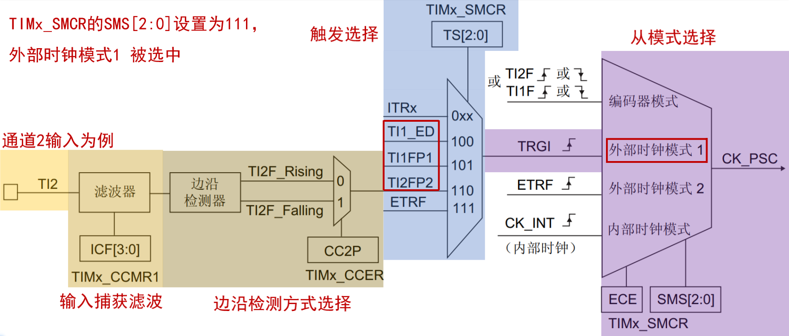

<!--
 * @Date: 2024-06-06
 * @LastEditors: GoKo-Son626
 * @LastEditTime: 2024-07-10
 * @FilePath: \STM32_Study\入门篇\6.Timer\Universal_timer.md
 * @Description: 通用定时器的学习和记录
-->

# 文件内容标题

> 内容目录：
> 
>       1.通用定时器

### 1. 通用定时器

> - **通用定时器：** TIM2/TIM3 /TIM4 /TIM5
> - **特性：**
>       16位**递增**、**递减**、**中心对齐计数器**（计数值：0~65535）
16位预分频器（分频系数：1~65536）
可用于触发**DAC,ADC**
在更新事件、**触发事件、输入捕获、输出比较**时，会产生中断/DMA请求
4个独立通道，可用于：**输入捕获、输出比较、输出PWM、单脉冲模式**
**使用外部信号控制定时器且可实现多个定时器互连的同步电路**
**支持编码器和霍尔传感器电路等**

###### 1. 通用定时器框图

> **①时钟源**

①**内部时钟**(CK_INT)，来自外设总线APB提供的时钟
> 高级定时器 TIM1 和 TIM8 是挂载在 APB2 总线上的,所以 TIM1 和 TIM8 时钟源频率为 72MHz

②**外部时钟模式1**：外部时钟源信号→IO→TIMx_CH1（或者 TIMx_CH2）,CH3 和 CH4 都是不可以的

 外部时钟模式1框图 

> TI1F_ED 表示来自于 CH1，并且没有经过边沿检测器过滤的信号，所以它是 CH1 的双边沿信号，即上升沿或者下降沿都是有效的。TI1FP1 表示来自 CH1 并经过边沿检测器后的信号，可以是上升沿或者下降沿。TI2FP2 表示来自 CH2 并经过边沿检测器后的信号，可以是上升沿或者下降沿。

③**外部时钟模式2**：外部
时钟源信号→IO→TIMx_ETR。从 IO到 TIMx_ETR，就需要我们配置 IO 的复用功能，才能使IO 和定时器相连通。

 外部时钟模式2框图 

- 反相器：
用于转换信号的有效边沿，确保系统能够统一处理上升沿触发事件。
适应不同的信号源，增加了系统的兼容性和灵活性。
- 滤波器：
在噪声环境中或信号边沿不稳定的情况下，滤波器能显著提高信号的可靠性。
对于高频信号输入，滤波器能有效去除抖动，确保定时器的准确计时。

④**内部触发输入**(ITRx)，用于与芯片内部其它通用/高级定时器级联

 内部触发输入框图 

- 详见开发手册

**通用定时器时钟源设置方法**
| 定时器时钟类型                    | 设置方法                                                        |
| --------------------------------- | --------------------------------------------------------------- |
| 内部时钟(CK_INT)                  | 设置 TIMx_SMCR 的 SMS=0000                                      |
| 外部时钟模式 1：外部输入引脚(TIx) | 设置 TIMx_SMCR的 SMS=1111                                       |
| 外部时钟模式 2：外部触发输入(ETR) | 设置 TIMx_SMCR 的 ECE=1                                         |
| 内部触发输入(ITRx)                | 设置可参考《STM32F10xxx参考手册_V10（中文版）.pdf》14.3.15 小节 |

> **②控制器**

> **③时基单元**

> **④输入捕获**

> **⑤捕获/比较(公共)**

> **⑥输出比较**
