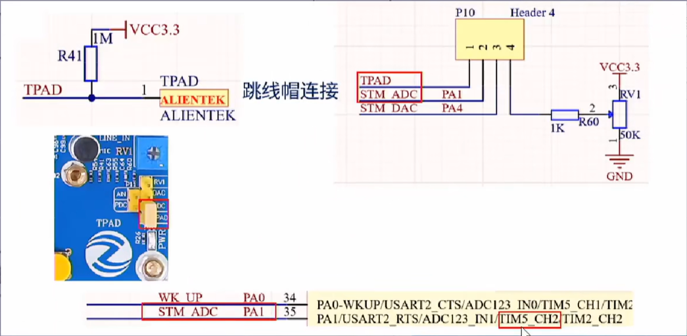
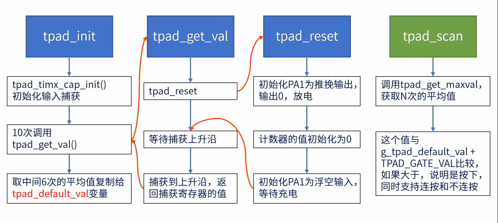

<!--
 * @Date: 2024-06-06
 * @LastEditors: GoKo-Son626
 * @LastEditTime: 2024-07-12
 * @FilePath: \STM32_Study\入门篇\7.电容触摸按键\电容触摸按键.md
 * @Description: 该模板为所有笔记模板
-->

# 文件内容标题

> 内容目录：
> 
>       1. 电容触摸按键原理介绍
>       2. 检测电容触摸按键过程
>       3. 编程实战

### 1. 电容触摸按键原理介绍

- 电容储能就是充放电

**硬件连接图**


> 电容触摸按键中判断按键的原理就是对充电事件的判断，当电容增大时（按键按下时），充电到达某个临界值所需时间变长
> - 可用定时器输入捕获功能计算充电时间（电容的初始状态要为0，即一开始要放电）
> - 先测量无触摸时充电时间Tcs作为比较基准，然后循环测量充电时间T与Tsc作比较，如果超过一定阈值就认为有手指触摸

### 2. 检测电容触摸按键过程




### 3. 编程实战

**tpad.c**
```c
#include "./BSP/TPAD/tpad.h"
#include "./SYSTEM/delay/delay.h"
#include "./SYSTEM/usart/usart.h"

/******************************************************************************************/
/* 空载的时候(没有手按下),计数器需要的时间
 * 这个值应该在每次开机的时候被初始化一次
 */
volatile uint16_t g_tpad_default_val = 0;       /* 空载的时候(没有手按下),计数器需要的时间 */


/* 定时器输入边沿捕获 */
static TIM_HandleTypeDef g_timx_cap_chy_handle; /* 定时器x句柄 */


/**
 * @brief       初始化触摸按键
 * @param       psc     : 分频系数(值越小, 越灵敏, 最小值为: 1)
 * @retval      0, 初始化成功; 1, 初始化失败;
 */
uint8_t tpad_init(uint16_t psc)
{
    uint16_t buf[10];
    uint16_t temp;
    uint8_t j, i;
    
    tpad_timx_cap_init(TPAD_ARR_MAX_VAL, psc - 1);  /* 以72 / (psc - 1) Mhz的频率计数 */

    for (i = 0; i < 10; i++)        /* 连续读取10次 */
    {
        buf[i] = tpad_get_val();
        delay_ms(10);
    }

    for (i = 0; i < 9; i++)         /* 排序 */
    {
        for (j = i + 1; j < 10; j++)
        {
            if (buf[i] > buf[j])    /* 升序排列 */
            {
                temp = buf[i];
                buf[i] = buf[j];
                buf[j] = temp;
            }
        }
    }

    temp = 0;

    for (i = 2; i < 8; i++)         /* 取中间的6个数据进行平均 */
    {
        temp += buf[i];
    }
    
    g_tpad_default_val = temp / 6;
    printf("g_tpad_default_val:%d\r\n", g_tpad_default_val);

    if (g_tpad_default_val > TPAD_ARR_MAX_VAL / 2)
    {
        return 1;                   /* 初始化遇到超过TPAD_ARR_MAX_VAL/2的数值,不正常! */
    }

    return 0;
}

/**
 * @brief       复位TPAD
 *   @note      我们将TPAD按键看做是一个电容, 当手指按下/不按下时容值有变化
 *              该函数将GPIO设置成推挽输出, 然后输出0, 进行放电, 然后再设置
 *              GPIO为浮空输入, 等待外部大电阻慢慢充电
 * @param       无
 * @retval      无
 */
static void tpad_reset(void)
{
    GPIO_InitTypeDef gpio_init_struct;

    gpio_init_struct.Pin = TPAD_GPIO_PIN;               /* 输入捕获的GPIO口 */
    gpio_init_struct.Mode = GPIO_MODE_OUTPUT_PP;        /* 推挽输出 */
    gpio_init_struct.Pull = GPIO_PULLUP;                /* 上拉 */
    gpio_init_struct.Speed = GPIO_SPEED_FREQ_MEDIUM;    /* 中速 */
    HAL_GPIO_Init(TPAD_GPIO_PORT, &gpio_init_struct);   /* TPAD引脚推挽输出 */

    HAL_GPIO_WritePin(TPAD_GPIO_PORT, TPAD_GPIO_PIN, GPIO_PIN_RESET);   /* TPAD引脚输出0, 放电 */

    delay_ms(5);

    g_timx_cap_chy_handle.Instance->SR = 0;             /* 清除标记 */
    g_timx_cap_chy_handle.Instance->CNT = 0;            /* 归零 */

    gpio_init_struct.Pin = TPAD_GPIO_PIN;               /* 输入捕获的GPIO口 */
    gpio_init_struct.Mode = GPIO_MODE_INPUT;            /* 输入 */
    gpio_init_struct.Pull = GPIO_NOPULL;                /* 浮空 */
    gpio_init_struct.Speed = GPIO_SPEED_FREQ_MEDIUM;    /* 中速 */
    HAL_GPIO_Init(TPAD_GPIO_PORT, &gpio_init_struct);   /* TPAD引脚浮空输入 */
}

/**
 * @brief       得到定时器捕获值
 *   @note      如果超时, 则直接返回定时器的计数值
 *              我们定义超时时间为: TPAD_ARR_MAX_VAL - 500
 * @param       无
 * @retval      捕获值/计数值（超时的情况下返回）
 */
static uint16_t tpad_get_val(void)
{
    uint32_t flag = (TPAD_TIMX_CAP_CHY== TIM_CHANNEL_1) ? TIM_FLAG_CC1 :\
                    (TPAD_TIMX_CAP_CHY== TIM_CHANNEL_2) ? TIM_FLAG_CC2 :\
                    (TPAD_TIMX_CAP_CHY== TIM_CHANNEL_3) ? TIM_FLAG_CC3 :TIM_FLAG_CC4;
    
    tpad_reset();
    while (__HAL_TIM_GET_FLAG(&g_timx_cap_chy_handle ,flag) == RESET)   /* 等待通道CHY捕获上升沿 */
    {
        if (g_timx_cap_chy_handle.Instance->CNT > TPAD_ARR_MAX_VAL - 500)
        {
            return g_timx_cap_chy_handle.Instance->CNT;     /* 超时了,直接返回CNT的值 */
        }
    }

    return TPAD_TIMX_CAP_CHY_CCRX;  /* 返回捕获/比较值 */
}

/**
 * @brief       读取n次, 取最大值
 * @param       n       ：连续获取的次数
 * @retval      n次读数里面读到的最大读数值
 */
static uint16_t tpad_get_maxval(uint8_t n)
{
    uint16_t temp = 0;
    uint16_t maxval = 0;

    while (n--)
    {
        temp = tpad_get_val();  /* 得到一次值 */

        if (temp > maxval) maxval = temp;
    }

    return maxval;
}

/**
 * @brief       扫描触摸按键
 * @param       mode    ：扫描模式
 *   @arg       0, 不支持连续触发(按下一次必须松开才能按下一次);
 *   @arg       1, 支持连续触发(可以一直按下)
 * @retval      0, 没有按下; 1, 有按下;
 */
uint8_t tpad_scan(uint8_t mode)
{
    static uint8_t keyen = 0;   /* 0, 可以开始检测;  >0, 还不能开始检测; */
    uint8_t res = 0;
    uint8_t sample = 3;         /* 默认采样次数为3次 */
    uint16_t rval;

    if (mode)
    {
        sample = 6;             /* 支持连按的时候，设置采样次数为6次 */
        keyen = 0;              /* 支持连按, 每次调用该函数都可以检测 */
    }

    rval = tpad_get_maxval(sample);

    if (rval > (g_tpad_default_val + TPAD_GATE_VAL))    /* 大于tpad_default_val+TPAD_GATE_VAL,有效 */
    {
        if (keyen == 0)
        {
            res = 1;            /* keyen==0, 有效 */
        }

        //printf("r:%d\r\n", rval);   /* 输出计数值, 调试的时候才用到 */
        keyen = 3;              /* 至少要再过3次之后才能按键有效 */
    }

    if (keyen) keyen--;

    return res;
}

/**
 * @brief       触摸按键输入捕获设置
 * @param       arr     ：自动重装值
 * @param       psc     ：时钟预分频数
 * @retval      无
 */
static void tpad_timx_cap_init(uint16_t arr, uint16_t psc)
{
    GPIO_InitTypeDef gpio_init_struct;
    TIM_IC_InitTypeDef timx_ic_cap_chy;
    
    TPAD_GPIO_CLK_ENABLE();             /* TPAD引脚 时钟使能 */
    TPAD_TIMX_CAP_CHY_CLK_ENABLE();     /* 定时器 时钟使能 */

    gpio_init_struct.Pin = TPAD_GPIO_PIN;               /* 输入捕获的GPIO口 */
    gpio_init_struct.Mode = GPIO_MODE_INPUT;            /* 输入 */
    gpio_init_struct.Pull = GPIO_PULLDOWN;              /* 下拉 */
    gpio_init_struct.Speed = GPIO_SPEED_FREQ_MEDIUM;    /* 中速 */
    HAL_GPIO_Init(TPAD_GPIO_PORT, &gpio_init_struct);   /* TPAD引脚下拉输入 */

    g_timx_cap_chy_handle.Instance = TPAD_TIMX_CAP;                     /* 定时器5 */
    g_timx_cap_chy_handle.Init.Prescaler = psc;                         /* 定时器分频 */
    g_timx_cap_chy_handle.Init.CounterMode = TIM_COUNTERMODE_UP;        /* 向上计数模式 */
    g_timx_cap_chy_handle.Init.Period = arr;                            /* 自动重装载值 */
    g_timx_cap_chy_handle.Init.ClockDivision = TIM_CLOCKDIVISION_DIV1;  /* 时钟分频因子 */
    HAL_TIM_IC_Init(&g_timx_cap_chy_handle);

    timx_ic_cap_chy.ICPolarity = TIM_ICPOLARITY_RISING;                                     /* 上升沿捕获 */
    timx_ic_cap_chy.ICSelection = TIM_ICSELECTION_DIRECTTI;                                 /* 映射到TI1上 */
    timx_ic_cap_chy.ICPrescaler = TIM_ICPSC_DIV1;                                           /* 配置输入分频，不分频 */
    timx_ic_cap_chy.ICFilter = 0;                                                           /* 配置输入滤波器，不滤波 */
    HAL_TIM_IC_ConfigChannel(&g_timx_cap_chy_handle, &timx_ic_cap_chy, TPAD_TIMX_CAP_CHY);  /* 配置TIM5通道2 */
    HAL_TIM_IC_Start(&g_timx_cap_chy_handle,TPAD_TIMX_CAP_CHY);                             /* 使能输入捕获和定时器 */
}
```
**tpad.h**
```c
#ifndef __TPAD_H
#define __TPAD_H

#include "./SYSTEM/sys/sys.h"
/******************************************************************************************/
/* TPAD 引脚 及 定时器 定义 */

/* 我们使用定时器的输入捕获功能, 对TPAD进行检测
 * 这里的输入捕获使用定时器TIM5_CH2, 捕获TPAD按键的输入
 * 因为我们的TPAD是连接在PA1引脚上的, PA1只能是TIM2_CH2 / TIM5_CH2
 * 所以定时器也只能在这两个里面选, 如果你自己设计的板卡, 则根据原理
 * 图进行相应的修改即可, 包括GPIO 及 对应的定时器和通道
 */
#define TPAD_GPIO_PORT                          GPIOA
#define TPAD_GPIO_PIN                           GPIO_PIN_1
#define TPAD_GPIO_CLK_ENABLE()                  do{ __HAL_RCC_GPIOA_CLK_ENABLE(); }while(0)   /* PA口时钟使能 */

#define TPAD_TIMX_CAP                           TIM5
#define TPAD_TIMX_CAP_CHY                       TIM_CHANNEL_2                                /* 通道Y,  1<= Y <=4 */
#define TPAD_TIMX_CAP_CHY_CCRX                  TIM5->CCR2                                   /* 通道Y的捕获/比较寄存器 */
#define TPAD_TIMX_CAP_CHY_CLK_ENABLE()          do{ __HAL_RCC_TIM5_CLK_ENABLE(); }while(0)   /* TIM5 时钟使能 */

/******************************************************************************************/

/* 触摸的门限值, 也就是必须大于 g_tpad_default_val + TPAD_GATE_VAL
 * 才认为是有效触摸, 改大 TPAD_GATE_VAL, 可以降低灵敏度, 反之, 则可以提高灵敏度
 * 根据实际需求, 选择合适的 TPAD_GATE_VAL 即可
 */
#define TPAD_GATE_VAL       100             /* 触摸的门限值, 也就是必须大于 g_tpad_default_val + TPAD_GATE_VAL, 才认为是有效触摸 */
#define TPAD_ARR_MAX_VAL    0XFFFF          /* 最大的ARR值, 一般设置为定时器的ARR最大值 */


extern volatile uint16_t g_tpad_default_val;/* 空载的时候(没有手按下),计数器需要的时间 */

/* 函数声明 */
/* 静态函数, 仅限 tapd.c调用 */
static void tpad_reset(void);                               /* 复位 */
static uint16_t tpad_get_val(void);                         /* 得到定时器捕获值 */
static uint16_t tpad_get_maxval(uint8_t n);                 /* 读取n次, 获取最大值 */
static void tpad_timx_cap_init(uint16_t arr, uint16_t psc); /* 定时器输入捕获初始化 */

/* 接口函数, 可以在其他.c调用 */
uint8_t tpad_init(uint16_t psc);                            /* TPAD 初始化 函数 */
uint8_t tpad_scan(uint8_t mode);                            /* TPAD 扫描 函数 */

#endif
```
**main.c**
```c
int main(void)
{
    uint8_t t = 0;

    HAL_Init();                             /* 初始化HAL库 */
    sys_stm32_clock_init(RCC_PLL_MUL9);     /* 设置时钟, 72Mhz */
    delay_init(72);                         /* 延时初始化 */
    usart_init(115200);                     /* 串口初始化为115200 */
    led_init();                             /* 初始化LED */
    tpad_init(6);                           /* 初始化触摸按键 */

    while (1)
    {
        if (tpad_scan(0))   /* 成功捕获到了一次上升沿(此函数执行时间至少15ms) */
        {
            LED1_TOGGLE();  /* LED1翻转 */
        }

        t++;
        if (t == 15)
        {
            t = 0;
            LED0_TOGGLE();  /* LED0翻转 */
        }

        delay_ms(10);
    }
}
```