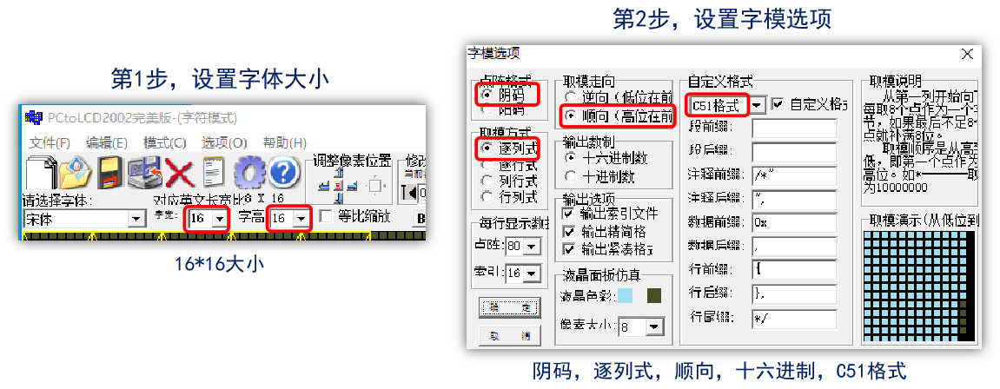

<!--
 * @Date: 2024-06-06
 * @LastEditors: GoKo-Son626
 * @LastEditTime: 2024-07-31
 * @FilePath: \STM32_Study\入门篇\8.OLED\OLED.md
 * @Description: 该模板为所有笔记模板
-->

# OLED

> 内容目录：
> 
>       1. OLED显示屏介绍
>       2. OLED驱动原理
>       3. OLED驱动芯片介绍
>       4. 字符显示原理
>       5. OLED基本驱动步骤
>       6. 编程实战

### 1. OLED显示屏介绍

> - OLED，即有机发光二极管（Organic Light-Emitting Diode）,又称为有机激光显示（Organic Electroluminesence Display）。	
> - OLED显示屏就是利用有机发光二极管制成的显示屏，只要在正负极上加上正确的电压就会发光。

> **正点原子OLED模块介绍**
> - ATK_OLED模块是一块小尺寸（0.96寸）、高亮、自带升压电路的高性能OLED显示模块，分辨率为128 * 64，采用SSD1306驱动IC，该芯片内部集成DCDC升压，仅需3.3V供电。
> - 模块支持8位6800并口、8位8080并口、4线SPI以及IIC等4种通信接口。
**选择方式：通过BS1和BS2选择（默认8080并口）**

| 接口方式 | 8位8080 | 8位6800 | 4线SPI | IIC |
| -------- | ------- | ------- | ------ | --- |
| BS1      | 1       | 0       | 0      | 1   |
| BS2      | 1       | 1       | 0      | 0   |

### 2. OLED驱动原理

**驱动核心：驱动OLED驱动芯片**

**SSD1306工作时序(8080时序)--写时序**
--写时序.png)
- 注意:在WR上升沿，使数据写入到SSD1306里
```c
void oled_wr_byte(uint8_t data, uint8_t cmd) 
{	
	OLED_RS (cmd);	/* 数据类型，由传参决定 */
    	OLED_CS ( 0 );	/* 拉低片选线，选中SSD1306 */
    	OLED_WR ( 0 );	/* 拉低WR线，准备数据 */
    	oled_data_out(data); /* WR低电平期间，准备数据 */
 	OLED_WR ( 1 );	/* 在WR上升沿，数据发出 */
    	OLED_CS ( 1 );	/* 取消片选 */
 	OLED_RS ( 1 );	/* 释放RS线，恢复默认 */
}
void oled_data_out(uint8_t data)
{
    	GPIOC->ODR = (GPIOC->ODR & 0XFF00) | (data & 0X00FF);
}
```

### 3. OLED驱动芯片介绍

**GRAM**

**页地址模式**

**显示覆盖问题的解决**
1. 弄清每一位当前状态
  - 能读模式：读->改->写（SPI和IIC不支持）
2. 建立一个OLED的GRAM
  - 单片机内部需要128*8个字节，每次修改的时候，只是修改单片机上的GRAM（实际上就是SRAM），在修改完之后，一次性把单片机内部的GRAM写入到OLED的GRAM。
  - **注意：** SRAM很小的的单片机，内存不够，推荐还是使用并口模式，节省内存

**GRAM和OLED屏幕对应关系**
**即一个通用的点(x，y)置1表达式为：**
### OLED_GRAM[x][y / 8] |= 1 << y % 8;
 1. **确定页数**:

   - `y / 8` 计算 y 坐标在第几页。
   - 比如说 y = 9，那么 `y / 8` 就是 1，即第2页（因为从0开始计数）。

2. **确定页内的行**:

   - `y % 8` 计算 y 坐标在页内的哪一行。
   - 比如说 y = 9，那么 `y % 8` 就是 1，即第2页的第2行（也是从0开始计数）。

3. **构造位掩码**:

   - `1 << (y % 8)` 计算在页内的第几行要置位。
   - 比如说 y = 9，那么 `1 << (y % 8)` 就是 `1 << 1`，即 00000010。

4. **置位操作**:

   - `OLED_GRAM[x][y / 8] |= 1 << (y % 8)` 使用位操作将对应的位设为1。
   - 比如说原本 `OLED_GRAM[x][1]` 是 00000000，那么 `OLED_GRAM[x][1] |= 00000010` 之后，`OLED_GRAM[x][1]` 就变成了 00000010

### 4. 字符显示原理

**ASCII**:基于拉丁字母的一套电脑编码系统，共128个字符：33个控制字符 和 95个显示字符

**95个显示字符如下**：
(第一个为空格) !"#$%&'()*+,-./0123456789:;<=>?@ABCDEFGHIJKLMNOPQRSTUVWXYZ[\]^_`abcdefghijklmnopqrstuvwxyz{|}~

**ASCII显示字符码表**


**内码**：计算机使用的二进制字符编码，就叫内码，简称编码。字符包含各种文字！
| 字符集  | 编码长度    | 说明                                         |
| ------- | ----------- | -------------------------------------------- |
| ASCII   | 1个字节     | 拉丁字母编码，仅128个编码，最简单            |
| GB2312  | 2个字节     | 简体中文字符编码，包含约6000多汉字编码       |
| GBK     | 2个字节     | 对GB2312的扩充，支持繁体中文，约2W多汉字编码 |
| BIG5    | 2个字节     | 繁体中文字符编码，在台湾、香港用的多         |
| UNICODE | 一般2个字节 | 国际标准编码，支持各国文字                   |

- ASCII字符**宽度** = 汉字**宽度**的一半


### 5. OLED基本驱动步骤

1. 确定IO连接关系 :开发板OLED接口原理图

2. 初始化IO口 :初始化连接OLED的各个IO口

3. 编写8080接口函数 :oled_wr_byte

4. 编写OLED初始化函数 :编写oled_init函数，完成初始化序列配置

5. 编写OLED画点函数 :编写oled_draw_point函数，实现OLED任意位置画点


### 6. 编程实战

> - 前导零是指数字前面不必要的零。例如，在显示数字 0042 时，前面的两个零就是前导零。对于很多场合，这些零是多余的，不需要显示。在显示数字时，通常会忽略前导零。以四位长度显示数字 42 为例，如果不处理前导零，它可能会显示为 0042；如果处理前导零，它会显示为 42。只有在需要表示数字长度一致或特殊情况下才会显示前导零

**初始化OLED函数**
```c
/**
 * @brief       初始化OLED(SSD1306)
 * @param       无
 * @retval      无
 */
void oled_init(void)
{
    GPIO_InitTypeDef gpio_init_struct;
    __HAL_RCC_GPIOC_CLK_ENABLE();     /* 使能PORTC时钟 */
    __HAL_RCC_GPIOD_CLK_ENABLE();     /* 使能PORTD时钟 */
    __HAL_RCC_GPIOG_CLK_ENABLE();     /* 使能PORTG时钟 */

#if OLED_MODE==1    /* 使用8080并口模式 */

    /* PC0 ~ 7 设置 */
    gpio_init_struct.Pin = GPIO_PIN_0|GPIO_PIN_1|GPIO_PIN_2|GPIO_PIN_3|GPIO_PIN_4|GPIO_PIN_5|GPIO_PIN_6|GPIO_PIN_7;                
    gpio_init_struct.Mode = GPIO_MODE_OUTPUT_PP;            /* 推挽输出 */
    gpio_init_struct.Pull = GPIO_PULLUP;                    /* 上拉 */
    gpio_init_struct.Speed = GPIO_SPEED_FREQ_MEDIUM;        /* 中速 */
    HAL_GPIO_Init(GPIOC, &gpio_init_struct);                /* PC0 ~ 7 设置 */

    gpio_init_struct.Pin = GPIO_PIN_3|GPIO_PIN_6;           /* PD3, PD6 设置 */
    gpio_init_struct.Mode = GPIO_MODE_OUTPUT_PP;            /* 推挽输出 */
    gpio_init_struct.Pull = GPIO_PULLUP;                    /* 上拉 */
    gpio_init_struct.Speed = GPIO_SPEED_FREQ_MEDIUM;        /* 中速 */
    HAL_GPIO_Init(GPIOD, &gpio_init_struct);                /* PD3, PD6 设置 */
    
    gpio_init_struct.Pin = GPIO_PIN_13|GPIO_PIN_14|GPIO_PIN_15;
    gpio_init_struct.Mode = GPIO_MODE_OUTPUT_PP;            /* 推挽输出 */
    gpio_init_struct.Pull = GPIO_PULLUP;                    /* 上拉 */
    gpio_init_struct.Speed = GPIO_SPEED_FREQ_MEDIUM;        /* 中速 */
    HAL_GPIO_Init(GPIOG, &gpio_init_struct);                /* WR/RD/RST引脚模式设置 */

    OLED_WR(1);
    OLED_RD(1);

#else               /* 使用4线SPI 串口模式 */

    gpio_init_struct.Pin = OLED_SPI_RST_PIN;                /* RST引脚 */
    gpio_init_struct.Mode = GPIO_MODE_OUTPUT_PP;            /* 推挽输出 */
    gpio_init_struct.Pull = GPIO_PULLUP;                    /* 上拉 */
    gpio_init_struct.Speed = GPIO_SPEED_FREQ_MEDIUM;        /* 中速 */
    HAL_GPIO_Init(OLED_SPI_RST_PORT, &gpio_init_struct);    /* RST引脚模式设置 */

    gpio_init_struct.Pin = OLED_SPI_CS_PIN;                 /* CS引脚 */
    gpio_init_struct.Mode = GPIO_MODE_OUTPUT_PP;            /* 推挽输出 */
    gpio_init_struct.Pull = GPIO_PULLUP;                    /* 上拉 */
    gpio_init_struct.Speed = GPIO_SPEED_FREQ_MEDIUM;        /* 中速 */
    HAL_GPIO_Init(OLED_SPI_CS_PORT, &gpio_init_struct);     /* CS引脚模式设置 */

    gpio_init_struct.Pin = OLED_SPI_RS_PIN;                 /* RS引脚 */
    gpio_init_struct.Mode = GPIO_MODE_OUTPUT_PP;            /* 推挽输出 */
    gpio_init_struct.Pull = GPIO_PULLUP;                    /* 上拉 */
    gpio_init_struct.Speed = GPIO_SPEED_FREQ_MEDIUM;        /* 中速 */
    HAL_GPIO_Init(OLED_SPI_RS_PORT, &gpio_init_struct);     /* RS引脚模式设置 */

    gpio_init_struct.Pin = OLED_SPI_SCLK_PIN;                /* SCLK引脚 */
    gpio_init_struct.Mode = GPIO_MODE_OUTPUT_PP;             /* 推挽输出 */
    gpio_init_struct.Pull = GPIO_PULLUP;                     /* 上拉 */
    gpio_init_struct.Speed = GPIO_SPEED_FREQ_MEDIUM;         /* 中速 */
    HAL_GPIO_Init(OLED_SPI_SCLK_PORT, &gpio_init_struct);    /* SCLK引脚模式设置 */

    gpio_init_struct.Pin = OLED_SPI_SDIN_PIN;               /* SDIN引脚模式设置 */
    gpio_init_struct.Mode = GPIO_MODE_OUTPUT_PP;            /* 推挽输出 */
    gpio_init_struct.Pull = GPIO_PULLUP;                    /* 上拉 */
    gpio_init_struct.Speed = GPIO_SPEED_FREQ_MEDIUM;        /* 中速 */
    HAL_GPIO_Init(OLED_SPI_SDIN_PORT, &gpio_init_struct);   /* SDIN引脚模式设置 */

    OLED_SDIN(1);
    OLED_SCLK(1);
#endif
    OLED_CS(1);
    OLED_RS(1);

    OLED_RST(0);
    delay_ms(100);
    OLED_RST(1);

    oled_wr_byte(0xAE, OLED_CMD);   /* 关闭显示 */
    oled_wr_byte(0xD5, OLED_CMD);   /* 设置时钟分频因子,震荡频率 */
    oled_wr_byte(80, OLED_CMD);     /* [3:0],分频因子;[7:4],震荡频率 */
    oled_wr_byte(0xA8, OLED_CMD);   /* 设置驱动路数 */
    oled_wr_byte(0X3F, OLED_CMD);   /* 默认0X3F(1/64) */
    oled_wr_byte(0xD3, OLED_CMD);   /* 设置显示偏移 */
    oled_wr_byte(0X00, OLED_CMD);   /* 默认为0 */

    oled_wr_byte(0x40, OLED_CMD);   /* 设置显示开始行 [5:0],行数. */

    oled_wr_byte(0x8D, OLED_CMD);   /* 电荷泵设置 */
    oled_wr_byte(0x14, OLED_CMD);   /* bit2，开启/关闭 */
    oled_wr_byte(0x20, OLED_CMD);   /* 设置内存地址模式 */
    oled_wr_byte(0x02, OLED_CMD);   /* [1:0],00，列地址模式;01，行地址模式;10,页地址模式;默认10; */
    oled_wr_byte(0xA1, OLED_CMD);   /* 段重定义设置,bit0:0,0->0;1,0->127; */
    oled_wr_byte(0xC8, OLED_CMD);   /* 设置COM扫描方向;bit3:0,普通模式;1,重定义模式 COM[N-1]->COM0;N:驱动路数 */
    oled_wr_byte(0xDA, OLED_CMD);   /* 设置COM硬件引脚配置 */
    oled_wr_byte(0x12, OLED_CMD);   /* [5:4]配置 */

    oled_wr_byte(0x81, OLED_CMD);   /* 对比度设置 */
    oled_wr_byte(0xEF, OLED_CMD);   /* 1~255;默认0X7F (亮度设置,越大越亮) */
    oled_wr_byte(0xD9, OLED_CMD);   /* 设置预充电周期 */
    oled_wr_byte(0xf1, OLED_CMD);   /* [3:0],PHASE 1;[7:4],PHASE 2; */
    oled_wr_byte(0xDB, OLED_CMD);   /* 设置VCOMH 电压倍率 */
    oled_wr_byte(0x30, OLED_CMD);   /* [6:4] 000,0.65*vcc;001,0.77*vcc;011,0.83*vcc; */

    oled_wr_byte(0xA4, OLED_CMD);   /* 全局显示开启;bit0:1,开启;0,关闭;(白屏/黑屏) */
    oled_wr_byte(0xA6, OLED_CMD);   /* 设置显示方式;bit0:1,反相显示;0,正常显示 */
    oled_wr_byte(0xAF, OLED_CMD);   /* 开启显示 */
    oled_clear();
}
```

### 附：ASCII字库制作（16*16）

**使用PCtoLCD2002.exe软件制作ASCII字库！**
