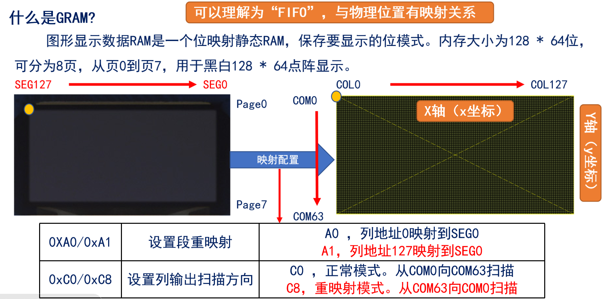
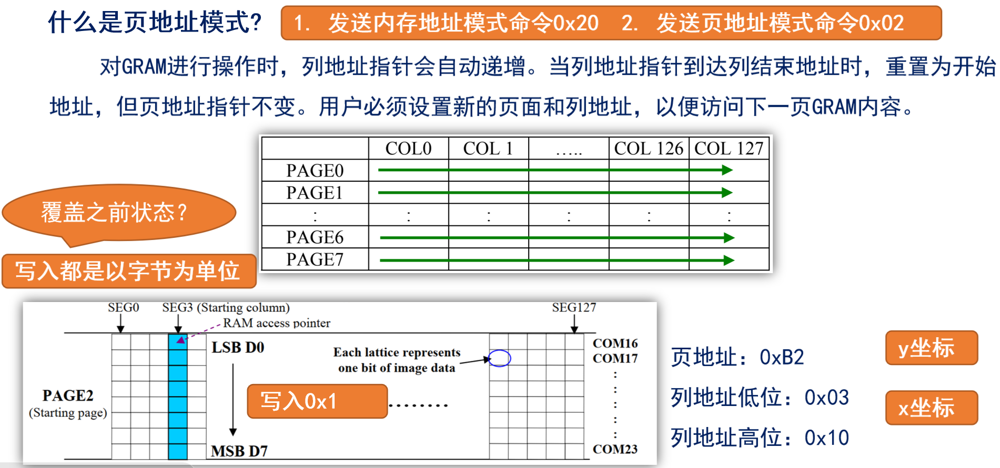
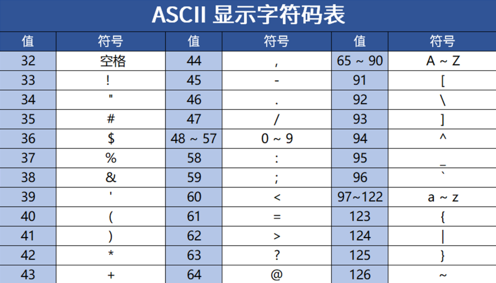

<!--
 * @Date: 2024-06-06
 * @LastEditors: GoKo-Son626
 * @LastEditTime: 2024-07-13
 * @FilePath: \STM32_Study\入门篇\8.OLED\OLED.md
 * @Description: 该模板为所有笔记模板
-->

# OLED

> 内容目录：
> 
>       1. OLED显示屏介绍
>       2. OLED驱动原理
>       3. OLED驱动芯片介绍
>       4. 字符显示原理
>       5. OLED基本驱动步骤
>       6. 编程实战

### 1. OLED显示屏介绍

> - OLED，即有机发光二极管（Organic Light-Emitting Diode）,又称为有机激光显示（Organic Electroluminesence Display）。	
> - OLED显示屏就是利用有机发光二极管制成的显示屏，只要在正负极上加上正确的电压就会发光。

> **正点原子OLED模块介绍**
> - ATK_OLED模块是一块小尺寸（0.96寸）、高亮、自带升压电路的高性能OLED显示模块，分辨率为128 * 64，采用SSD1306驱动IC，该芯片内部集成DCDC升压，仅需3.3V供电。
> - 模块支持8位6800并口、8位8080并口、4线SPI以及IIC等4种通信接口。
**选择方式：通过BS1和BS2选择（默认8080并口）**

| 接口方式 | 8位8080 | 8位6800 | 4线SPI | IIC |
| -------- | ------- | ------- | ------ | --- |
| BS1      | 1       | 0       | 0      | 1   |
| BS2      | 1       | 1       | 0      | 0   |

### 2. OLED驱动原理

**驱动核心：驱动OLED驱动芯片**

**SSD1306工作时序(8080时序)--写时序**
--写时序.png)
- 注意:在WR上升沿，使数据写入到SSD1306里
```c
void oled_wr_byte(uint8_t data, uint8_t cmd) 
{	
	OLED_RS (cmd);	/* 数据类型，由传参决定 */
    	OLED_CS ( 0 );	/* 拉低片选线，选中SSD1306 */
    	OLED_WR ( 0 );	/* 拉低WR线，准备数据 */
    	oled_data_out(data); /* WR低电平期间，准备数据 */
 	OLED_WR ( 1 );	/* 在WR上升沿，数据发出 */
    	OLED_CS ( 1 );	/* 取消片选 */
 	OLED_RS ( 1 );	/* 释放RS线，恢复默认 */
}
void oled_data_out(uint8_t data)
{
    	GPIOC->ODR = (GPIOC->ODR & 0XFF00) | (data & 0X00FF);
}
```

### 3. OLED驱动芯片介绍

**GRAM**

**页地址模式**

**显示覆盖问题的解决**
1. 弄清每一位当前状态
  - 能读模式：读->改->写（SPI和IIC不支持）
2. 建立一个OLED的GRAM
  - 单片机内部需要128*8个字节，每次修改的时候，只是修改单片机上的GRAM（实际上就是SRAM），在修改完之后，一次性把单片机内部的GRAM写入到OLED的GRAM。
  - **注意：**SRAM很小的的单片机，内存不够，推荐还是使用并口模式，节省内存

### 4. 字符显示原理

**ASCII**:基于拉丁字母的一套电脑编码系统，共128个字符：33个控制字符 和 95个显示字符

**95个显示字符如下**：
  !"#$%&'()*+,-./0123456789:;<=>?@ABCDEFGHIJKLMNOPQRSTUVWXYZ[\]^_`abcdefghijklmnopqrstuvwxyz{|}~

**ASCII显示字符码表**


### 5. OLED基本驱动步骤


### 6. 编程实战

> - 前导零是指数字前面不必要的零。例如，在显示数字 0042 时，前面的两个零就是前导零。对于很多场合，这些零是多余的，不需要显示。在显示数字时，通常会忽略前导零。以四位长度显示数字 42 为例，如果不处理前导零，它可能会显示为 0042；如果处理前导零，它会显示为 42。只有在需要表示数字长度一致或特殊情况下才会显示前导零。