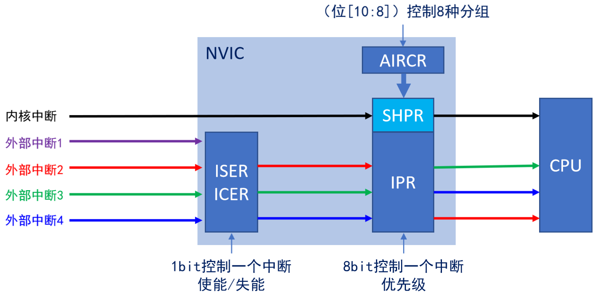
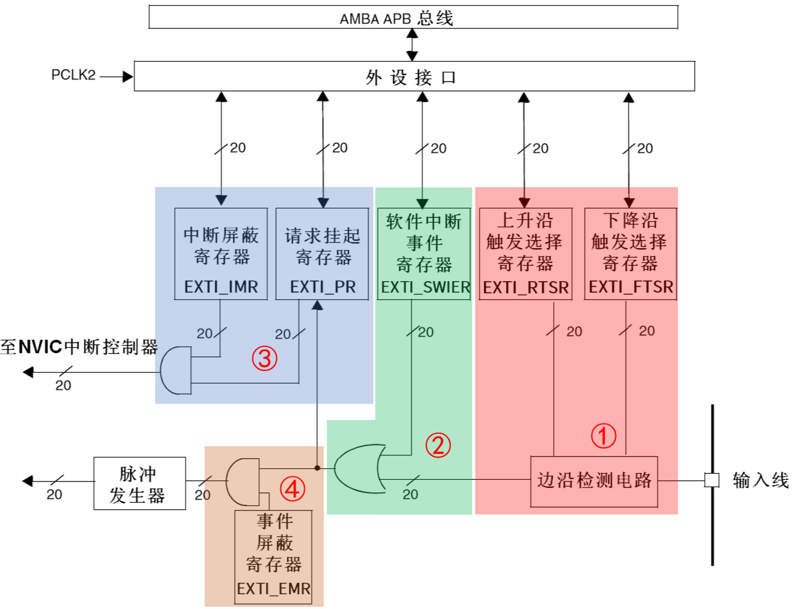
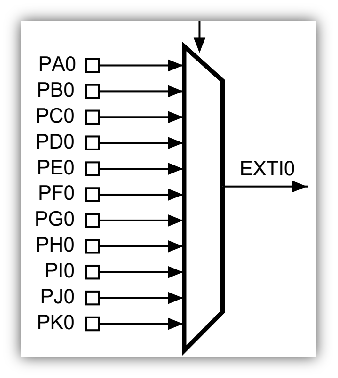
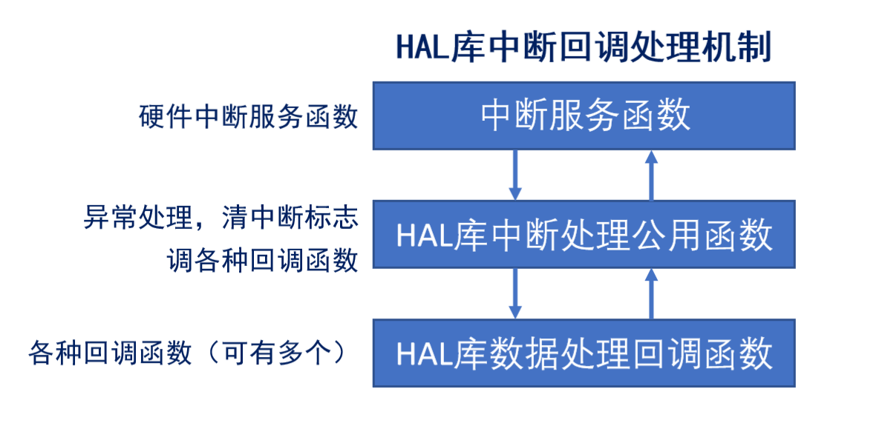

<!--
 * @Date: 2024-06-09
 * @LastEditors: GoKo-Son626
 * @LastEditTime: 2024-06-10
 * @FilePath: \STM32_Study\入门篇\中断\中断.md
 * @Description: 
-->

# 中断

> 内容目录：
> 
>       1. 什么是中断
>       2. NVIC
>       3. EXTI
>       4. EXTI和I0映射关系
>       5. 如何使用中断
>       6. 通用外设驱动模型(四步法)
>       7. HAL库中断回调处理机制介绍
>       8. 编程实战:通过外部中断控制一个灯亮灭

#### 1. 什么是中断

> 中断：
>       打断CPU执行正常的程序，转而处理紧急程序，然后返回原暂停的程序继续运行。
> 作用：
>       1. 实时控制
>       2. 故障处理
>       3. 数据传输（如串口数据接收）
> 意义：
>       高效处理紧急程序，不会一直占用CPU资源

**外部中断简略流程**
GPIO(上下拉浮空输入) -> AFIO(F1)（GPIOXy->EXTly） -> EXTI（屏蔽上升/下降沿） -> NVIC（使能，优先级控制）-> CPU（处理中断）

#### 2. NVIC

**NVIC**：嵌套向量中断控制器，属于内核
> 中断服务函数是中断的入口，中断服务函数被定义在中断向量表中

**中断向量表**：定义一块固定的内存，以4字节对齐，存放各个中断服务函数程序的首地址
中断向量表定义在启动文件(.s)，当发生中断，CPU会自动执行对应的中断服务函数

1. NVIC相关寄存器介绍

| NVIC相关寄存器                      | 位数 | 寄存器个数 | 备注                                  |
| ----------------------------------- | ---- | ---------- | ------------------------------------- |
| 中断使能寄存器(ISER)                | 32   | 8          | 每个位控制一个中断                    |
| 中断除能寄存器(ICER)                | 32   | 8          | 每个位控制一个中断                    |
| 应用程序中断及复位控制寄存器(AIRCR) | 32   | 1          | 位[10:8]控制优先级分组                |
| 中断优先级寄存器(IPR)               | 8    | 240        | 8个位对应一个中断，而STM32只使用高4位 |

> 32*8=256 - 240 = 16个位保留

2. NVIC工作原理

3. 中断优先级基本概念

        1. 抢占优先级(pre)：高抢占优先级可以打断正在执行的低抢占优先级中断
        2. 响应优先级(sub)：当抢占优先级相同时，响应优先级高的先执行，但是不能互相打断
        3. 抢占和响应都相同的情况下，自然优先级越高的，先执行
        4. 自然优先级：中断向量表的优先级
        5. 数值越小，表示优先级越高

4. 中断优先级分组

| 优先级分组 | AIRCR[10:8] | IPRx bit[7:4]分配 | 分配结果                     |
| ---------- | ----------- | ----------------- | ---------------------------- |
| 0          | 111         | None  ：[7:4]     | 0位抢占优先级，4位响应优先级 |
| 1          | 110         | [7]  ：[6:4]      | 1位抢占优先级，3位响应优先级 |
| 2          | 101         | [7:6]  ：[5:4]    | 2位抢占优先级，2位响应优先级 |
| 3          | 100         | [7:5]  ：[4]      | 3位抢占优先级，1位响应优先级 |
| 4          | 011         | [7:4]  ：None     | 4位抢占优先级，0位响应优先级 |

> 特别提示：一个工程中，一般只设置一次中断优先级分组
> 参考：STM32F10xxx编程手册（英文版）.pdf，4.4.5节
> 考虑顺序：抢占 -> 相应 -> 自然

5. NVIC的使用

   1. 设置中断分组：AIRCR[10:8]，HAL_NVIC_SetPriorityGrouping
   2. 设置中断优先级：IPRx bit[7:4]，HAL_NVIC_SetPriority
   3. 使能中断：ISERx，HAL_NVIC_EnableIRQ

#### 3. EXTI

**EXIT**：外部（扩展）中断时间控制器,包含20个产生事件/中断请求的边沿检测器，即总共：20条EXTI线（F1）

**中断和事件的理解**：
中断：要进入NVIC，有相应的中断服务函数，需要CPU处理
事件：不进入NVIC，仅用于内部硬件自动控制的，如：TIM、DMA、ADC

1. EXTI主要特征

        每条EXTI线都可以单独配置：选择类型（中断或者事件）、触发方式（上升沿，下降沿或者双边沿触发）、支持软件触发、开启/屏蔽、有挂起状态位

2. EXTI工作原理
   

> - 1. 边沿检测
> - 2. 软件触发
> - 3. 中断屏蔽/清除
> - 4. 时间屏蔽

> 相关（一个）32位寄存器位0-19位有效，控制20根EXIT
#### 4. EXTI和I0映射关系

**AFIO简介(F1)**：复用功能IO，主要用于重映射和外部中断映射配置

        1.调试IO配置：AFIO_MAPR[26:24]，配置JTAG/SWD的开关状态
        2.重映射配置：AFIO_MAPR，部分外设IO重映射配置
        3.外部中断配置：AFIO_EXTICR1~4，配置EXTI中断线0~15对应具体哪个IO口

> 配置AFIO寄存器之前要使能AFIO时钟
> 方法如下：
__HAL_RCC_AFIO_CLK_ENABLE();对应RCC_APB2ENR寄存器(位0)

**SYSCFG简介（F4/F7/H7）**:系统配置控制器，用于外部中断映射配置

        外部中断配置:SYSCFG_EXTICR1~4，配置EXTI中断线0~15对应具体哪个IO口

> 配置SYSCFG寄存器之前要使能SYSCFG时钟
> 方法如下：
__HAL_RCC_SYSCFG_CLK_ENABLE(); 

1. EXTI与IO对应关系

> AFIO_EXTICR1的 EXTI0[3:0]位控制（F1）
>       Px0映射到EXTI0
        Px1映射到EXTI1
        ...
        Px14映射到EXTI14
        Px15映射到EXTI15
> 每个寄存器四条线，四个寄存器16条对应16个EXTI
> 每条线对应四个位即对应16个Px

#### 5. 如何使用中断

> EXTI0-15通过GPIO（设置输入模式）和AFIO（设置EXTI和IO的映射关系）到EXTI，EXTI其它中断直接到EXTI，外设中断直接开启相关中断到NVIC，

**EXTI的配置步骤**
1，使能GPIO时钟
2，设置GPIO输入模式
3，使能AFIO/SYSCFG时钟
4，设置EXTI和IO对应关系
5，设置EXTI屏蔽，上/下沿
6，设置NVIC：设置优先级，使能中断
7，设计中断服务函数

> 注意：步骤2 - 5
使用HAL_GPIO_Init一步到位
> STM32仅有：EXTI0~4、EXTI9_5、EXTI15_10，7个外部中断服务函数(.s中定义)

#### 6. 通用外设驱动模型(四步法)

1.初始化（必）
2.读函数（选）
3.写函数（选）
4.中断服务函数（选）

#### 7. HAL库中断回调处理机制介绍

#### 8. 编程实战:通过外部中断控制一个灯亮灭

