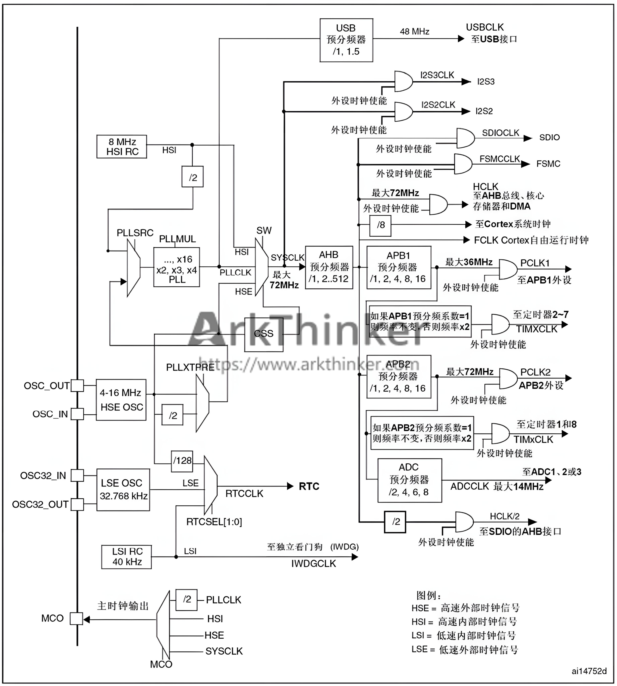

<!--
 * @Date: 2024-06-03
 * @LastEditors: GoKo-Son626
 * @LastEditTime: 2024-06-15
 * @FilePath: \STM32_Study\基础篇\11.STM32时钟系统.md
 * @Description: 
-->

# STM32时钟系统

> 内容目录：
>
>       1. 认识时钟树
>       2. 配置系统时钟

#### 1. 认识时钟树

1. 什么是时钟？

- 时钟是具有周期性的脉冲信号，最常用的是占空比50%的方波（时钟：单片机的脉搏）

2. 认识时钟树（F1）

**STM32F1时钟源介绍**


- HSE（4~16MHz）和HSI（8MHz）通过锁相环（PLL）得到72MHz（max）的SYSCLK



#### 2. 配置系统时钟

1. 系统时钟配置步骤

    1. 配置HSE_VALUE(外部晶振频率)
    2. 调用SystemInit()函数（可选）(BECAUSE 只配置了中断向量表的位置，无意义)
    3. 选择时钟源，配置PLL（通过HAL_RCC_OscConfig()函数设置）
    4. 选择系统时钟源（PLL），配置总线分配器（通过HAL_RCC_ClockConfig()函数设置）

2. 外设时钟使能和失能

        要使用外设，必须先使其使能
        禁止时失能

3. sys_stm32_clock_init函数（F1）

   1. HAL_RCC_OscConfig()函数 
   ```c
        typedef struct 
        { 
                uint32_t  OscillatorType; 		/* 选择需要配置的振荡器 */ 
                uint32_t  HSEState; 			/* HSE 状态 */ 
                uint32_t  HSEPredivValue; 		/* HSE 预分频值 */ 
                uint32_t  LSEState; 			/* LSE 状态 */ 
                uint32_t  HSIState; 			/* HSI状态 */ 
                uint32_t  HSICalibrationValue; 	/* HSI 校准值 */ 
                uint32_t  LSIState; 			/* LSI 状态 */ 
                RCC_PLLInitTypeDef  PLL; 		/* PLL 结构体 */ 
        }RCC_OscInitTypeDef;

        typedef struct 
        { 
                uint32_t  PLLState; 		/* PLL 状态 */ 
                uint32_t  PLLSource; 	/* PLL 时钟源 */ 
                uint32_t  PLLMUL; 		/* PLL 倍频系数 */ 
        }RCC_PLLInitTypeDef;
   ```
   2. HAL_RCC_ClockConfig()函数
   ```c
      typedef struct 
        { 
                uint32_t  ClockType; 		/* 要配置的时钟（SYSCLK/HCLK/PCLK1/PCLK2） */ 
                uint32_t  SYSCLKSource; 		/* 系统时钟源 */ 
                uint32_t  AHBCLKDivider; 		/* AHB  时钟预分频系数 */ 
                uint32_t  APB1CLKDivider; 	/* APB1 时钟预分频系数 */ 
                uint32_t  APB2CLKDivider; 	/* APB2 时钟预分频系数 */ 
        }RCC_ClkInitTypeDef;
  
        uint32_t FLatency 

        #define  FLASH_LATENCY_0   0x00000000U 				/* FLASH 0个等待周期 */ 
        #define  FLASH_LATENCY_1   FLASH_ACR_LATENCY_0 		/* FLASH 1个等待周期 */ 
        #define  FLASH_LATENCY_2   FLASH_ACR_LATENCY_1 		/* FLASH 2个等待周期 */
   ```
