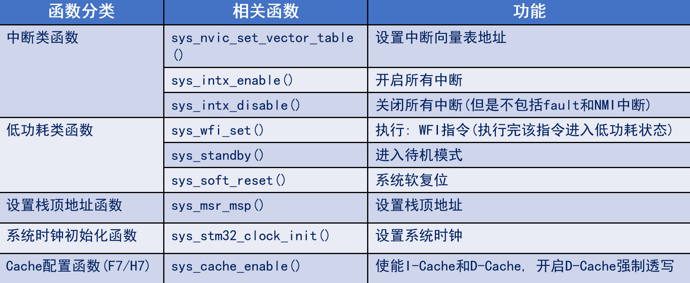
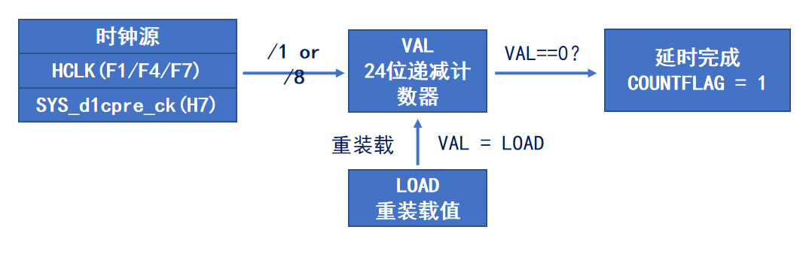
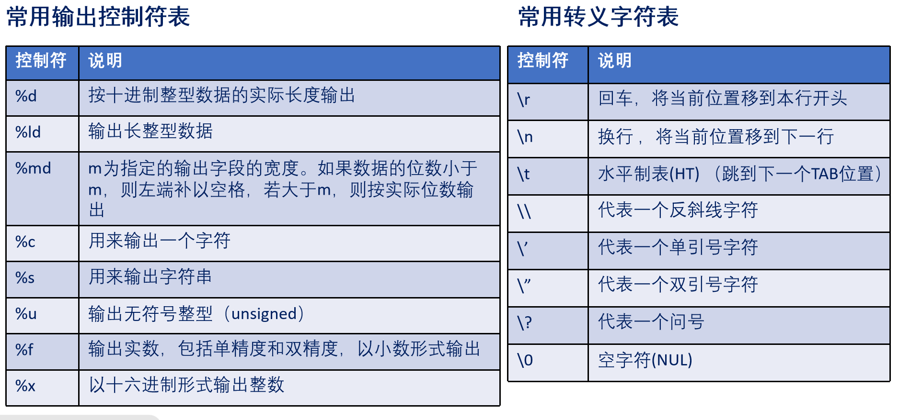

<!--
 * @Date: 2024-06-04
 * @LastEditors: GoKo-Son626
 * @LastEditTime: 2024-06-15
 * @FilePath: \STM32_Study\基础篇\12.SYSTEM文件夹介绍.md
 * @Description: 
-->

# SYSTEM文件夹介绍

> 内容目录：
>
>       1. sys文件夹介绍
>       2. delay文件夹介绍
>       3. usart文件夹介绍

#### 1. sys文件夹介绍



> 中断类函数：设置地址，开启和关闭中断
> 低功耗类函数：执行WFI指令，进入待机模式，系统软件复位
> 设置栈顶地址函数：设置栈顶地址
> 系统时钟初始化函数：设置系统时钟
> Cache配置函数：(主要针对F7/H7)

#### 2. delay文件夹介绍

> 两类：使用和不使用OS的函数

**使用OS：**

- SysTick，即系统滴答计时器，包含在M3/4/7内核里面，核心是一个24位的递减计数器
- 每次VAL到0时，VAL自动从LOAD重载！开始新一轮递减计数！

**SysTick工作原理**


**SysTick寄存器介绍**

- SysTick控制及状态寄存器(CTRL) 
- SysTick重装载数值寄存器(LOAD)
- SysTick当前数值寄存器(VAL) 

###### 1. delay_init()函数：初始化系统滴答定时器

1M:1us = 1/100 0000,
72/8 = 9M ,1us = 1/9M * 9次 = 9/900 0000
g_fac_us = sysclk/8 = 9

```c
        void delay_init(uint16_t sysclk) 
        { 
                SysTick->CTRL = 0; 
                HAL_SYSTICK_CLKSourceConfig(SYSTICK_CLKSOURCE_HCLK_DIV8); 
                g_fac_us = sysclk / 8; 
        }
```

###### 2. delay_us():用系统滴答定时器实现微秒延时

```
        void delay_us(uint32_t nus) 
        { 
                uint32_t temp; 
                SysTick->LOAD = nus * g_fac_us; 	/* 时间加载 */ 
                SysTick->VAL = 0x00; 			/* 清空计数器 */ 
                SysTick->CTRL |= 1 << 0 ; 		/* 开始倒数 */ 
                do 
                { 
                        temp = SysTick->CTRL; 
                } while ((temp & 0x01) && !(temp & (1 << 16))); /* CTRL.ENABLE位必须为1, 并等待时间到达 */

        
                SysTick->CTRL &= ~(1 << 0) ; 		/* 关闭SYSTICK */ 
                SysTick->VAL = 0X00; 			/* 清空计数器 */ 
        }
```
###### 3. dilay_ms()：用微秒延时函数实现毫秒延时

```
        void delay_ms(uint16_t nms) 
        { 
                uint32_t repeat = nms / 1000;	/* 这里用1000,是考虑到可能有超频应用, 
                                                                        * 比如128Mhz的时候, delay_us最大只能延时1048576us
                                                                        */ 
                uint32_t remain = nms % 1000; 
                while (repeat) 
                { 
                        delay_us(1000 * 1000); 	/* 利用delay_us 实现 1000ms 延时 */ 
                        repeat--; 
                } 
                if (remain) 
                { 
                        delay_us(remain * 1000); 	/* 利用delay_us, 把尾数延时(remain ms)给做了 */ 
                } 
        }
```

#### 3. usart文件夹介绍

###### 1. printf函数输出流程

> printf()由编译器提供的stdio.h解析，使用fput最终实现输出（用户需要根据最终输出的硬件重新定义该函数，此过程称为：printf重定向）

###### 2. printf的使用

> ```
> printf("字符串\r\n");
> uint32_t temp = 10;
> 
> printf("%d\r\n",temp);
> ```

**常用输出控制符和转义字符**


> "\","%"和"""的打印：、
>  \ = \\
>  % = %%
>  " = \"

###### 3. printf函数支持

> **半主机模式**
> 用于ARM目标的一种机制，可将来自应用程序代码的输入/输出请求传送至运行调试器的主机
> 简单来说就是通过仿真器实现开发板在电脑上的输入和输出 

> 1. 避免使用半主机模式（ 一般不适用半主机模式，所以避免）
> 
>       1. 微库法(简单，好)
>       魔术棒->Target->勾选：Use Micro LIB
>       2. 代码法（复杂，慢）
>       一个预处理,两个定义，三个
>               1. #pragmaimport(__use_no_semihosting)，确保不从C库中使用半主机函数
>               2. 定义:__FILE结构体,避免HAL库某些情况下报错
>               3. 定义:FILE__stdout,避免编译报错
>               4. 实现:_ttywrch、_sys_exit和 _sys_command_string等三个函数

> 2. 实现fputc函数（实现单个字符输出）
> ```
> /* MDK下需要重定义fputc函数, printf函数最终会通过调用fputc输出字符串到串口 */
> int fputc(int ch, FILE *f)
> {
>     while ((USART_UX->SR & 0X40) == 0);     /* 等待上一个字符发送完成, 不然会一直发送叠加导致乱码 */
> 
>     USART_UX->DR = (uint8_t)ch;             /* 将要发送的字符 ch 写入到DR寄存器 */
>     return ch;
> }
> ```