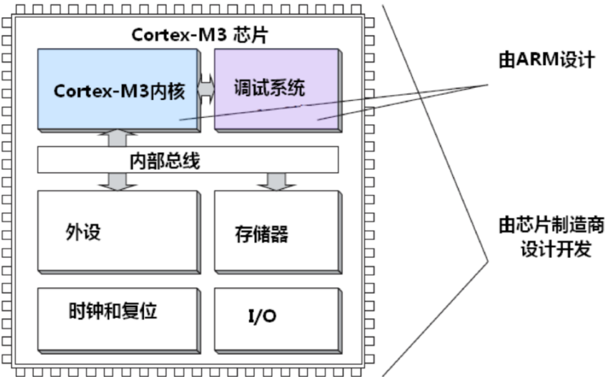
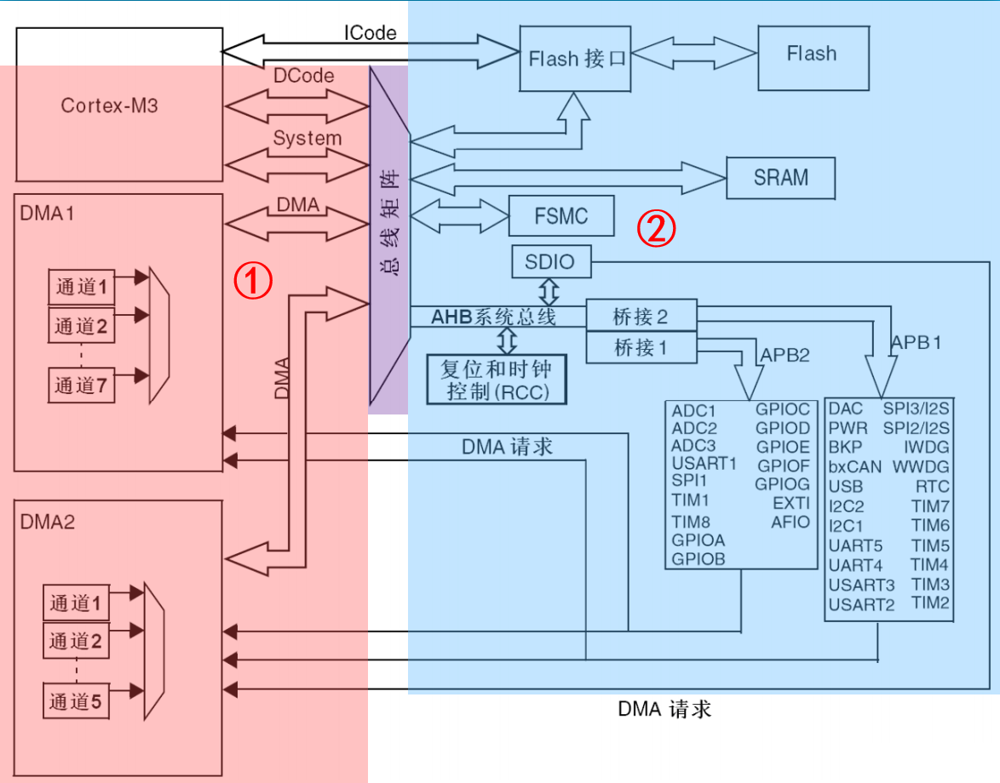
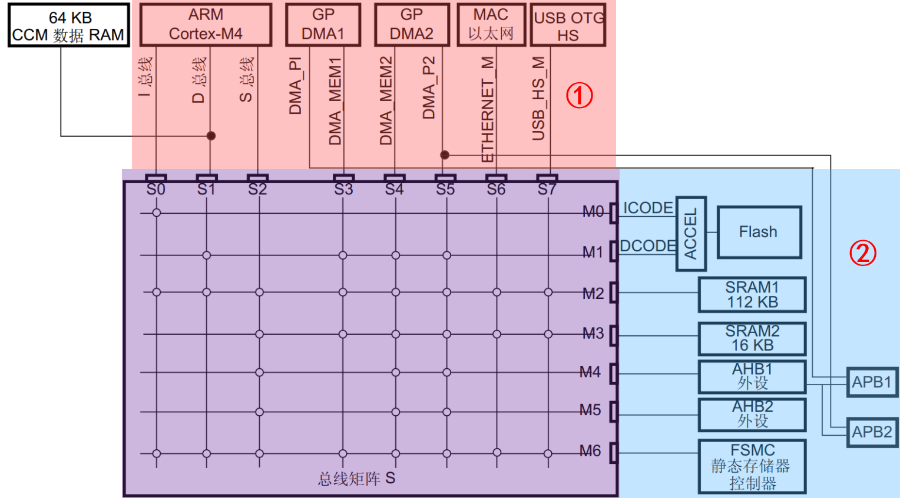
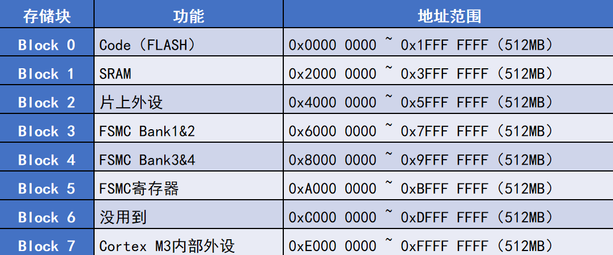
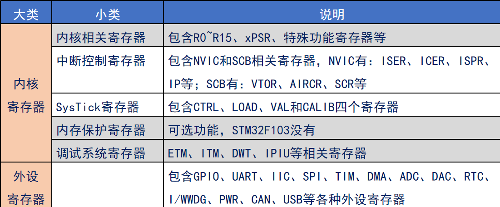

<!--
 * @Date: 2024-05-31
 * @LastEditors: GoKo-Son626
 * @LastEditTime: 2024-06-15
 * @FilePath: \STM32_Study\基础篇\6.STM32基础知识.md
 * @Description: 
-->

# STM32基础知识

> 内容目录：
>
>       1. STM32系统框架
>       2. STM32寻址范围
>       3. 存储器映射
>       4. 寄存器映射

#### 1. STM32系统框架

**Cortex-M内核 & 芯片**


###### F1系统框架

**F1系统架构图**


1. ① 4个主动单元 + ② 4个被动单元
2. F1系统框架简图：ICode总线直接连接FLash
可以不需要总线矩阵（避免冲突等待……）直接读取Flash中的指令
1. 总线时钟频率：
   1. AHB：72MHz(Max)
   2. APB1：36MHz(Max)(需求不同，频率不同)
   3. APB2：72MHz(Max)
2. 互联型：……


###### F4系统框架

**F4系统架构图(F407为例)**


1. ① 主控总线，② 被控总线
2. CCM RAM:只能存数据，访问速度快，不支持DMA
3. 总线时钟频率：
   1. AHB1/2：168/180MHz(Max)
   2. APB1：42/45MHz(Max)(需求不同，频率不同)
   3. APB2：84/90MHz(Max)

###### F7系统架构

- 略

###### H7系统架构

- 略

#### 2. STM32寻址范围

1. 32根地址线
2. 存储单元按字节编址（8bit）
   | 地址线数 | 地址编号       | 地址编号数（内存大小） |
   | -------- | -------------- | ---------------------- |
   | 1        | 0，1           | 2                      |
   | 2        | 00，01，10，11 | 4                      |
   | 3        | …………           | 8                      |
   | n        | ……………………       | 2^n                    |
3. STM32寻址大小：2^23 = 4G(字节)
4. 寻址范围：0x0000 0000 ~ 0xFFFF FFFF

#### 3. 存储器映射

> 存储器指可以存储数据的设备，本身没有地址信息，对其分配地址的过程称为存储器映射

> 字：word（1字 = 2字节）
> 字节：byte（1byte = 8bit）
> 位：bit（比特，即二进制位）

**存储器功能划分**


**STM32F1存储器映射图**
> 数据手册：Page 28: Figure 9:Memory map


- ST将4GB（2^32）地址空间分成8个块


**Block0(FLASH)功能划分**
功能划分.png)

**Block1(SRAM)功能划分**
功能划分.png)

**Block2(外设)功能划分**
功能划分.png)

#### 4. 寄存器映射

> 寄存器是单片机内部一种特殊的内存，可以实现对单片机各个功能的控制
> 简单来说：寄存器就是单片机内部的控制机构

**STM32寄存器分类**


**寄存器映射(以F1为例)**

> 寄存器是特殊的存储器，给寄存器地址命名的过程，就叫寄存器映射

- 端口输出数据寄存器（GPIOx_ODR)(x=ABC..E)
EX:GPIOA_ODR
- 地址偏移：0Ch
  复位值：0x0000 0000
- 寄存器位表：
  位0-15：rw
  位16-31:保留，始终读位0
- 寄存器映射举例
  直接操作寄存器地址：\*(unsigned int*)(0x4001 080C) = 0xFFFF
  > 定义名字后再操作：
  ```
  #define GPIOA_ODR *(unsigned int*)(0x4001 080C)
  GPIOA_ODR = 0xFFFF;
  ```

- 寄存器地址计算：
  1. 总线基地址（BUS_BASE_ADDR)
  2. 外设基于总线基地址的偏移量（PERIPH_OFFSET）
  3. 寄存器相对于外设基地址的偏移量（REG_OFFSET）

> 使用结构体可以方便对寄存器的映射