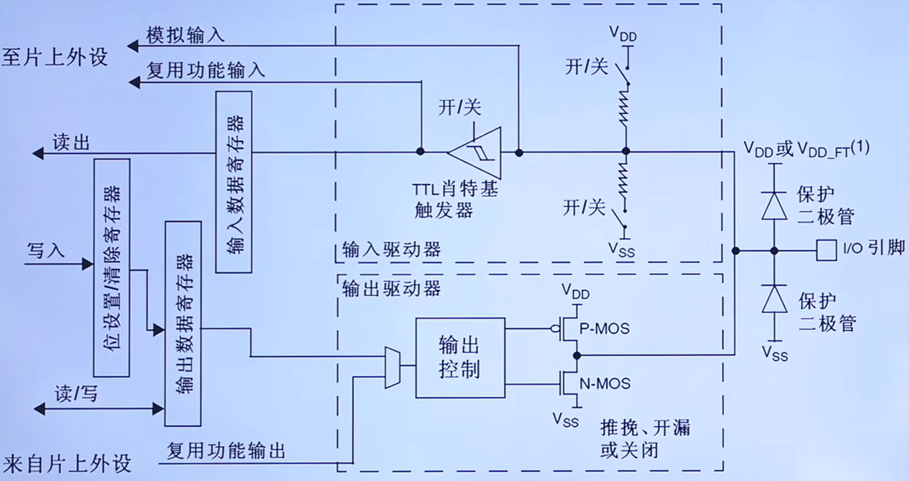

<!--
 * @Date: 2024-06-06
 * @LastEditors: GoKo-Son626
 * @LastEditTime: 2024-06-06
 * @FilePath: \STM32_Study\基础篇\GPIO.md
 * @Description: 
-->
# GPIO
> 内容目录：
> 
>        1. 什么是GPIO?
>        2. STME32 GPIO简介
>        3. IO端口基本结构介绍
>        4. GPIO的八种模式分析
>        5. GPIO寄存器介绍
>        6. 通用外设驱动模型（四步法）
>        7. GPIO配置步骤
>        8. 编程实战：点亮一个LED灯
>        9. 编程实战：通过一个按键控制一个LED灯

#### 1. 什么是GPIO?

> General Purposelnput Output，即通用输入输出端口，简称GPIO
> 作用:负责采集外部器件的信息或者控制外部器件工作，即输入输出

#### 2. STME32 GPIO简介

###### 1. GPIO特点 
- 不同类型IO口数量可能不一样
- 快速翻转（翻转高电平到低或低到高）
  
        若芯片的时钟频率为72Mhz，且每次翻转最需要两个时钟周期，那么IO口最大翻转频率：

        一个周期为1/72Mhz
        单次翻转时间：2 * 1/72Mhz
        翻转频率 = 1s/翻转时间 = 36Mhz
- 每个IO口都可做中断
- 支持8种工作模式
###### 2. GPIO电气特性
- STM32工作电压范围：2V <= VDD <= 3.6V
- GPIO识别电压范围：
  
        COMS端口（IO电平未标记为FT的）：
                
                0：-0.3V ≤ V.IL ≤ 1.164V
                1：1.866V ≤ V.IH ≤ 3.6V
        TTL端口（IO电平标记为FT的）：
- GPIO输出电流：单个IO，最大25mA

更多参考数据手册：5.1.2小节和5.3.13小节
###### 3.GPIO引脚分布
- 64个引脚，51个IO口
- 引脚类型（六大类）：
  
        电源引脚：V字母开头的
        晶振引脚：
                PC 14-0 SC 32_IN
                PC 15-0 SC 32_OUT
                P DO-OS C_IN
                P D 1-OS C_OUT
        复位引：脚位为7的NRST引脚
        下载引脚：串口，SWF，JTAG
        BOOT引脚：BOOT0和PB2上的BOOT1
        GPIO引脚：剩下的P开头的
- 特点：按组存在，组数视芯片而定，每组最多16个IO口
#### 3. IO端口基本结构介绍

###### 1. F1系列IO端口基本结构

- 保护二极管（弱保护）：
  
        上：V.DD或V.DD_FF^(1)有0.3V的压降
        下：V.ss为0V，到上位正好位-0.3V，起到保护作用
- （弱的）内部上下拉电阻：
- 施密特触发器：施密特触发器就是一种整形电路，可以将非标准方波，整形成方波

        特点:
        当输入电压高于正向阈值电压，输出为高;
        当输入电压低于负向阈值电压，输出为低;
        当输入在正负向阈值电压之间，输出不改变。
        作用：
        整形！如正弦波转方波
- P-MOS & N-MOS管简介

        MOS管是压控型元件，通过控制栅源电压(Vgs）来实现导通或关闭。

#### GPIO的八种模式分析

###### 1. GPIO的八种模式分析

1. 输入浮空

        上拉电阻关闭
        下拉电阻关闭
        施密特触发器打开
        双MOS管不导通
        特点：空闲时（高阻态（外部引脚不接任何东西时）），IO状态不确定，由外部环境确定
2. 输入上拉

        较1.变化：上拉电阻打开
        特点：空闲时，IO呈高电平，弱上拉

3. 输入下拉

        较2.变化：下拉电阻打开
        特点：空闲时，IO呈低电平

4. 模拟功能

        较1.变化：施密特触发器关闭
        特点：专门用于模拟信号输入或输出，如：ADC和DAC

5. 开漏输出（输出模式可以读取到引脚电平）

        较1.变化：P-MOS始终不导通，往ODR对应位写0，N-MOS管导通，写1则N-MOS不导通
        特点:不能输出高电平必须有外部(或内部，对于F4-H7)上拉才能输出高电平

6. 开漏式复用功能

        同5.：
        特点:
           1. 不能输出高电平必须有外部(或内部，对于F4-H7)上拉才能输出高电平
           2. 由其它外设控制输出

7. 推挽输出

        较1.变化：往ODR对应位写0，N-MOS管导通，写1则P-MOS不导通
        特点:可以输出高低电平，驱动能力强

8. 推挽式复用功能

        上拉电阻关闭
        下拉电阻关闭
        施密特触发器打开
        特点:
                1、可输出高低电平，驱动能力强
                2、由其他外设控制输出
> STM32能输出5V的电平吗？
>       开漏式外接外部上拉才可以
#### GPIO寄存器介绍

#### 通用外设驱动模型（四步法）

#### GPIO配置步骤

#### 编程实战：点亮一个LED灯

#### 编程实战：通过一个按键控制一个LED灯
