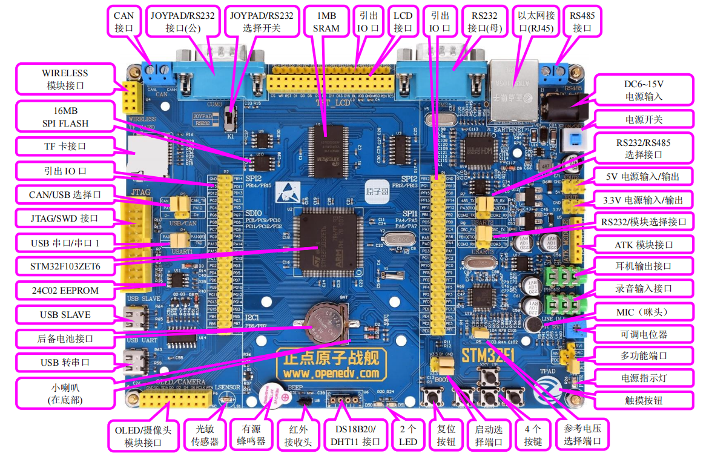

<!--
 * @Date: 2024-06-14
 * @LastEditors: GoKo-Son626
 * @LastEditTime: 2024-06-14
 * @FilePath: \STM32_Study\基础篇\硬件参考手册学习.md
 * @Description: 
-->

# 硬件参考手册学习

> 内容目录：
> 
>       1. 硬件基本参数
>       2. 硬件资源分布图
>       3. 硬件资源列表
>       4. 硬件资源说明和战舰V4 IO引脚分配

> **战舰 V4 STM32F103开发板**

#### 1. 硬件基本参数

| 项目     | 说明                         |
| -------- | ---------------------------- |
| 产品型号 | ATK- DNF103P V4              |
| CPU      | STM32F103ZET6，LQFP144       |
| 引出     | IO 110 个                    |
| 外形尺寸 | 121mm*160mm                  |
| 工作电压 | 5V（USB）、DC6V~15V（DC005） |
| 工作电流 | 120mA~160mA1（@5V）          |
| 工作温度 | 0℃~+70℃                      |

#### 2. 硬件资源分布图

#### 3. 硬件资源列表

| 资源（数量：默认一个）   | 说明                                                                  |
| ------------------------ | --------------------------------------------------------------------- |
| CPU                      | STM32F103ZET6[1]；FLASH[2]：512KB；SRAM：64KB； |
| SRAM[3]       | 1MB（B：字节，下同），16 位并口访问                                   |
| SPI FLASH                | 16MB                                                                  |
| EEPROM[4]     | 2Kb（256B）                                                           |
| 电源指示灯               | 蓝色                                                                  |
| 状态指示灯（2个）        | 红色（DS0）；绿色（DS1）；                                            |
| 复位按键 [5]  | 用于 MCU&LCD 的复位                                                   |
| 功能按键（4个）          | KEY0、KEY1、KEY2、KEY_UP（具备唤醒功能）                              |
| 电容触摸按键             | TPAD，用于电容触摸按键                                                |
| 电源开关                 | 控制整个板子供电                                                      |
| 可调电位器[6] | 用于设置 RV1 的电源，方便 ADC 实验测试                                |
| 蜂鸣器                   | 有源蜂鸣器，用于发出提示音                                            |
| 板载扬声器               | 在开发板背面，用于播放音乐                                            |
| 红外接收头               | 用于红外接收，配备红外遥控器                                          |
| 光敏传感器               | 用于感应环境光照强度                                                  |
| 音频编解码芯片           | VS1053，用于 WAV、MP3、OGG、FLAC 等音频编解码                         |
| 无线模块接口             | 可以接 NRF24L01 等无线模块                                            |
| CAN 接口                 | 用于 CAN 通信，带 120R 终端电阻                                       |
| RS485 接口               | 用于 RS485 通信，带 120R 终端电阻                                     |
| RS232 接口（两个）       | 用于 RS232 通信，提供一公一母两路 RS232 接口                          |
| 游戏手柄接口             | 用于接 FC 游戏手柄，和公头 RS232 接口共用一个 DB9                     |
| 数字温湿度传感器接口     | 支持 DS18B20、DHT11 等数字温湿度传感器                                |
| ATK 模块接口             | 支持正点原子各种模块产品（蓝牙/GPS/MPU6050 等）                       |
| LCD 接口                 | 支持正点原子 2.8/3.5/4.3/7 寸等多种 TFTLCD 模块                       |
| 摄像头接口               | 和 OLED 共用一个接口，支持正点原子各种摄像头模块                      |
| OLED 模块接口            | 和摄像头模块接口共用，支持正点原子各种 OLED 模块                      |
| USB 转串口               | 用于 USB 转 TTL 串口通信                                              |
| USB 从机接口             | 用于 USB SLAVE（从机）通信                                            |
| RS232/手柄选择开关       | 用于选择 COM3 DB9 口接 RS232 还是 FC 游戏手柄                         |
| RS232/485 选择接口       | 用于选择 PA2/PA3 做 RS232 还是 RS485 通信                             |
| RS232/模块选择接口       | 用于选择 PB10/PB11 做 RS232 还是 ATK Module 接口                      |
| CAN/USB 选择接口         | 用于选择 PA11/PA12 做 CAN 还是 USB 通信                               |
| TF 卡接口                | 用于接 TF 卡                                                          |
| 10M/100M 网口            | 用于以太网通信                                                        |
| JTAG/SWD 调试口          | 用于仿真调试、下载代码等                                              |
| 录音咪头（MIC）          | 用于录音                                                              |
| 立体声音频输出接口       | 用于外接耳机、功放等                                                  |
| 立体声录音输入接口       | 用于外接音源输入                                                      |
| 多功能接口               | 用于 DAC/ADC/PWM DAC/AUDIO IN/TPAD 等互联                             |
| 5V 电源输入/输出口       | 用于 5V 电源接入/对外提供 5V 电压                                     |
| 3.3V 电源输入/输出口     | 用于 3.3V 电源接入/对外提供 3.3V 电压                                 |
| 参考电压设置接口         | 用于选择 ADC 参考电压                                                 |
| 直流电源输入接口         | 支持 DC6V~15V 直流电源输入，采用 DC005 接口                           |
| 启动模式选择配置接口     | 用于设置 STM32 启动模式                                               |
| 后备电池接口             | 用于 RTC 后备电池                                                     |
| 引出 IO（110个）         | 除 RTC 晶振占用的 2 个 IO 口外，其他 IO 口全引出                      |
| 一键下载电路             | 正点原子专利电路，方便使用串口下载代码                                |

**注释**
> 1. STM32F103ZET6 是一款基于 ARM Cortex-M3 内核的微控制器 (MCU)，由意法半导体（STMicroelectronics）生产。它广泛应用于嵌入式系统中，具备多种外设和功能。
> 2. FLASH 是一种非易失性存储器，断电后数据不会丢失。用于存储程序代码和常量数据。在嵌入式系统中，程序代码通常会存储在 FLASH 中，因此每次上电后，处理器可以从 FLASH 中读取并执行程序。除此之外，还可以存储一些不常更改的数据，例如配置参数。
> 3. SRAM（静态随机存取存储器）是一种易失性存储器，断电后数据会丢失。用于存储运行时数据，包括堆栈、全局变量和动态分配的数据。由于 SRAM 访问速度快，因此在运行时，程序会将临时数据和需要快速访问的数据存储在 SRAM 中。
> 4. EEPROM 是一种非易失性存储器：与 FLASH 相似，EEPROM 在断电后仍能保存数据。
可擦除和重写：EEPROM 数据可以通过电信号擦除和重写，这使得它可以反复用于存储需要修改的数据。
字节级写入：与 FLASH 通常以块（或页）为单位写入数据不同，EEPROM 可以按字节进行写入和擦除操作，这使得它非常适合用于存储需要频繁更新的小量数据。
EEPROM 是一种用于存储需要频繁更新但又需要持久保存的数据的存储器。在 STM32F103ZET6 中，虽然没有独立的 EEPROM 模块，但可以通过仿真和外部 EEPROM 芯片来实现其功能
> 5. MCU（Microcontroller Unit，微控制器）
一种集成了处理器、内存和外设的单芯片微型计算机。常见的微控制器包括 ARM Cortex-M 系列、AVR、PIC 等。MCU 负责执行嵌入式系统的程序代码，控制系统的所有操作。包括处理器核心，内存和外设接口。
LCD（Liquid Crystal Display，液晶显示器）
LCD 是一种显示技术，通过控制液晶分子的排列来显示图像。常见的 LCD 类型包括字符 LCD、图形 LCD 和 TFT LCD 等。LCD 用于显示信息，可以是简单的字符、数字或复杂的图形。它通常与 MCU 配合使用，MCU 通过接口（如 SPI、I2C、并行接口）向 LCD 发送显示数据。
复位则分为软件和硬件复位每个对应两种
> 6. 可调电位器（Potentiometer）是一种能够改变其电阻值的电子元件，广泛应用于电路调节和控制中。它通常由一个旋转或滑动的机械部件控制电阻值的变化。

#### 4. 硬件资源说明和战舰V4 IO引脚分配

- **略**